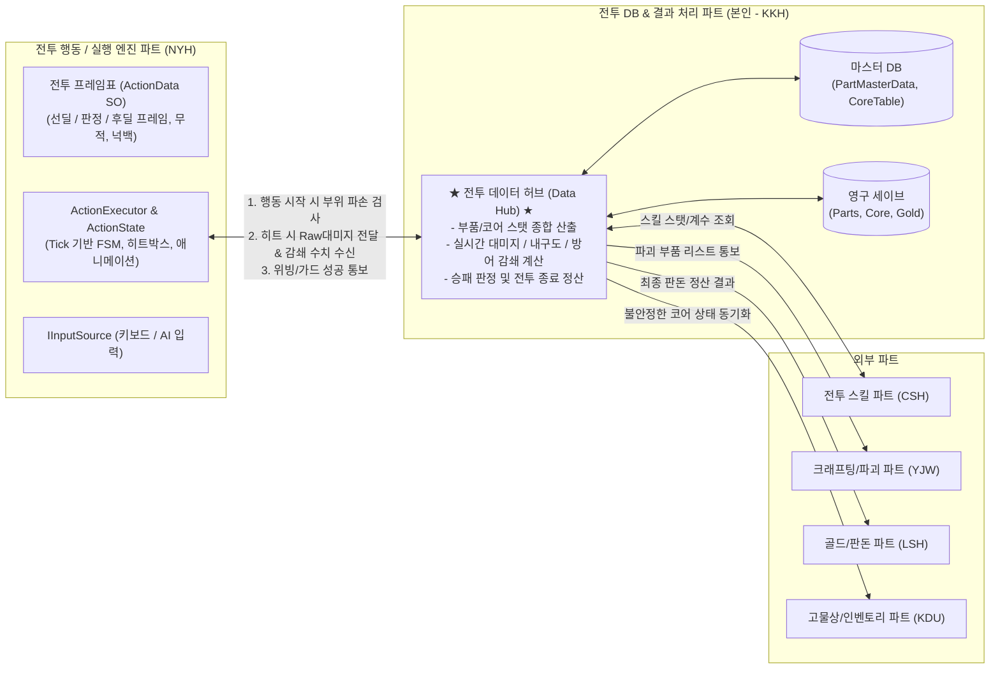
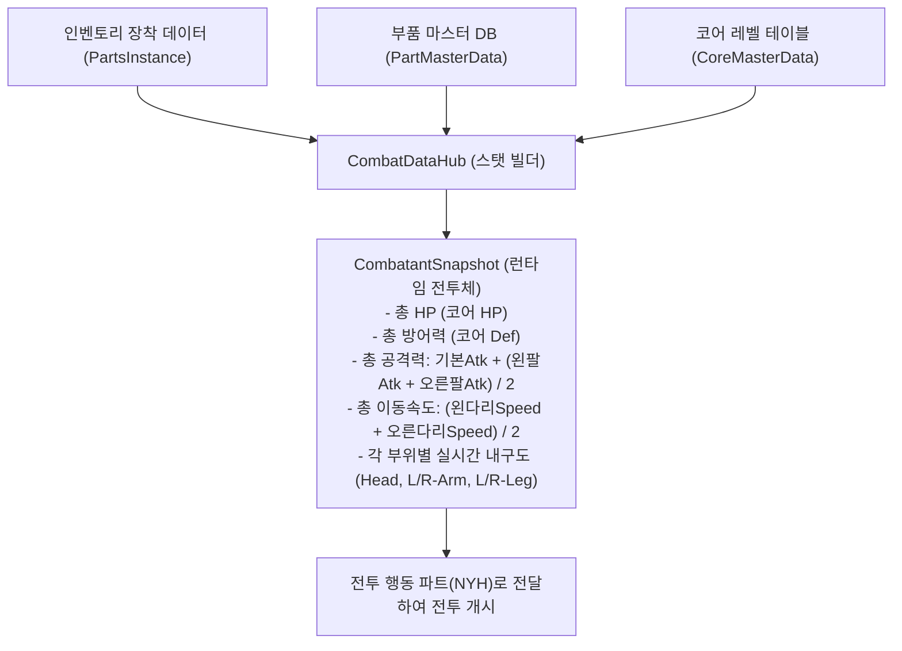
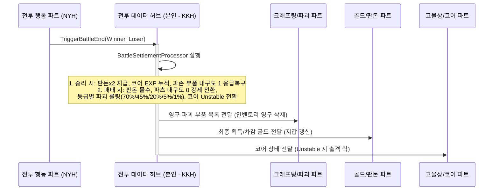
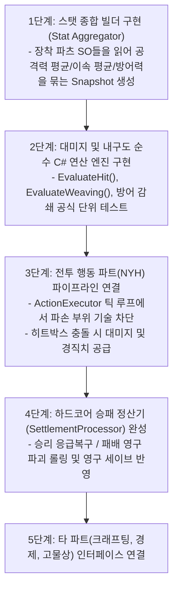

# 전투 DB & 배틀 매니저(Battle Manager) 아키텍처 설계서

- **문서 버전**: v3.0 (파트 간 R&R 확정 및 통합 데이터 허브 구조 개정판)
- **담당 파트**: 전투 DB / 전투 결과 처리 및 데이터 허브 파트 (본인 파트)
- **협력 파트**: 전투 행동 / 전투 실행 엔진 및 프레임표 파트 (NYH 파트)
- **대상 프로젝트**: 리얼 스틸 (로봇 커스터마이징 RPG / 2.5D 실시간 액션)
- **최종 수정일**: 2026-09-18

---

## 1. 개요 및 파트별 역할 분담 (R&R)

### 1.1 확정된 핵심 역할 분담
전투 시스템의 복잡도를 낮추고 모듈 간 충돌을 방지하기 위해 **"프레임 단위 실시간 실행"**과 **"수치 연산 및 영구 데이터 허브"**로 역할을 명확히 양분합니다.



| 구분 | 전투 행동 파트 (NYH) | 전투 DB & 데이터 허브 파트 (본인 - KKH) |
| :--- | :--- | :--- |
| **핵심 성격** | **전투 런타임 실행 엔진 (How to Play)** | **스탯 연산 및 데이터 중앙 허브 (What & How Much)** |
| **담당 범위** | • 60fps Tick 기반 전투 프레임 카운팅 (`CombatClock`)<br>• `ActionData` SO 에셋(선딜/활성/후딜, 애니메이션)<br>• 캐릭터 상태 머신(`Idle/Startup/Active/Recovery`)<br>• 공격 히트박스 및 허트박스 충돌 감지<br>• 넉백 물리 이동 및 피격/다운 모션 | • 파츠별 스탯(머리, 양팔, 양다리, 코어) 총합 산출<br>• 타격 시 방어력 감쇄 대미지 계산식 연산<br>• 가드/위빙/피격 시 부위별 내구도 차감 및 파손 판정<br>• 승패 판정(코어 HP 0) 및 하드코어 정산(영구 파괴 롤링)<br>• 크래프팅, 경제, 인벤토리 파트와의 데이터 연동 총괄 |

---

## 2. 데이터 허브(Data Hub) 아키텍처

본인 파트의 `CombatDataHub`는 전투 씬 안팎의 모든 데이터를 취합하고 계산하여 전투 행동 파트에 수치를 공급하는 중앙 관제소 역할을 수행합니다.

### 2.1 전투 진입 시 스탯 빌드 (Pre-Battle Stat Aggregation)
전투가 시작될 때 인벤토리에서 장착된 파츠들을 읽어와 전투 런타임 스냅샷(`CombatantSnapshot`)을 빌드합니다.



```csharp
public class CombatantSnapshot
{
    public string FighterId;
    public bool IsPlayer;

    // 코어 스탯
    public int CurrentHp;
    public int MaxHp;
    public int BaseDefense;

    // 기획서 (2) 복합 연산 스탯
    public int TotalAttackPower;       // 기본Atk + (왼팔Atk + 오른팔Atk) / 2
    public float FinalMoveSpeed;       // (왼다리Speed + 오른다리Speed) / 2
    public float CritResistance;       // 머리 파츠 치명타 저항 (합연산)
    public float CritDamageReduction;  // 머리 파츠 치명타 피해 삭감률
    public int GuardDefBonus;          // 팔 가드 방어력 보정
    public float InvincibleBonus;      // 다리 위빙 무적 보정

    // 실시간 부위 내구도 상태 (NYH BodyPart 사용)
    public Dictionary<BodyPart, PartRuntimeState> PartStates;

    public bool IsPartBroken(BodyPart part)
    {
        return PartStates.TryGetValue(part, out var state) && state.CurrentDurability <= 0;
    }
}

public class PartRuntimeState
{
    public int MasterPartId;
    public int CurrentDurability;
    public int MaxDurability;
}
```

---

## 3. 전투 중 상호작용 인터페이스 (전투 행동 파트와의 연동)

전투 행동 파트(NYH)가 프레임 및 충돌을 판정할 때, 본인 파트의 `CombatDataHub`와 주고받는 구체적인 API 규약입니다.

### 3.1 행동 가능 여부 질의 (`CanExecuteAction`)
- **시점**: `ActionExecutor`에서 입력을 받아 `ActionData`를 실행하기 직전.
- **판정**:
  - `ActionData.Source == ActionSource.CoreFixed` (잽, 가드, 위빙, 이동): 항상 실행 가능 (단, 부위 파괴 시 페널티 적용).
  - `ActionData.Source == ActionSource.Part` (훅, 스트레이트, 어퍼컷, 백스핀): `requiredPart`의 내구도가 0이면 실행 차단.

```csharp
// CombatDataHub.cs
public bool CanExecuteAction(CombatantSnapshot actor, ActionData action)
{
    if (action.Source == ActionSource.CoreFixed)
        return true;

    // 파츠 소속 기술인 경우 해당 부위 파손 여부 검사
    if (actor.IsPartBroken(action.RequiredPart))
    {
        Debug.Log($"[CombatDataHub] {action.ActionName} 시전 불가: {action.RequiredPart} 파손됨");
        return false;
    }

    return true;
}
```

---

### 3.2 타격 적중 시 대미지 감쇄 및 부위 피격 처리 (`EvaluateHit`)
- **시점**: 전투 행동 파트에서 히트박스가 상대 허트박스에 닿았을 때.
- **연산**:
  1. 공격자의 `TotalAttackPower`와 `ActionData.Damage` 계수를 곱해 `RawDamage` 산출.
  2. 방어자 상태에 따른 분기:
     - **가드 중**:
       - `ActionData.IsGuardable == false` (백스핀 엘보우): 가드 무시, 코어에 직격.
       - 일반 공격: `(방어자 BaseDefense + GuardDefBonus)` 적용 후 잔여 피해를 **양팔 내구도**에서 차감.
     - **위빙(회피) 성공**: 대미지 0 (무적).
     - **일반 피격**:
       - 치명타 판정 시 $\rightarrow$ 머리 내구도 차감 및 크리티컬 대미지 적용.
       - 일반 타격 시 $\rightarrow$ 기획서 방어력 감쇄 공식 적용 후 **코어 HP 차감**.
  3. 경직도(`StaggerValue`) 누적치 반환.

$$\text{FinalDamage} = \text{RawDamage} \times \frac{100}{\text{Defense} + 100}$$

```csharp
// CombatDataHub.cs
public HitResolutionResult EvaluateHit(CombatantSnapshot attacker, CombatantSnapshot defender, ActionData attackAction, bool isGuarding, bool isWeaving)
{
    var result = new HitResolutionResult();

    if (isWeaving)
    {
        result.IsEvaded = true;
        result.DamageToHp = 0;
        return result;
    }

    // 1. 공격력 계산
    float rawAtk = attacker.TotalAttackPower * (attackAction.Damage / 100f);

    // 2. 가드 판정
    if (isGuarding && attackAction.IsGuardable)
    {
        result.IsGuarded = true;
        int totalDef = defender.BaseDefense + defender.GuardDefBonus;
        float finalDmg = rawAtk * (100f / (totalDef + 100f));
        
        // 가드 시 양팔 내구도 소모
        ConsumePartDurability(defender, BodyPart.LeftArm, (int)(finalDmg * 0.5f));
        ConsumePartDurability(defender, BodyPart.RightArm, (int)(finalDmg * 0.5f));
        result.DamageToHp = 0;
    }
    else
    {
        // 3. 본체(코어) 직격
        float finalDmg = rawAtk * (100f / (defender.BaseDefense + 100f));
        result.DamageToHp = Mathf.RoundToInt(finalDmg);
        defender.CurrentHp = Mathf.Max(0, defender.CurrentHp - result.DamageToHp);
    }

    // 경직도 누적치 전달
    result.StaggerAdded = attackAction.StaggerValue;
    return result;
}
```

---

### 3.3 위빙(회피) 시 다리 내구도 소모 및 실패 페널티 (`EvaluateWeavingAttempt`)
기획서 5.7.4 명세를 데이터 허브에서 계산합니다.
- 위빙 시도 시: 좌/우 다리 중 무작위 1개 내구도 5 고정 소모.
- **다리 1개 파괴 상태**: 입력 타이밍이 맞아도 **50% 확률로 실패 판정** 반환 $\rightarrow$ 전투 행동 파트에서 "회피 실패" 플로팅 텍스트 출력 및 피격 허용.
- **양다리 모두 파괴 상태**: 회피 완전 불가.

---

## 4. 전투 종료 및 외부 파트 연동 (허브 총괄)

전투 행동 파트(NYH)가 코어 HP 0 도달을 감지하여 `EndBattle`을 호출하면, 본인 파트의 `BattleSettlementProcessor`가 모든 외부 파트로 결과를 브로드캐스팅합니다.



---

## 5. 단계별 작업 진행 가이드 (본인 파트 실행 로드맵)

전투 행동 파트와의 역할 분담이 정해졌으므로, 본인 파트는 아래 순서로 작업을 집중 진행합니다.



1. **1단계 (스탯 빌더 작성)**:
   - 플레이어는 인벤토리/세이브 데이터에서, NPC(적)는 기획된 프리셋 데이터에서 장착 파츠 목록을 받아 기획서의 복합 스탯(양팔 평균 공격력, 양다리 평균 속도, 머리 치명타 저항 등)을 하나의 `CombatantSnapshot` 객체로 패키징하는 로직(팩토리) 작성.
2. **2단계 (수치 판정기 단위 테스트 - TDD)**:
   - 유니티 씬 없이도 방어력 100일 때 대미지 50% 감쇄, 가드 시 팔 내구도 소모, 위빙 시 다리 내구도 5 소모가 정확히 연산되는지 Pure C# 테스트 작성.
3. **3단계 (전투 행동 파트와 접점 연결)**:
   - 전투 행동 파트가 작성 중인 `ActionExecutor`의 틱(Tick) 루프 진입점에 `CombatDataHub.CanExecuteAction()` 검사를 주입.
   - 타격(히트박스 충돌) 감지 시 `EvaluateHit()`를 호출하여 대미지를 던져주고 피격 결과를 돌려받는 파이프라인 연결.
4. **4단계 (결과 정산 파이프라인 구축)**:
   - 승리 시 내구도 0 파츠 1로 긴급 복구, 패배 시 등급별 파괴 확률(70%/45%/20%/5%/1%) 롤링 로직 완성.
