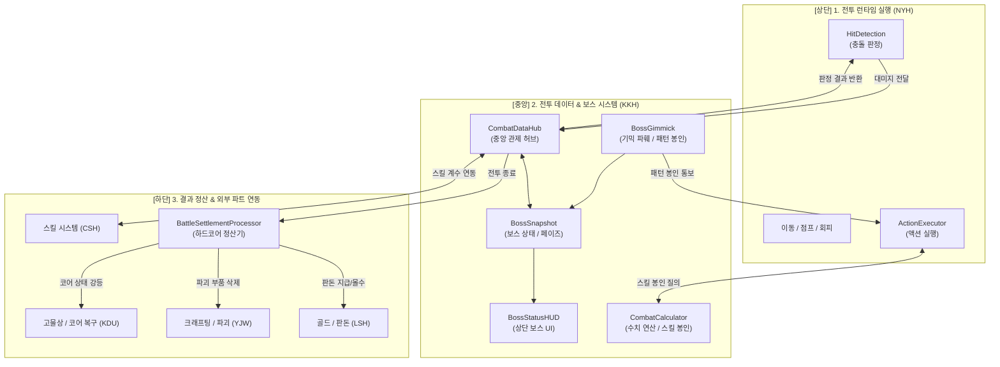
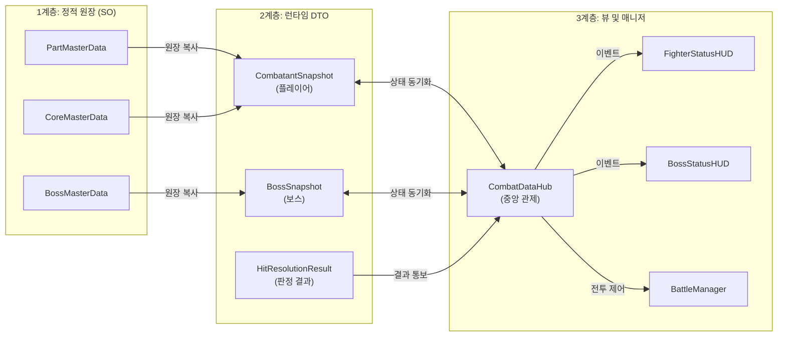
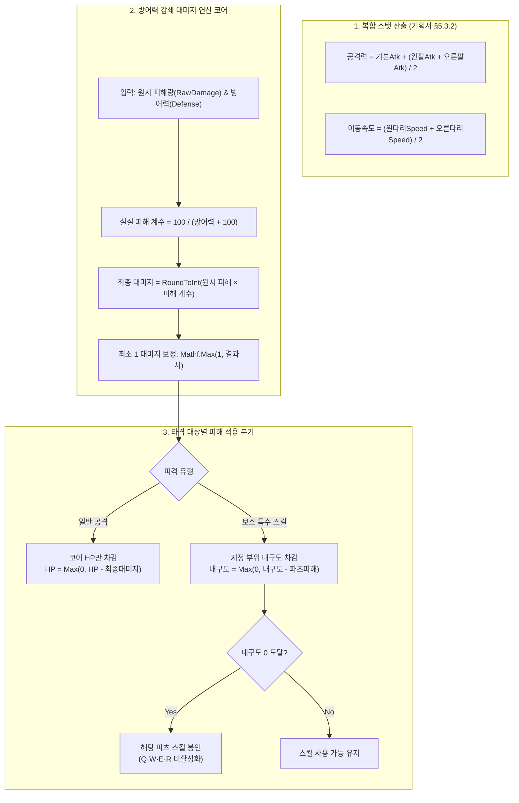
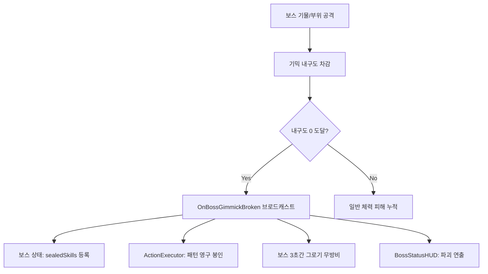
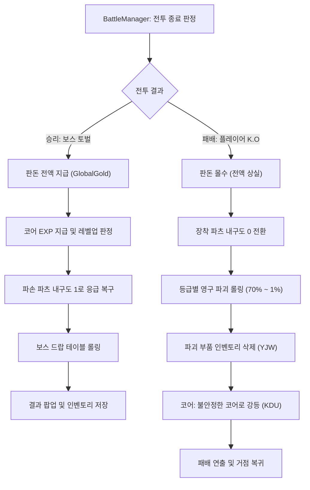
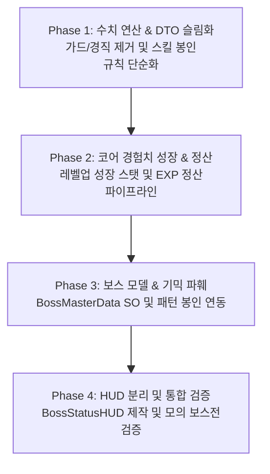

# 전투 데이터 & 보스 시스템(Battle & Boss System) 상세 아키텍처 설계서

- **문서 버전**: v4.0 (PvE 실시간 액션 보스전 & 보스 시스템 총괄 통합 개정판)
- **담당 파트**: **KKH (전투 데이터 매니지먼트 & 보스 시스템 총괄)**
- **협력 파트**:
  - **전투 행동/프레임 파트 (NYH)**: 2.5D 실시간 액션 실행 엔진, 4방향 이동/점프/달리기, 히트/허트박스 충돌 판정, 애니메이션
  - **스킬 파트 (CSH)**: 플레이어 Q·W·E·R 파츠 스킬 및 보스 패턴 스킬 구현
  - **크래프팅/파괴 파트 (YJW)**: 부품 제작 및 패배 시 영구 파괴 부품 인벤토리 소멸 처리
  - **골드/판돈 파트 (LSH)**: 판돈 협상 및 전투 결과 골드 입출금 (`GlobalGold`)
  - **고물상/인벤토리 파트 (KDU)**: 고철 수집, 인벤토리 파츠 장착, 패배 시 '불안정한 코어' 정비소 복구
- **기준 기획서**: `리얼스틸 기획서.md` (2026-09-30 최신 기획 반영)
- **최종 수정일**: 2026-09-30

---

## 1. 개요 및 파트별 역할 분담 (R&R)

### 1.1 기획 전환 배경 및 KKH 파트 역할 확장
최신 기획서(`리얼스틸 기획서.md`)에 따라 전투 메카닉이 **1:1 복싱 격투**에서 **사이드뷰 실시간 액션 기믹 파훼형 보스전(Blasphemous 레퍼런스)**으로 전면 전환되었습니다.
이에 따라 **KKH 파트는 기존의 "전투 데이터 매니지먼트 & 결과 정산" 영역에 더하여 "보스 시스템(Boss System) 전반(보스 데이터, 기믹 파훼, 패턴 봉인, 보스 UI/라이프사이클)"을 총괄 담당**합니다.



### 1.2 상세 파트 R&R

| 구분 | 전투 DB & 보스 시스템 (본인 - KKH) | 전투 행동/프레임 파트 (NYH) | 스킬 파트 (CSH) |
| :--- | :--- | :--- | :--- |
| **핵심 성격** | **수치 연산 허브, 정산 및 보스 시스템 총괄** | **2.5D 실시간 액션 물리 엔진** | **개별 스킬 액션 리소스** |
| **담당 범위** | • 플레이어 런타임 스냅샷(`CombatantSnapshot`) 관리<br>• 코어 HP 대미지 감쇄 및 부위 피격 수치 연산<br>• D 기본기 허용 / Q·W·E·R 스킬 봉인 게이트<br>• **보스 데이터 모델(`BossMasterData`, `BossSnapshot`) 설계**<br>• **보스 기믹 파훼(기물/부위 파괴) 및 패턴 봉인 로직**<br>• **보스 상단 대형 체력바 및 기믹 위젯 HUD**<br>• 코어 경험치 획득/레벨업 및 하드코어 승패 정산<br>• 외부 파트(경제/크래프팅/고물상) 이벤트 브로드캐스팅 | • 60fps Tick 기반 프레임 엔진 (`CombatClock`)<br>• 좌우 이동, 달리기(←←/→→), 점프(↑)<br>• 회피(Space) 0.3초 무적 프레임 및 이동 물리<br>• 플레이어 및 보스 히트/허트박스 충돌 판정<br>• 피격 애니메이션 및 넉백 물리 처리 | • 파츠별 액티브 스킬 데이터 SO 작성<br>• 주먹 발사 이펙트 및 연출 바인딩<br>• 스킬 쿨타임/사거리 밸런싱 |

---

## 2. 데이터 아키텍처 (3계층 분리 원칙)

데이터 오염 방지와 단위 테스트 무결성을 위해 **정적 마스터(SO) → 런타임 상태(DTO) → 뷰/연출(MonoBehaviour)**의 3계층 아키텍처를 엄격히 준수합니다.



---

## 3. 마스터 데이터 정의 (SO 계층)

### 3.1 코어 마스터 데이터 (`CoreMasterData.cs`)
기획서 §5.3, §5.5 조항에 따른 코어 기본 스탯 및 영구 레벨업 성장 스키마입니다.
```csharp
[CreateAssetMenu(fileName = "CoreMasterData", menuName = "RealSteel/CoreMasterData")]
public class CoreMasterData : ScriptableObject
{
    [Header("기본 식별 정보")]
    public string coreID;
    public string coreName;
    public int baseLevel = 1;

    [Header("기본 스탯")]
    public int baseHp = 1000;
    public int baseDefense = 50;

    [Header("레벨당 성장치 (기획서 §5.3.2)")]
    public int hpGrowthPerLevel = 100;       // 레벨업 시 영구 상승 체력
    public int defGrowthPerLevel = 5;        // 레벨업 시 영구 상승 방어력

    [Header("경험치 테이블")]
    public int[] requiredExpTable = new int[10] { 100, 250, 450, 700, 1000, 1400, 1900, 2500, 3200, 4000 };
}
```

### 3.2 파츠 마스터 데이터 (`PartMasterData.cs`)
기획서 §5.3.3 등급별 계수 및 §5.7.5 파츠별 스킬 배정 규칙을 반영합니다.
```csharp
public enum PartGrade { Normal, Rare, Epic, Legendary, Prototype }

[CreateAssetMenu(fileName = "PartMasterData", menuName = "RealSteel/PartMasterData")]
public class PartMasterData : ScriptableObject
{
    [Header("부품 식별")]
    public string partID;
    public string partName;
    public BodyPart bodyPart; // Head, LeftArm, RightArm, LeftLeg, RightLeg
    public PartGrade grade;   // 일반(1.0), 레어(1.2), 에픽(1.44), 전설(1.73), 프로토(2.07)

    [Header("기본 수치 (내구도 및 고유 스탯)")]
    public int maxDurability = 100;
    public int attackPower;        // 팔 파츠 공격력
    public float moveSpeed;        // 다리 파츠 이동속도
    public float critResistance;   // 머리 치명타 저항
    public float critDmgReduction; // 머리 치명타 피해 삭감률

    [Header("장착 스킬 (스킬 파트 CSH 연동)")]
    public string skillID;         // Q/W/E/R 키에 매핑될 스킬 식별자
}
```

### 3.3 보스 마스터 데이터 (`BossMasterData.cs`) — KKH 전담
Blasphemous 레퍼런스의 기믹 파훼형 보스를 정의하는 원장 에셋입니다.
```csharp
[System.Serializable]
public class BossGimmickPartData
{
    public string gimmickID;               // 예: "GIMMICK_RIGHT_ARM", "GENERATOR_A"
    public string gimmickName;             // 예: "플라즈마 제너레이터"
    public bool isPhysicalBossPart;        // true: 보스 본체 부위, false: 전장 설치형 기물
    public int maxDurability = 300;        // 파괴에 필요한 피해량
    public string targetSkillIDToSeal;     // 파괴 시 봉인되는 보스 스킬 패턴 ID
    public float damageMultiplierOnBreak = 1.3f; // 파괴 시 보스 본체 대미지 증폭 계수
}

[System.Serializable]
public class BossPhaseData
{
    public int phaseIndex;                 // 1, 2, 3 페이즈
    public float hpThresholdRatio;         // 페이즈 진입 체력 비율 (예: 0.6f -> 체력 60% 이하 시)
    public int additionalDefense;          // 페이즈 전환 시 방어력 증가치
    public List<string> availableSkillIDs; // 해당 페이즈에서 사용하는 보스 스킬 패턴 목록
    public string phaseTransitionEffect;   // 페이즈 전환 연출 트리거 키
}

[CreateAssetMenu(fileName = "BossMasterData", menuName = "RealSteel/BossMasterData")]
public class BossMasterData : ScriptableObject
{
    [Header("보스 기본 정보")]
    public string bossID;
    public string bossName;
    public int maxHp = 5000;
    public int baseDefense = 60;

    [Header("페이즈 구성")]
    public List<BossPhaseData> phases;

    [Header("기믹 파훼 / 부위 파괴 목록 (기획서 §5.7.9)")]
    public List<BossGimmickPartData> gimmickParts;

    [Header("토벌 보상 테이블 (정수 가중치 룰)")]
    public int rewardGold = 1000;
    public int rewardCoreExp = 300;
    public List<PartDropEntry> dropTable;  // 드랍 가능한 전용 파츠 목록
}
```

---

## 4. 런타임 상태 모델 계층 (인메모리 DTO)

### 4.1 플레이어 런타임 스냅샷 (`CombatantSnapshot.cs`)
```csharp
public class CombatantSnapshot
{
    public string fighterID = "Player";
    public bool isPlayer = true;

    // 코어 실시간 스탯
    public int currentHp;
    public int maxHp;
    public int baseDefense;
    public int coreLevel;
    public int currentCoreExp;

    // 복합 연산 스탯 (기획서 §5.3.2)
    public int totalAttackPower; // 기본Atk + (왼팔Atk + 오른팔Atk) / 2
    public float finalMoveSpeed; // (왼다리Speed + 오른다리Speed) / 2

    // 5개 파츠 실시간 내구도 (Head, LeftArm, RightArm, LeftLeg, RightLeg)
    public Dictionary<BodyPart, PartRuntimeState> partStates = new();

    public bool IsPartBroken(BodyPart part)
    {
        return partStates.TryGetValue(part, out var state) && state.currentDurability <= 0;
    }
}
```

### 4.2 보스 런타임 스냅샷 (`BossSnapshot.cs`) — KKH 전담
```csharp
public class BossGimmickRuntimeState
{
    public string gimmickID;
    public int currentDurability;
    public int maxDurability;
    public bool isBroken;
    public string sealedSkillID;
}

public class BossSnapshot
{
    public string bossID;
    public string bossName;
    public int currentHp;
    public int maxHp;
    public int baseDefense;
    public int currentPhase = 1;
    public bool isGroggy = false; // 기믹 파괴 시 일시적 무방비 상태

    // 보스 기믹/부위 실시간 상태 딕셔너리
    public Dictionary<string, BossGimmickRuntimeState> gimmickStates = new();

    // 현재 봉인된 보스 스킬 목록
    public HashSet<string> sealedSkills = new();

    public bool IsGimmickBroken(string gimmickID)
    {
        return gimmickStates.TryGetValue(gimmickID, out var state) && state.isBroken;
    }
}
```

### 4.3 타격 결과 DTO (`HitResolutionResult.cs`)
가드 및 경직 레거시를 완전 제거하고, 무적 회피 및 특정 부위/기믹 피격을 명확히 표현합니다.
```csharp
public class HitResolutionResult
{
    public bool isEvaded;           // 회피 무적 구간(0.3s)으로 인한 무효화 여부
    public int coreHpDamage;        // 코어 체력 피해량
    public BodyPart targetBodyPart; // 타격된 플레이어 부위 (일반 공격 시 BodyPart.Core)
    public int partDurabilityDamage;// 파츠 내구도 피해량 (보스 특수 스킬 적중 시)
    public bool isPartDestroyed;    // 이번 타격으로 해당 부위가 파괴되었는지 여부
    
    // 보스 피격 전용 필드
    public string hitGimmickID;     // 타격된 보스 기믹/부위 ID (있을 경우)
    public bool isGimmickDestroyed; // 기믹 파괴 여부
}
```

---

## 5. 수치 연산 코어 (`CombatCalculator.cs`)

### 5.1 방어력 감쇄 대미지 공식 및 수치 연산 파이프라인
기획서 §5.3.2 조항의 스탯 산출 및 대미지 감쇄 공식을 시각화한 파이프라인입니다.



> **방어력 대미지 공식 요약 (기획서 §5.3.2)**
> - **대미지 감소율**: $\text{감소율} = \frac{\text{방어력}}{\text{방어력} + 100}$
> - **최종 피해량**: $\text{최종 피해} = \text{원시 피해} \times \frac{100}{\text{방어력} + 100}$

$$
\text{최종 대미지} = \text{원시 대미지} \times \left( \frac{100}{\text{방어력} + 100} \right)
$$

### 5.2 타격 판정 분기 로직
```csharp
public static class CombatCalculator
{
    // 방어력 감쇄 계산
    public static int CalculateDamage(float rawDamage, int defense)
    {
        float multiplier = 100f / (Mathf.Max(0, defense) + 100f);
        return Mathf.Max(1, Mathf.RoundToInt(rawDamage * multiplier));
    }

    // 1. 보스 -> 플레이어 타격 판정
    public static HitResolutionResult EvaluateBossAttack(
        BossSnapshot boss, 
        CombatantSnapshot player, 
        float skillRawDamage, 
        BodyPart targetPart, // 일반 공격은 Core, 특수 스킬은 Head/LeftArm 등
        int partDamageAmount, 
        bool isPlayerInvincible)
    {
        var result = new HitResolutionResult();

        // 1) 회피 무적 판정 (Space 회피 중)
        if (isPlayerInvincible)
        {
            result.isEvaded = true;
            return result;
        }

        // 2) 본체 코어 대미지 계산
        result.coreHpDamage = CalculateDamage(skillRawDamage, player.baseDefense);
        player.currentHp = Mathf.Max(0, player.currentHp - result.coreHpDamage);

        // 3) 보스 특정 스킬의 부위 내구도 타격 (기획서 §5.7.7)
        if (targetPart != BodyPart.Core && player.partStates.TryGetValue(targetPart, out var partState))
        {
            result.targetBodyPart = targetPart;
            result.partDurabilityDamage = partDamageAmount;
            partState.currentDurability = Mathf.Max(0, partState.currentDurability - partDamageAmount);
            result.isPartDestroyed = (partState.currentDurability <= 0);
        }

        return result;
    }

    // 2. 플레이어 -> 보스 타격 판정
    public static HitResolutionResult EvaluatePlayerAttack(
        CombatantSnapshot player, 
        BossSnapshot boss, 
        float actionRawDamage, 
        string targetGimmickID = null)
    {
        var result = new HitResolutionResult();

        // 보스 기믹/부위 타격 시 추가 배율 반영
        float multiplier = 1f;
        if (!string.IsNullOrEmpty(targetGimmickID) && boss.gimmickStates.TryGetValue(targetGimmickID, out var gimmick))
        {
            result.hitGimmickID = targetGimmickID;
            gimmick.currentDurability = Mathf.Max(0, gimmick.currentDurability - Mathf.RoundToInt(actionRawDamage));
            if (gimmick.currentDurability <= 0 && !gimmick.isBroken)
            {
                gimmick.isBroken = true;
                result.isGimmickDestroyed = true;
                boss.sealedSkills.Add(gimmick.sealedSkillID);
            }
        }

        // 보스 본체 체력 차감
        result.coreHpDamage = CalculateDamage(actionRawDamage * multiplier, boss.baseDefense);
        boss.currentHp = Mathf.Max(0, boss.currentHp - result.coreHpDamage);

        return result;
    }

    // 3. 행동 실행 가능 여부 게이트 (기획서 §5.7.4, §5.7.8)
    public static bool CanExecuteAction(CombatantSnapshot player, ActionSource source, BodyPart requiredPart)
    {
        // D 고정 기본기는 파츠 파괴와 무관하게 항상 사용 가능
        if (source == ActionSource.CoreFixed)
            return true;

        // Q·W·E·R 스킬은 해당 부위가 파손(내구도 0)되면 즉시 봉인
        if (source == ActionSource.Part)
            return !player.IsPartBroken(requiredPart);

        return true;
    }
}
```

---

## 6. 보스 시스템 상세 설계 (Boss Architecture) — KKH 총괄

### 6.1 기믹 파훼 & 패턴 봉인 메카닉
기획서 §5.7.9 조항을 시스템화하여 보스전의 전략성을 완성합니다.



### 6.2 보스 라이프사이클 및 페이즈 머신
```csharp
public enum BossState
{
    Intro,          // 보스 등장 컷씬/연출
    PhaseActive,    // 일반 전투 패턴 실행 중
    Groggy,         // 기믹 파괴로 인한 무력화 상태 (받는 피해 1.5배)
    PhaseTransition,// 페이즈 전환 무적 연출 중
    Dead            // 토벌 완료
}
```
- **페이즈 전환 트리거**: 보스 현재 체력이 `PhaseData.hpThresholdRatio` 이하로 떨어지는 순간, 즉시 `PhaseTransition` 상태로 진입하여 무적 쉴드를 전개하고 폭주 연출을 수행한 뒤 신규 패턴 목록으로 전환합니다.

### 6.3 보스 전용 UI (`BossStatusHUD.cs`)
- **화면 최상단 중앙 고정**: 대형 보스 이름 및 총합 체력 슬라이더(`Boss_HP_Slider`).
- **하단 기믹 슬롯**: 현재 파괴 가능한 보스 부위/기물 2~3개의 미니 내구도 게이지 배치. 파괴 시 붉은 `DESTROYED` 텍스트와 함께 해당 게이지 소멸 연출.

---

## 7. 전투 라이프사이클 & 하드코어 결과 정산 (`BattleSettlementProcessor.cs`)

전투 종료 시 승패에 따른 기획서 §5.6, §5.7.10 명세를 100% 자동 정산합니다.



### 7.1 코어 경험치 및 레벨업 정산
```csharp
public static void ProcessCoreExp(CombatantSnapshot player, int gainedExp, CoreMasterData coreMaster)
{
    player.currentCoreExp += gainedExp;
    int reqExp = coreMaster.requiredExpTable[Mathf.Clamp(player.coreLevel - 1, 0, coreMaster.requiredExpTable.Length - 1)];

    if (player.currentCoreExp >= reqExp)
    {
        player.currentCoreExp -= reqExp;
        player.coreLevel++;
        player.maxHp += coreMaster.hpGrowthPerLevel;
        player.baseDefense += coreMaster.defGrowthPerLevel;
        player.currentHp = player.maxHp; // 레벨업 시 완충
        
        CombatDataHub.Instance.BroadcastCoreLevelUp(player.coreLevel, player.maxHp, player.baseDefense);
    }
}
```

---

## 8. 중앙 관제 허브 (`CombatDataHub.cs`) API 및 이벤트 계약

외부 및 전투 씬 모든 모듈이 참조하는 단일 창구(Façade) 계약입니다.

### 8.1 주요 API 명세
```csharp
// 1. 초기화 및 등록
public void InitializeBattle(CombatantSnapshot player, BossSnapshot boss);

// 2. 타격 및 연산 질의
public HitResolutionResult ProcessBossHit(string gimmickPartId, float rawDamage);
public HitResolutionResult ProcessPlayerHit(BodyPart targetPart, float rawDamage, int partDamage);
public bool CanExecutePlayerAction(ActionSource source, BodyPart requiredPart);

// 3. 상태 질의
public CombatantSnapshot PlayerSnapshot { get; }
public BossSnapshot BossSnapshot { get; }
```

### 8.2 C# Action 브로드캐스팅 이벤트 목록
UI 및 타 파트는 매 프레임 폴링(Polling)하지 않고 아래 이벤트를 구독하여 화면을 갱신합니다.

| 이벤트 명 | 매개변수 | 용도 |
| :--- | :--- | :--- |
| `OnPlayerHpChanged` | `(int curHp, int maxHp)` | 플레이어 하단 체력바 갱신 |
| `OnPlayerPartDurabilityChanged` | `(BodyPart part, int cur, int max)` | 플레이어 5부위 내구도 슬라이더 갱신 |
| `OnPlayerPartBroken` | `(BodyPart brokenPart)` | 해당 파츠 Q·W·E·R 스킬 아이콘 X(봉인) 처리 |
| `OnBossHpChanged` | `(int curHp, int maxHp, int phase)` | 상단 보스 체력바 및 페이즈 갱신 |
| `OnBossGimmickBroken` | `(string gimmickId, string sealedSkill)` | 보스 기믹 파괴 연출 및 패턴 봉인 안내 |
| `OnCoreLevelUp` | `(int newLv, int newHp, int newDef)` | 전투 종료 시 코어 레벨업 축하 팝업 |
| `OnBattleEnded` | `(BattleSettlementResult result)` | 최종 결과(골드/파괴 부품/드랍템) 정산 팝업 |

---

## 9. 단계별 구현 및 리팩토링 로드맵



---

## 10. KKH 실무 작업 TODO 리스트 (Checklist)

아래 체크리스트는 최신 기획 전환에 따라 KKH가 실제로 코드를 수정/구현해야 하는 작업 목록입니다.

### [Phase 1] 레거시 청소 및 수치 연산/DTO 슬림화
- [ ] **`HitResolutionResult.cs` DTO 정리**
  - [ ] 레거시 필드 삭제 (`isGuarded`, `staggerAdded`, `leftArmDurabilityDamage`, `rightArmDurabilityDamage`, `causesKnockdown` 등)
  - [ ] 신규 필드 확정 (`coreHpDamage`, `targetBodyPart`, `partDurabilityDamage`, `isPartDestroyed`, `isEvaded`)
- [ ] **`CombatCalculator.cs` 연산 로직 리팩토링**
  - [ ] 복싱 레거시 제거 (가드 시 양팔 5:5 분산 로직, 위빙 시 다리 5 소모 및 50% 실패 확률 판정 삭제)
  - [ ] 방어력 감쇄 공식 적용: $\text{피해량} = \text{원시 피해} \times \frac{100}{\text{방어력} + 100}$
  - [ ] 일반 공격(코어 HP만 차감) vs 보스 특수 스킬(지정 부위 내구도 차감) 분기 구현
  - [ ] 스킬 봉인 게이트(`CanExecuteAction`) 구현: D 기본기는 항상 허용, Q·W·E·R 스킬은 해당 부위 내구도 0 시 차단
- [ ] **단위 테스트 검증**
  - [ ] 더미 피격 호출 시 일반 공격은 코어 체력만 깎이고 파츠 내구도는 보존되는지 확인

### [Phase 2] 보스 시스템 모델링 및 기믹 파훼 엔진 구축
- [ ] **`BossMasterData.cs` (ScriptableObject) 신규 생성**
  - [ ] 보스 기본 스탯 (이름, maxHp, baseDefense)
  - [ ] 페이즈 목록 (`BossPhaseData`: 체력 임계 비율, 추가 방어력, 사용 패턴 스킬 목록)
  - [ ] 기믹/부위 목록 (`BossGimmickPartData`: 기믹ID, maxDurability, 파괴 시 봉인될 스킬ID `targetSkillIDToSeal`)
  - [ ] 토벌 보상 (골드, 코어 경험치, 전용 파츠 드랍 테이블)
- [ ] **`BossSnapshot.cs` (런타임 DTO) 신규 생성**
  - [ ] 실시간 보스 체력, 현재 페이즈, 그로기 여부(`isGroggy`)
  - [ ] 기믹 실시간 내구도 및 파괴 상태 딕셔너리 (`gimmickStates`)
  - [ ] 봉인된 스킬 패턴 목록 (`HashSet<string> sealedSkills`)
- [ ] **기믹 파훼 & 패턴 봉인 연산 구현 (`CombatCalculator` / `CombatDataHub`)**
  - [ ] 플레이어가 기믹 부위 타격 시 기믹 내구도 차감
  - [ ] 기믹 내구도 0 도달 시 `sealedSkills`에 등록 및 `OnBossGimmickBroken` 이벤트 발행
  - [ ] 보스 상태를 3초간 `Groggy`로 전환하고 받는 피해 증폭 계수 적용

### [Phase 3] 코어 경험치 성장 및 하드코어 승패 정산 고도화
- [ ] **`CoreMasterData.cs` 스펙 확장**
  - [ ] 레벨업 시 체력 성장치(`hpGrowthPerLevel = 100`), 방어력 성장치(`defGrowthPerLevel = 5`) 추가
  - [ ] 1~10레벨 구간별 누적 필요 경험치 테이블(`requiredExpTable`) 반영
- [ ] **`BattleSettlementProcessor.cs` 승패 정산 로직 고도화**
  - [ ] 승리 시: 판돈 전액 지급 (`GlobalGold.Instance.AddGold`)
  - [ ] 승리 시: 코어 경험치 지급 및 레벨업 판정 (`ProcessCoreExp`)
  - [ ] 승리 시: 내구도 0 파손 부품 내구도 1로 응급 복구 처리
  - [ ] 승리 시: 보스 전용 파츠 정수 가중치 드랍 롤링
  - [ ] 패배 시: 판돈 전액 몰수
  - [ ] 패배 시: 장착 파츠 내구도 0 전환 및 등급별 영구 파괴 확률 롤링(일반 70% ~ 프로토 1%)
  - [ ] 패배 시: 코어 상태를 '불안정한 코어'로 강등 통보

### [Phase 4] 중앙 관제 허브(CombatDataHub) API 재정비 & HUD 연동
- [ ] **`CombatDataHub.cs` API 리팩토링**
  - [ ] `InitializeBattle(CombatantSnapshot player, BossSnapshot boss)` 연동
  - [ ] `ProcessPlayerHit(targetPart, rawDamage, partDamage)` 구현 및 이벤트 발행
  - [ ] `ProcessBossHit(gimmickPartId, rawDamage)` 구현 및 이벤트 발행
  - [ ] `CanExecutePlayerAction(source, requiredPart)` 게이트 열기
- [ ] **UI 계층 (HUD) 정리 및 신규 제작**
  - [ ] 기존 `FighterStatusHUD.cs`: 플레이어 전용 HUD(가슴 CORE 및 하단 440/440 + 5개 부위 게이지)로 바인딩 확인
  - [ ] `BossStatusHUD.cs` 신규 구현: 상단 대형 보스 체력바 + 기믹 슬롯 미니 게이지 표출
  - [ ] 기믹 파괴 시 붉은 `DESTROYED` 텍스트 연출 및 슬롯 소멸 연계
- [ ] **통합 검증 (Mock Battle Test)**
  - [ ] 테스트 씬에서 가상 보스 공격 $\rightarrow$ 플레이어 코어 HP / 특정 파츠 내구도 감소 검증
  - [ ] 플레이어 공격으로 보스 기믹 파괴 $\rightarrow$ 보스 패턴 봉인 및 그로기 전환 검증
  - [ ] 코어 체력 0 도달 시 패배 처리 및 결과창 팝업 연동 검증

---

본 설계서는 기획서의 최신 방향성을 완벽히 반영하며, KKH가 보스 시스템을 독립적이고 강력하게 통제할 수 있는 모듈화된 기반을 제공합니다.

