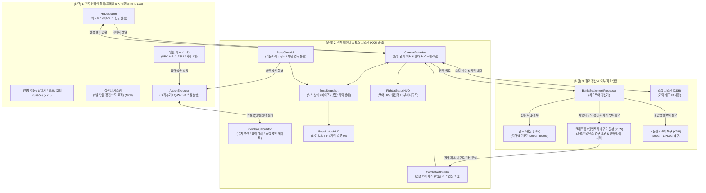
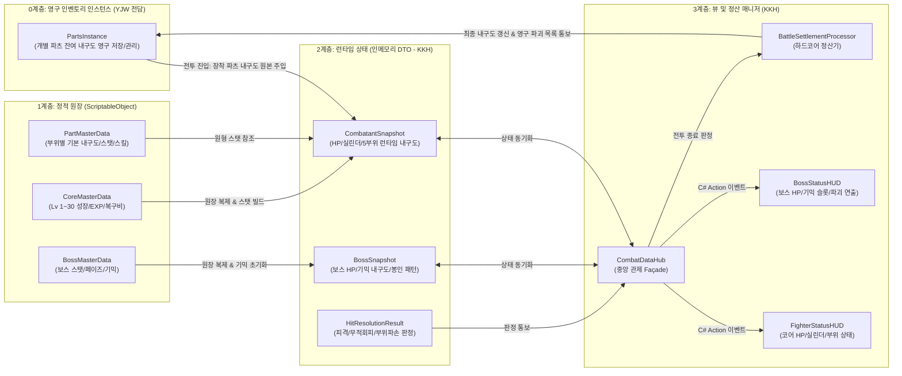
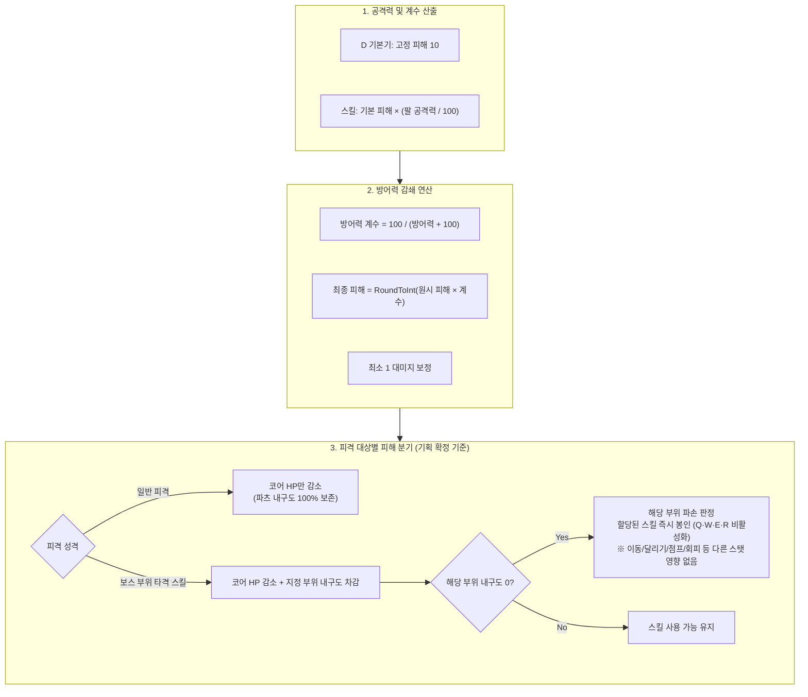
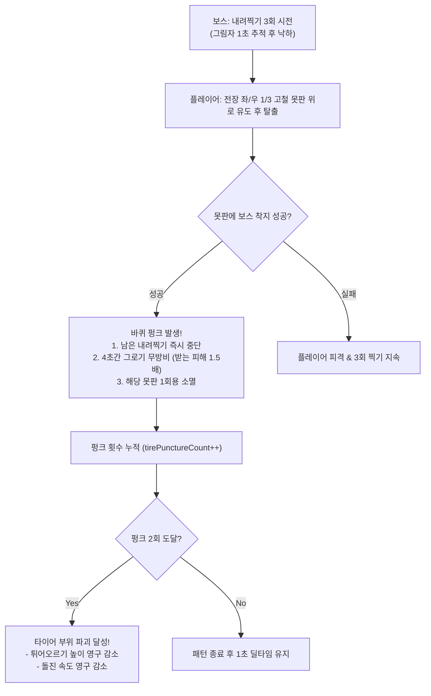
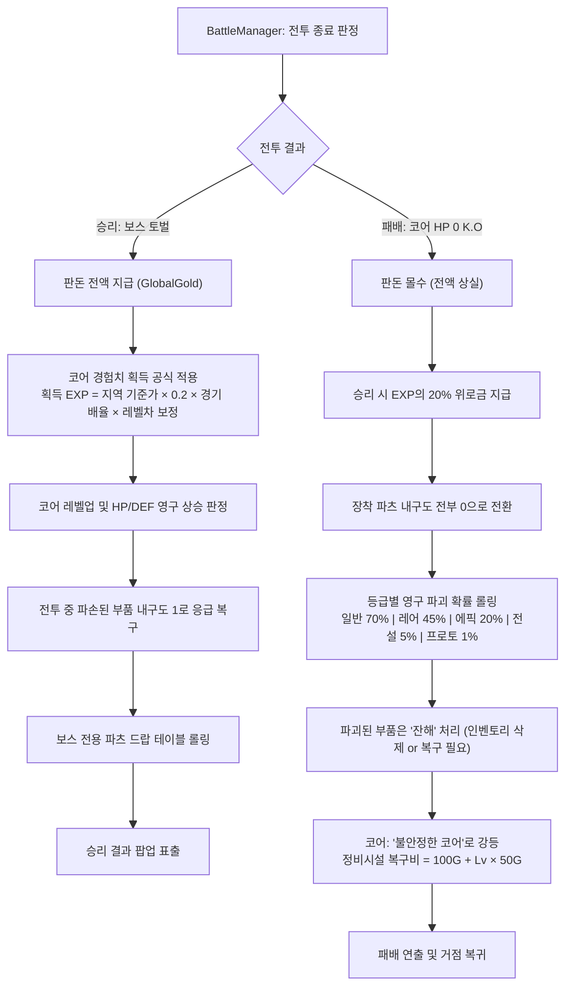

# 전투 데이터 & 보스 시스템(Battle & Boss System) 상세 아키텍처 설계서

- **문서 버전**: v5.4 (내구도 영구 원본 데이터 관리 주체 확정: YJW 인벤토리 인스턴스 전담 및 KKH 정산 연동 반영)
- **담당 파트**: **KKH (전투 데이터 매니지먼트 & 보스 시스템 총괄)**
- **협력 파트**:
  - **전투 행동/프레임 & 실린더 파트 (NYH)**: 2.5D 사이드뷰 실시간 액션 물리 엔진 (4방향 이동, ←←/→→ 달리기, ↑ 점프, Space 회피 무적 0.3초, D 기본기, 히트/허트박스 충돌 판정), **실린더 시스템 구현 (최대 3발, D 기본기 적중 시 충전, 스킬 소모/장전 로직 관리)**
  - **일반 적 AI 파트 (LJS)**: 경기장 상주 일반 적 NPC(A, B, C) AI 로직, 기물/부위 파괴 기믹 1개 보유 일반 적 행동 패턴 구현 및 지역 메타 파츠 연동
  - **스킬 파트 (CSH)**: 파츠별 Q·W·E·R 스킬, 머리 패시브, 기믹 태그(ID) 매핑, 주먹 발사 이펙트/연출, 보스 패턴 스킬
  - **크래프팅/인벤토리 & 내구도 원본 파트 (YJW)**: 부품 제작, **인벤토리 파츠 인스턴스 및 내구도 영구 데이터 원본 관리**, 거점 정비소 수리/복구, 전투 종료 후 KKH 정산 결과(`BattleSettlementResult`) 수신에 따른 인벤토리 내구도 최신화 및 영구 파괴 부품 잔해 처리/삭제
  - **골드/판돈 파트 (LSH)**: 지역별 기준가(500G~3000G), 판돈 협상, 경기 결과 골드 정산 (`GlobalGold`)
  - **고물상/코어 파트 (KDU)**: 고철 수집, 인벤토리 파츠 장착, 패배 시 '불안정한 코어' 정비시설 복구(`100G + Lv * 50G`)
- **기준 기획서**: `D:\3학년\리얼스틸 기획서.md` (2026-10-01 최신 기획 완전 일치)
- **최종 수정일**: 2026-10-01

---

## 1. 개요 및 파트별 역할 분담 (R&R)

### 1.1 기획 정합성 요약 (최신 기획서 핵심 룰)
1. **사이드뷰 실시간 액션 기믹 파훼형 보스전 (Blasphemous 레퍼런스)**:
   - 전투는 1:1 복싱이 아닌 **사이드뷰 실시간 액션 보스 전투**입니다.
   - **경직 시스템은 완전히 배제**하며, 무적 프레임은 회피(Space)와 일부 특정 스킬에만 존재합니다.
2. **조작 및 기본기 체계**:
   - 이동: `←` / `→` 좌우 이동, `←←` / `→→` 달리기, `↑` 점프
   - 회피 (`Space`): 쿨타임 1.0초, 전체 동작 0.5초, **무적 구간 0.05s ~ 0.35s (0.3초)**, 이동 거리 2.0, 공중 사용 불가, 자원 소모 없음
   - 일반 공격 (`D`): 파츠와 무관한 **고정 기본기** (파츠 파괴 시에도 항시 사용 가능), 쿨타임 0.5초, 기본 피해량 10, 사거리 1.2, **적중 시 실린더 탄 +1**
3. **실린더 시스템 (Cylinder System) — [NYH 전담]**:
   - 블래스터를 모티브로 스킬 사용 시 실린더 탄환을 소모하는 시스템으로 **NYH(전투 행동) 파트에서 전담 구현**합니다.
   - **최대 탄수 3발 (양팔 공용)**, **전투 시작 시 1발 기본 장전**
   - 장전: `D` 기본기 적중 시 +1, 일부 다리 스킬(스톰프, 백 부스트) 및 머리 패시브(자동 장전 장치: 6초마다 +1)로 충전
   - KKH 파트는 런타임 DTO 스냅샷 및 HUD 실린더 UI 동기화 인터페이스를 지원합니다.
4. **일반 적 AI 시스템 (Common Enemy AI) — [LJS 전담]**:
   - 경기장 맵 상주 NPC A, B, C의 전투 AI를 **LJS 파트에서 전담 구현**합니다.
   - **NPC A**: 판돈 0원 구제 경기 가능, 기물 파괴 기믹 1개 보유, 일반 등급 파츠
   - **NPC B**: 기준가 × 2.5 재산, 기물 파괴 기믹 1개 보유, 일반+레어 파츠
   - **NPC C**: 기준가 × 4 재산, 부위 파괴 기믹 1개 보유, 에픽급 지역 메타 파츠 사용
   - KKH 파트는 NPC 프리셋 스탯 공급(`CombatantBuilder`) 및 타격/피격 수치 연산 파이프라인을 지원합니다.
5. **내구도 및 부위 파괴 메카닉 [기획 확정 기준 & YJW 관리 방향 확정]**:
   - **체력(HP)은 오직 코어(Core)만 소유**: 코어 HP가 0이 되면 즉시 패배(K.O)합니다. 파츠에는 체력 개념이 없습니다.
   - **일반 피격 시**: **코어 체력(HP)만 감소**하며 파츠 내구도는 일체 감소하지 않습니다.
   - **보스 특정 스킬 피격 시**: **오직 보스의 특정 스킬에 피격될 때만 파츠 내구도가 감소**합니다. 보스 스킬마다 타격 부위(Head, LeftArm, RightArm, LeftLeg, RightLeg)가 정해져 있으며, 피격 시 해당 부위 파츠의 내구도가 감소합니다.
   - **부위 파괴(내구도 0)의 효과는 '해당 파츠 스킬 봉인뿐'**: 내구도가 0이 된 파츠는 파괴 판정을 받으며, 오직 해당 파츠에 할당된 스킬만 즉시 봉인됩니다 (머리: 패시브 해제, 왼팔: Q 봉인, 오른팔: W 봉인, 왼다리: E 봉인, 오른다리: R 봉인). 이동·달리기·점프·회피·공격력 등 다른 수치에는 일체 페널티가 없습니다.
   - **기본기 보존**: 코어 고정 기본기인 `D` 일반 공격은 모든 파츠가 파괴되어도 항상 사용 가능합니다.
   - **내구도 영구 원본 데이터 관리 주체 (YJW 파트 확정)**: 인벤토리 내 개별 장착 파츠의 잔여 내구도 영구 인스턴스는 **윤지우(YJW) 파트에서 전담 관리**합니다. 전투 진입 시 YJW 인벤토리에서 스탯을 주입받아 KKH 런타임 스냅샷을 생성하고, 전투 종료 시 KKH의 `BattleSettlementProcessor`가 최종 내구도 및 영구 파괴 목록을 YJW에게 이벤트로 전달하여 인벤토리에 일괄 동기화합니다.
6. **기본 파츠(Default Parts) 시스템**:
   - 슬롯이 비어 있는 부위마다 전투 입장 시 일반 등급 70% 스탯의 기본 파츠가 자동 장착되며, 전투 종료 시 소멸합니다.
7. **보스 시스템 & 기믹 파훼**:
   - 보스 기믹은 **1) 특정 기물 파괴**, **2) 보스 부위 파괴**로 구성됩니다.
   - 지역 1 보스(폐타이어+폐엔진): 못판 유도를 통한 타이어 펑크(그로기 4초, 받는 피해 1.5배, 2회 누적 시 부위 파괴), 돌진 예고 2초 중 피해 누적 스턴(3초), 모든 패턴 종료 후 1초 딜타임.
8. **하드코어 승패 정산 및 코어 30레벨 성장**:
   - 코어는 1~30레벨까지 성장하며, 구간별 HP/DEF 성장률과 필요 EXP 공식(`230 * 1.085^(Lv-1)`)을 가집니다.
   - 패배 시 판돈 전액 상실, 모든 장착 파츠 내구도 0 전환 및 등급별 영구 파괴 롤링(일반 70% ~ 프로토타입 1%), 코어는 '불안정한 코어'로 강등.



### 1.2 상세 파트 R&R 매트릭스

| 구분 | 전투 DB & 보스 시스템 (본인 - KKH) | 전투 행동/프레임 & 실린더 (NYH) | 일반 적 AI (LJS) | 크래프팅/인벤토리 & 내구도 원본 (YJW) | 스킬 파트 (CSH) |
| :--- | :--- | :--- | :--- | :--- | :--- |
| **핵심 성격** | **수치 연산 허브, 정산 및 보스 시스템 총괄** | **2.5D 실시간 액션 물리 & 탄환 관리** | **일반 적 NPC AI & 행동 패턴** | **인벤토리 및 파츠 내구도 원본 관리** | **개별 스킬 액션 리소스 및 연출** |
| **담당 범위** | • 런타임 스냅샷(`CombatantSnapshot`) 관리<br>• 코어 HP 대미지 감쇄 및 부위 피격 수치 연산<br>• D 기본기 항상 허용 / Q·W·E·R 스킬 봉인 게이트<br>• 기본 파츠(일반 70% 스탯) 자동 채움<br>• **보스 데이터 모델 및 기믹 파훼 총괄**<br>• **보스 상단 대형 HUD 제작**<br>• 코어 EXP(Lv 1~30) 및 승패 정산<br>• **전투 종료 시 최종 내구도/파괴 목록 YJW 전달** | • 60fps Tick 프레임 엔진 (`CombatClock`)<br>• 이동, 달리기, 점프, 회피(Space 0.3s)<br>• **실린더 시스템 구현 (최대 3발, D 적중 +1 장전, 스킬 소모 연계)**<br>• 충돌 판정 및 피격 애니메이션 | • 경기장 NPC A, B, C AI FSM 구현<br>• NPC A: 구제 경기, 기물 파괴 1개<br>• NPC B: 일반+레어, 기물 파괴 1개<br>• NPC C: 에픽급 지역 메타, 부위 파괴 1개<br>• KKH 스냅샷 기반 행동 트리거 | • **인벤토리 파츠 인스턴스 및 내구도 영구 저장/관리**<br>• 거점 정비소 수리(1h) 및 복구(4h)<br>• 전투 진입 시 KKH로 장착 파츠 스탯 주입<br>• **전투 정산 결과 수신 후 내구도 최신화 & 파괴 부품 잔해 처리/삭제** | • 파츠별 액티브 스킬 SO 작성<br>• Q·W·E·R 스킬 & 머리 패시브 구현<br>• 기믹 태그 ID 매핑<br>• 주먹 발사 이펙트/연출 (불독 스타일)<br>• 투사체 리소스 연동 |

---

## 2. 데이터 아키텍처 (3계층 분리 원칙 & YJW 인벤토리 내구도 연동)



---

## 3. 마스터 데이터 정의 (ScriptableObject 계층)

### 3.1 코어 마스터 데이터 (`CoreMasterData.cs`)
기획서 §6.5 조항에 따른 코어 1~30레벨 성장, 경험치 테이블 및 복구비 공식 스키마입니다.

```csharp
[CreateAssetMenu(fileName = "CoreMasterData", menuName = "RealSteel/DB/CoreMasterData", order = 0)]
public class CoreMasterData : ScriptableObject
{
    [Header("1. 기본 식별 정보")]
    public string coreID;
    public string coreName;
    [Range(1, 30)] public int coreLevel = 1;

    [Header("2. 코어 기본 스탯 (Lv.1 기준)")]
    public int baseHp = 300;               // Lv.1 기본 체력 300
    public int baseDefense = 20;           // Lv.1 기본 방어력 20
    public int baseAttackPower = 20;       // 로봇 기본 공격력

    [Header("3. 레벨 상한 및 복구 비용")]
    public const int MaxLevel = 30;

    [Header("4. 레벨업 누적 경험치 테이블 (Lv.1 ~ Lv.30)")]
    // 공식: 필요 EXP = 230 * 1.085^(Lv-1), Lv.30 누적 26,120
    public int[] requiredExpTable = new int[30]
    {
        230, 250, 270, 290, 320, 350, 380, 410, 440, 480,       // Lv.1 ~ 10
        520, 560, 610, 660, 720, 780, 850, 920, 1000, 1080,     // Lv.11 ~ 20
        1180, 1280, 1380, 1500, 1630, 1770, 1920, 2080, 2260, 0 // Lv.21 ~ 30 (MAX)
    };

    #region 레벨별 스탯 산출 헬퍼 메서드
    /// <summary>
    /// 기획서 §6.5.4 레벨별 HP 공식 산출:
    /// Lv.1: 300
    /// Lv.2~10: +15/Lv
    /// Lv.11~20: +20/Lv
    /// Lv.21~30: +25/Lv
    /// </summary>
    public int GetMaxHp(int level = -1)
    {
        int lv = Mathf.Clamp(level > 0 ? level : coreLevel, 1, MaxLevel);
        int hp = 300;

        if (lv <= 10)
            hp += (lv - 1) * 15;
        else if (lv <= 20)
            hp += (9 * 15) + (lv - 10) * 20;
        else
            hp += (9 * 15) + (10 * 20) + (lv - 20) * 25;

        return hp;
    }

    /// <summary>
    /// 기획서 §6.5.4 레벨별 방어력 공식 산출:
    /// Lv.1: 20
    /// Lv.2~10: +3/Lv
    /// Lv.11~20: +4/Lv
    /// Lv.21~30: +5/Lv
    /// </summary>
    public int GetDefense(int level = -1)
    {
        int lv = Mathf.Clamp(level > 0 ? level : coreLevel, 1, MaxLevel);
        int def = 20;

        if (lv <= 10)
            def += (lv - 1) * 3;
        else if (lv <= 20)
            def += (9 * 3) + (lv - 10) * 4;
        else
            def += (9 * 3) + (10 * 4) + (lv - 20) * 5;

        return def;
    }

    public int GetBaseAttackPower() => baseAttackPower;

    /// <summary>
    /// 기획서 §6.7.4 코어 복구비 공식: 100G + 코어레벨 * 50G
    /// </summary>
    public int GetRestoreCost(int level = -1)
    {
        int lv = level > 0 ? level : coreLevel;
        return 100 + (lv * 50);
    }
    #endregion
}
```

### 3.2 파츠 마스터 데이터 (`PartMasterData.cs`)
기획서 §6.6, §6.7, §6.20 조항에 따른 부위별 고유 내구도, 스탯 및 기믹 태그 스키마입니다.

```csharp
public enum BodyPart { Head, LeftArm, RightArm, LeftLeg, RightLeg, Core }
public enum PartGrade { Common, Rare, Epic, Legendary, Prototype }

/// <summary>
/// 기획서 §6.20.4 기믹 태그
/// </summary>
public enum GimmickTag
{
    None,
    ObjectBreak,      // 기물 파괴: 지상 기물에 추가 피해
    RangedObject,     // 원거리 기물: 멀리 있거나 높은 기물 타격
    HighPart,         // 상단 부위: 보스 머리·어깨 높이 판정
    MidPart,          // 중단 부위: 몸통 높이 판정
    LowPart           // 하단 부위: 다리·바닥 높이 판정
}

[CreateAssetMenu(fileName = "PartMasterData", menuName = "RealSteel/DB/PartMasterData", order = 1)]
public class PartMasterData : ScriptableObject
{
    [Header("1. 기본 식별 정보")]
    public string partID;
    public string partName;
    public BodyPart slotType;
    public PartGrade partGrade;

    [Header("2. 부위별 기본 최대 내구도 (기획서 §6.7.2)")]
    // 머리: 60, 팔: 100, 다리: 80
    public int baseDurability;

    [Header("3. 영구 파괴 확률 (기획서 §6.6.3)")]
    // 일반 70%, 레어 45%, 에픽 20%, 전설 5%, 프로토타입 1%
    [Range(0f, 1f)] public float destructionResistance;

    [Header("4. 부위별 특화 스탯 (전투 6종 스탯 연동)")]
    public int attackPower;        // 팔 파츠: 공격력 기여치
    public float moveSpeedBonus;   // 다리 파츠: 이동속도 보정
    public float critResistance;   // 머리 파츠: 치명타 저항
    public float critDamageReduction;

    [Header("5. 스킬 연동 (스킬 파트 CSH 매핑)")]
    public int activeSkillId = -1; // Q/W/E/R 키 바인딩 스킬 ID
    public GimmickTag gimmickTag;  // 기믹 파훼 태그 ID
    public int cylinderCost = 1;   // 스킬 사용 시 소모 실린더 탄수
}
```

### 3.3 기본 파츠 데이터 규격 (기획서 §6.8)
전투 입장 시 비어 있는 부위 슬롯에 자동 장착되는 임시 파츠 규칙입니다:
- **스탯**: 해당 부위 일반(Common) 등급의 70% 스탯 부여
- **스킬**: 팔·다리 공용 기본 스킬 1종 제공, 머리는 패시브 미제공
- **내구도**: 0 도달 시 해당 전투 동안만 봉인되며, **영구 파괴 대상에서 완전 제외**
- **소멸**: 전투 종료 시 자동 소멸 (인벤토리 보관/판매/수리 불가)

### 3.4 보스 마스터 데이터 (`BossMasterData.cs`) — KKH 전담
기획서 §6.17(지역 1 보스: 폐타이어+폐엔진) 명세를 반영한 보스 원장 에셋입니다.

```csharp
[System.Serializable]
public class BossGimmickPartData
{
    public string gimmickID;               // 예: "GIMMICK_NAIL_BOARD", "TIRE_PART", "CHARGE_CORE"
    public string gimmickName;             // 예: "고철 못판", "폐타이어", "돌진 축적 코어"
    public bool isPhysicalBossPart;        // true: 보스 본체 부위, false: 전장 설치형 기물
    public int maxDurability;              // 파괴 또는 저지에 필요한 요구 수치
    public GimmickTag requiredGimmickTag;  // 파훼에 요구되는 스킬 태그
    public string targetSkillIDToSeal;     // 파괴 시 봉인되는 보스 패턴 ID
    public float groggyDuration = 4.0f;    // 파훼 성공 시 그로기 시간 (못판: 4초)
    public float damageAmplification = 1.5f;// 그로기 중 받는 피해 배율 (1.5배)
}

[System.Serializable]
public class BossPhaseData
{
    public int phaseIndex;
    public float hpThresholdRatio;         // 페이즈 진입 HP 비율
    public List<string> availableSkillIDs; // 튀어오르기 탄막, 돌진, 3회 찍기 등
}

[CreateAssetMenu(fileName = "BossMasterData", menuName = "RealSteel/DB/BossMasterData", order = 2)]
public class BossMasterData : ScriptableObject
{
    [Header("보스 기본 정보")]
    public string bossID = "BOSS_REGION_01";
    public string bossName = "정크 휠러 (폐타이어 & 폐엔진)";
    public int maxHp = 4000;
    public int baseDefense = 40;
    public float patternPostDelay = 1.0f;  // 모든 패턴 종료 후 1초 딜레이(딜타임)

    [Header("지역 1 전용 기믹 목록 (기획서 §6.17)")]
    // 1. 고철 못판 (내려찍기 3회 유도 파훼 -> 바퀴 펑크, 그로기 4초, 못판 1회용 파괴)
    // 2. 타이어 부위 (펑크 2회 누적 시 부위 파괴 -> 높이/속도 감소)
    // 3. 돌진 예고 저지 (예고 2초 중 피해 누적 시 3초 스턴)
    public List<BossGimmickPartData> gimmickParts;

    [Header("페이즈 구성")]
    public List<BossPhaseData> phases;

    [Header("토벌 보상 테이블")]
    public int rewardGold = 1500;
    public int rewardCoreExp = 500;
}
```

---

## 4. 런타임 상태 모델 계층 (인메모리 DTO)

### 4.1 플레이어 런타임 스냅샷 (`CombatantSnapshot.cs`)
**체력(HP)은 오직 코어만 단독 보유**하며, **5개 파츠는 스킬 시전 시 소모되는 런타임 내구도(Durability)**만 독립적으로 관리합니다.

```csharp
[Serializable]
public class CombatantSnapshot
{
    // 1. 기본 식별 정보
    public string fighterID = "Player";
    public bool isPlayer = true;

    // 2. 코어 실시간 스탯 (체력은 코어만 소유! 0 도달 시 패배)
    public int currentHp;                  // 코어 현재 체력
    public int maxHp;                      // 코어 최대 체력
    public int baseDefense;                // 코어 본체 방어력
    public int coreLevel;
    public int currentCoreExp;

    // 3. 실린더 시스템 (기획서 §6.11 / NYH 전담)
    public int currentCylinder = 1;        // 전투 시작 시 1발 장전
    public const int MaxCylinder = 3;      // 최대 3발 (양팔 공용)

    // 4. 복합 연산 스탯 (기획서 §6.12.3)
    public int totalAttackPower;           // 기본Atk + (왼팔Atk + 오른팔Atk) / 2
    public float finalMoveSpeed;           // (왼다리Speed + 오른다리Speed) / 2

    // 5. 5개 파츠 실시간 내구도 맵 (보스 특정 스킬 피격 시에만 차감)
    public Dictionary<BodyPart, PartRuntimeState> partStates = new();

    // 6. 스킬 봉인 및 내구도/실린더 헬퍼
    /// <summary>
    /// 내구도가 0 이하(파손)인지 검사 (스킬 봉인 판정)
    /// </summary>
    public bool IsPartBroken(BodyPart part)
    {
        return !partStates.TryGetValue(part, out var state) || state.isBroken;
    }

    /// <summary>
    /// 보스 특정 부위 타격 스킬 피격 시 해당 부위의 내구도 차감
    /// 내구도 0 도달 시 true 반환 (부위 파손 및 스킬 봉인 발생)
    /// </summary>
    public bool ConsumePartDurability(BodyPart part, int amount)
    {
        if (partStates.TryGetValue(part, out var state))
        {
            state.Consume(amount);
            return state.isBroken;
        }
        return false;
    }

    public bool CanSpendCylinder(int cost) => currentCylinder >= cost;
    public void SpendCylinder(int cost) => currentCylinder = Mathf.Max(0, currentCylinder - cost);
    public void AddCylinder(int count = 1) => currentCylinder = Mathf.Min(MaxCylinder, currentCylinder + count);
}
```

### 4.2 보스 런타임 스냅샷 (`BossSnapshot.cs`) — KKH 전담
```csharp
[Serializable]
public class BossSnapshot
{
    public string bossID;
    public string bossName;
    public int currentHp;
    public int maxHp;
    public int baseDefense;
    public int currentPhase = 1;

    // 상태 플래그
    public bool isGroggy = false;          // 기믹 파훼 시 4초 무력화 (받는 피해 1.5배)
    public float currentDamageMultiplier = 1.0f;
    public int tirePunctureCount = 0;      // 못판 펑크 누적 횟수 (2회 시 타이어 영구 파괴)

    // 기믹 실시간 상태 및 봉인된 패턴 목록
    public Dictionary<string, BossGimmickRuntimeState> gimmickStates = new();
    public HashSet<string> sealedSkills = new();
}
```

### 4.3 타격 판정 결과 DTO (`HitResolutionResult.cs`)
기획서 표준에 따라 일반 피격은 코어 HP만 차감하고, 보스 특정 스킬 피격 시에만 해당 부위 내구도가 차감됩니다.

```csharp
public class HitResolutionResult
{
    public bool isEvaded;                  // Space 회피 무적(0.3s) 회피 성공 여부
    public int coreHpDamage;               // 코어 체력 피해량 (모든 피격 시 코어 HP 차감)
    public BodyPart targetBodyPart;        // 보스 스킬에 의해 지정된 타격 부위 (일반 공격은 Core)
    public int partDurabilityDamage;       // 보스 특정 스킬로 인한 파츠 내구도 피해량 (일반 공격 시 0)
    public bool isPartDestroyed;           // 이번 피격으로 해당 부위가 파손(스킬 봉인)되었는지 여부
    public bool cylinderGained;            // D 기본기 적중으로 탄환 +1 획득 여부

    // 보스 피격 전용
    public string hitGimmickID;
    public bool isGimmickTriggered;        // 못판 착지 펑크 / 스턴 저지 성공 여부
    public bool isBossGroggyStarted;       // 4초 그로기 진입 여부
}
```

---

## 5. 수치 연산 코어 (`CombatCalculator.cs`)

### 5.1 방어력 감쇄 대미지 공식 및 수치 연산 파이프라인
기획서 §6.5 및 §6.20 조항에 따른 최종 피해 공식:

$$
\text{실제 피해} = \text{기본 피해량} \times \left( \frac{\text{팔 공격력}}{100} \right)
$$

$$
\text{최종 피해} = \text{실제 피해} \times \left( \frac{100}{\text{방어력} + 100} \right)
$$



### 5.2 연산 메서드 명세
```csharp
public static class CombatCalculator
{
    // 방어력 감쇄 계산
    public static int CalculateDamage(float rawDamage, int defense)
    {
        float multiplier = 100f / (Mathf.Max(0, defense) + 100f);
        return Mathf.Max(1, Mathf.RoundToInt(rawDamage * multiplier));
    }

    // 보스/적 -> 플레이어 공격 판정 [기획 확정 기준]
    // 1) 일반 피격: 코어 HP만 감소 (targetPart == BodyPart.Core)
    // 2) 보스 부위 타격 스킬: 코어 HP 차감 + 해당 지정 부위 내구도 차감
    public static HitResolutionResult EvaluateBossAttack(
        BossSnapshot boss,
        CombatantSnapshot player,
        float skillRawDamage,
        BodyPart targetPart,
        int partDamageAmount,
        bool isPlayerInvincible)
    {
        var result = new HitResolutionResult();

        // 1) Space 회피(0.3초) 무적 회피 판정
        if (isPlayerInvincible)
        {
            result.isEvaded = true;
            return result;
        }

        // 2) 코어 HP 차감 (모든 공격 공통 방어력 감쇄 적용)
        result.coreHpDamage = CalculateDamage(skillRawDamage, player.baseDefense);
        player.currentHp = Mathf.Max(0, player.currentHp - result.coreHpDamage);

        // 3) 보스 특정 스킬인 경우에만 지정 부위 내구도 차감
        if (targetPart != BodyPart.Core && player.partStates.TryGetValue(targetPart, out var partState))
        {
            result.targetBodyPart = targetPart;
            result.partDurabilityDamage = partDamageAmount;
            result.isPartDestroyed = player.ConsumePartDurability(targetPart, partDamageAmount);

            if (result.isPartDestroyed)
            {
                // 부위 파손 및 스킬 봉인 이벤트 브로드캐스팅
                CombatDataHub.Instance?.BroadcastPlayerPartBroken(targetPart);
            }
        }

        return result;
    }

    // 플레이어 -> 보스 공격 판정 (기믹 파훼 포함)
    public static HitResolutionResult EvaluatePlayerAttack(
        CombatantSnapshot player,
        BossSnapshot boss,
        float skillBaseDamage,
        bool isBasicAttackD,
        GimmickTag attackTag = GimmickTag.None,
        string targetGimmickID = null)
    {
        var result = new HitResolutionResult();

        // 1) D 기본기 적중 시 탄환 +1 장전 (NYH 실린더 연동)
        if (isBasicAttackD)
        {
            player.AddCylinder(1);
            result.cylinderGained = true;
        }

        // 2) 그로기 상태 1.5배 대미지 배율 적용
        float damageMultiplier = boss.isGroggy ? 1.5f : 1.0f;
        float actualDamage = isBasicAttackD ? 10f : skillBaseDamage * (player.totalAttackPower / 100f);
        result.coreHpDamage = CalculateDamage(actualDamage * damageMultiplier, boss.baseDefense);
        boss.currentHp = Mathf.Max(0, boss.currentHp - result.coreHpDamage);

        // 3) 기믹 타격 처리
        if (!string.IsNullOrEmpty(targetGimmickID) && boss.gimmickStates.TryGetValue(targetGimmickID, out var gimmick))
        {
            gimmick.currentDurability = Mathf.Max(0, gimmick.currentDurability - Mathf.RoundToInt(actualDamage));
            if (gimmick.currentDurability <= 0 && !gimmick.isBroken)
            {
                gimmick.isBroken = true;
                result.isGimmickTriggered = true;
            }
        }

        return result;
    }

    // 행동 실행 가능 게이트 (기획서 §6.12.4, §6.12.9)
    public static bool CanExecuteAction(CombatantSnapshot player, ActionSource source, BodyPart requiredPart, int cylinderCost = 0)
    {
        // D 기본기: 코어 고정 기본기이므로 부위 파괴 및 실린더와 무관하게 항상 사용 가능
        if (source == ActionSource.CoreFixed)
            return true;

        // Q·W·E·R 스킬: 해당 부위 내구도가 0(파손)이면 즉시 실행 차단 (스킬 봉인)
        if (source == ActionSource.Part)
        {
            if (player.IsPartBroken(requiredPart)) return false;
            if (cylinderCost > 0 && !player.CanSpendCylinder(cylinderCost)) return false;
        }

        return true;
    }
}
```

---

## 6. 보스 시스템 상세 설계 (Boss Architecture) — KKH 총괄

### 6.1 지역 1 보스 기믹 파훼 흐름도 (못판 유도 & 타이어 펑크)
기획서 §6.17 조항에 따른 지역 1 보스 핵심 공략 메카닉입니다:



### 6.2 보스 라이프사이클 및 페이즈 머신
```csharp
public enum BossState
{
    Intro,           // 보스 등장 컷씬 연출
    PatternExecute,  // 탄막 / 돌진 / 3회 찍기 패턴 실행 중
    PostPatternDelay,// 모든 패턴 종료 후 1초 딜레이 (딜타임)
    Groggy,          // 못판 펑크 성공으로 인한 4초 무방비 상태 (피해 1.5배)
    Stunned,         // 돌진 예고 2초 중 피해 누적 성공 시 3초 스턴
    PhaseTransition, // 페이즈 전환 연출 (무적)
    Dead             // 토벌 완료
}
```

### 6.3 보스 전용 UI (`BossStatusHUD.cs`)
- **최상단 중앙 대형 게이지**: 보스 명칭(`정크 휠러`), 총합 체력 슬라이더, 페이즈 표시
- **하단 기믹 위젯**:
  - 좌/우 고철 못판 활성화 상태 아이콘 (1회용 소멸 시 비활성화)
  - 타이어 펑크 누적 게이지 (0/2 -> 2/2 파괴 시 `TIRE DESTROYED` 연출)
  - 돌진 예고 시 보스 머리 위 누적 피해 게이지 팝업

---

## 7. 전투 라이프사이클 & 하드코어 결과 정산 (`BattleSettlementProcessor.cs`)

### 7.1 승패 정산 규칙 및 흐름도 (기획서 §6.5, §6.6, §6.7, §6.12.11)



### 7.2 코어 경험치 획득 및 승패 정산 로직 명세
```csharp
public static class BattleSettlementProcessor
{
    /// <summary>
    /// 기획서 §6.5.6 경험치 획득 공식:
    /// 획득 EXP = 지역 기준가 * 0.2 * 경기 배율 * 레벨차 보정
    /// </summary>
    public static int CalculateGainedExp(int regionBasePrice, float matchMultiplier, float levelDiffMultiplier, bool isWin)
    {
        float baseExp = regionBasePrice * 0.2f * matchMultiplier * levelDiffMultiplier;
        return isWin ? Mathf.RoundToInt(baseExp) : Mathf.RoundToInt(baseExp * 0.2f); // 패배 시 20%
    }

    /// <summary>
    /// 코어 경험치 누적 및 레벨업 정산
    /// </summary>
    public static void ProcessCoreExp(CombatantSnapshot player, int gainedExp, CoreMasterData coreMaster)
    {
        if (player.coreLevel >= CoreMasterData.MaxLevel) return;

        player.currentCoreExp += gainedExp;
        int reqExp = coreMaster.requiredExpTable[player.coreLevel - 1];

        while (player.currentCoreExp >= reqExp && player.coreLevel < CoreMasterData.MaxLevel)
        {
            player.currentCoreExp -= reqExp;
            player.coreLevel++;
            player.maxHp = coreMaster.GetMaxHp(player.coreLevel);
            player.baseDefense = coreMaster.GetDefense(player.coreLevel);
            player.currentHp = player.maxHp; // 완충

            CombatDataHub.Instance.BroadcastCoreLevelUp(player.coreLevel, player.maxHp, player.baseDefense);

            if (player.coreLevel < CoreMasterData.MaxLevel)
                reqExp = coreMaster.requiredExpTable[player.coreLevel - 1];
        }
    }
}
```

### 7.3 내구도 영구 데이터 관리(YJW) 및 정산 동기화 파이프라인 [확정]

- **책임 분리(R&R)**:
  - **윤지우(YJW)**: 인벤토리 파츠 인스턴스(`PartsInstance`)의 잔여 내구도 원본을 영구 저장/관리하며, 거점 정비소 수리(1시간/골드) 및 복구(4시간/골드+재료)를 전담합니다.
  - **김관현(KKH)**: 전투 동안 인메모리 스냅샷(`CombatantSnapshot`)에서만 내구도를 임시 차감하며, 전투 종료 시 최종 결과 DTO(`BattleSettlementResult`)를 생성해 YJW에게 발행합니다.
- **전투 종료 시 동기화 인터페이스 계약**:
  ```csharp
  [Serializable]
  public class BattleSettlementResult
  {
      public bool PlayerWon;
      public int GoldDelta;                                      // 판돈 획득/상실
      public int CoreExpGained;                                  // 획득 코어 EXP
      public bool CoreUnstable;                                  // 코어 불안정 상태 전락 여부
      public Dictionary<string, int> FinalPartDurabilities;      // [YJW 연동] 부품별 최종 잔여 내구도 (파손 시 승리면 1로 응급 복구 수치)
      public List<string> DestroyedPartIDs = new();              // [YJW 연동] 패배 시 등급별 확률 롤링으로 영구 파괴된 부품 ID 목록
      public string SummaryMessage;
  }
  ```
- **YJW 파트의 수신 후 처리 흐름**:
  1. `OnSettlementCompleted` 수신: `FinalPartDurabilities`를 기반으로 인벤토리 내 장착 파츠들의 현재 내구도 값을 일괄 업데이트.
  2. `OnPartsPermanentlyDestroyed` 수신: `DestroyedPartIDs`에 포함된 부품들을 인벤토리에서 '잔해(파괴)' 상태로 전환하거나 삭제 처리.

---

## 8. 중앙 관제 허브 (`CombatDataHub.cs`) API 및 이벤트 계약

```csharp
// 1. 전투 초기화
public void InitializeBattle(CombatantSnapshot player, BossSnapshot boss);

// 2. 피격 및 연산 질의 (NYH 실행부 호출)
public HitResolutionResult ProcessBossHit(string targetGimmickId, float rawDamage, GimmickTag tag);
public HitResolutionResult ProcessPlayerHit(BodyPart targetPart, float rawDamage, int partDamage);
public bool CanExecutePlayerAction(ActionSource source, BodyPart requiredPart, int cylinderCost);

// 3. 상태 질의 (HUD 바인딩용)
public CombatantSnapshot PlayerSnapshot { get; }
public BossSnapshot BossSnapshot { get; }
```

### 브로드캐스팅 이벤트 목록

| 이벤트 명 | 매개변수 | 용도 |
| :--- | :--- | :--- |
| `OnPlayerHpChanged` | `(int curHp, int maxHp)` | 플레이어 하단 체력바 갱신 |
| `OnPlayerCylinderChanged` | `(int curCylinder, int maxCylinder)` | 3발 실린더 탄창 UI 표출 |
| `OnPlayerPartDurabilityChanged` | `(BodyPart part, int cur, int max)` | 5부위 내구도 슬라이더 갱신 |
| `OnPlayerPartBroken` | `(BodyPart brokenPart)` | 해당 스킬 Q·W·E·R X 아이콘 봉인 표출 |
| `OnBossHpChanged` | `(int curHp, int maxHp, int phase)` | 상단 보스 체력바 갱신 |
| `OnBossGimmickTriggered` | `(string gimmickId, bool isGroggy)` | 못판 펑크 / 스턴 / 4초 그로기 연출 |
| `OnBossTireDestroyed` | `(int punctureCount)` | 타이어 영구 파괴 연출 |
| `OnCoreLevelUp` | `(int newLv, int newHp, int newDef)` | 전투 종료 코어 레벨업 팝업 |
| `OnBattleEnded` | `(BattleSettlementResult result)` | 하드코어 결과 정산 팝업 |

---

## 9. KKH 실무 체크리스트 (Action Items)

### [Phase 1] 코어 & 파츠 데이터 모델 최신화 (완료/진행)
- [x] **`CoreMasterData.cs` 헬퍼 메서드 추가**: `GetMaxHp()`, `GetDefense()`, `GetBaseAttackPower()` 구현 완료
- [ ] **`CoreMasterData.cs` 기획서 공식 전면 반영**:
  - [ ] Lv 1~30 레벨 성장 공식 적용 (Lv.1: HP 300, DEF 20 / 구간별 +15/+3, +20/+4, +25/+5)
  - [ ] 기획서 공식 30레벨 누적 경험치 테이블 및 복구비 공식(`100G + Lv * 50G`) 반영
- [ ] **`PartMasterData.cs` 스펙 반영**:
  - [ ] 부위별 기본 내구도 (머리: 60, 팔: 100, 다리: 80)
  - [ ] 기획서 기믹 태그(`GimmickTag`) 열거형 연동

### [Phase 2] 실린더(NYH) & 일반 적 AI(LJS) 연동 및 수치 연산
- [ ] **실린더 시스템 연동 (NYH 파트 협업)**:
  - [ ] `CombatantSnapshot.cs`에 실린더 상태(`currentCylinder = 1`, `MaxCylinder = 3`) 반영
  - [ ] NYH 실행부의 D 기본기 적중 / 탄환 소모에 따른 실시간 HUD 브로드캐스팅 이벤트 연계
- [ ] **일반 적 AI 스탯 연동 (LJS 파트 협업)**:
  - [ ] `CombatantBuilder.cs`: NPC A, B, C 전용 프리셋 스냅샷 생성기 지원 (기물/부위 파괴 기믹 1개 연동)
  - [ ] LJS AI가 KKH `CombatDataHub`를 통해 공격 액션 및 스킬 판정을 질의할 수 있도록 인터페이스 개방
- [ ] **`CombatCalculator.cs` 연산 리팩토링**:
  - [ ] 일반 피격 시 코어 HP만 감쇄 차감 (파츠 내구도 100% 보존)
  - [ ] 보스 특정 스킬 피격 시 코어 HP 감쇄 차감 + 해당 지정 부위 내구도 차감(`ConsumePartDurability`)
  - [ ] 피격으로 내구도 0 도달 시 해당 부위 파손 판정 및 `OnPlayerPartBroken` 이벤트 브로드캐스팅
  - [ ] `CanExecuteAction`: 부위 내구도가 0(파손)이면 해당 Q·W·E·R 스킬 실행 차단 (스킬 봉인, D 기본기는 항상 허용)
  - [ ] Space 회피 무적(0.3s) 회피 판정

### [Phase 3] 지역 1 보스 시스템 및 기믹 파훼 구현
- [ ] **`BossMasterData.cs` & `BossSnapshot.cs` 생성**:
  - [ ] 보스 기본 스탯 (체력 4000, 방어력 40, 딜타임 1.0s)
  - [ ] 고철 못판 유도 착지 펑크 기믹 (4초 그로기 1.5배 피해, 못판 소멸)
  - [ ] 펑크 2회 누적 시 타이어 부위 파괴 판정
  - [ ] 돌진 예고 2초 중 피해 누적 스턴(3초) 판정
- [ ] **`BossStatusHUD.cs` 상단 UI 제작**:
  - [ ] 상단 대형 보스 체력바 + 기믹 슬롯(못판/타이어) 위젯

### [Phase 4] 승패 정산 및 통합 검증
- [ ] **`BattleSettlementProcessor.cs` 고도화**:
  - [ ] 지역 기준가 기반 코어 경험치 획득 공식 적용
  - [ ] 패배 시 불안정한 코어 강등 및 등급별 영구 파괴 롤링
- [ ] **테스트 씬 (`Battle_Test_KKH`) 검증**:
  - [ ] D 기본기 타격 -> 실린더 충전 확인
  - [ ] 보스 공격 -> 일반 공격은 코어 HP만 감소, 특수 공격만 파츠 내구도 감소 확인
  - [ ] 못판 기믹 유도 -> 보스 4초 그로기 및 1.5배 피해 적용 확인
