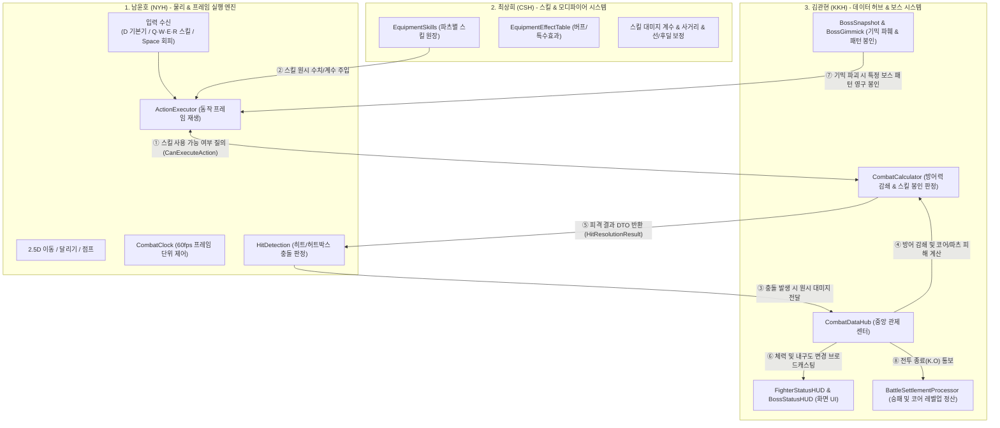

# 전투 파트 3인 협업 체계 및 실행 가이드 (Battle Team 3-Way R&R)

> **프로젝트**: 리얼 스틸 (카쿠토우 / 팀 999)  
> **장르**: 2.5D 사이드뷰 실시간 액션 기믹 파훼형 보스전 (Blasphemous 레퍼런스)  
> **전투 파트원 (3명)**:
> 1. **남윤호 (NYH)**: 전투 실행 엔진 & 물리/프레임
> 2. **최상희 (CSH)**: 스킬 시스템 & 모디파이어/이펙트
> 3. **김관현 (KKH - 본인)**: 전투 데이터 매니지먼트 & 보스 시스템 총괄

---

## 1. 전투 파트 3인 핵심 역할 분담 (R&R)

전투는 **「몸체(물리) + 무기(스킬) + 두뇌(데이터/보스)」**의 3박자로 완벽히 분리되어 동작합니다.



---

## 2. 파트원별 상세 담당 업무 및 산출물

### 1) 남윤호 (NYH) — "전투의 몸체 (물리 & 프레임)"
* **핵심 역할**: 플레이어와 보스가 전장에서 실제로 움직이고, 때리고, 피하는 **실시간 60fps 프레임 엔진**.
* **주요 담당 업무**:
  * **조작 및 이동**: 좌우 이동(`←/→`), 대시 달리기(`←←/→→`), 점프(`↑`), 회피(`Space`, 0.3초 무적 구간 적용).
  * **프레임 단위 액션 실행 (`CombatClock`, `ActionExecutor`)**: 선딜 $\rightarrow$ 공격 판정 유효 프레임 $\rightarrow$ 후딜레이 제어.
  * **충돌 판정 (`HitDetection`, `BoxResolver`)**: 공격 히트박스와 피격 허트박스가 겹쳤을 때 충돌 감지 후 KKH 허브로 전달.
  * **피격 리액션**: 넉백(`KnockbackSystem`) 및 피격 애니메이션 트리거.

---

### 2) 최상희 (CSH) — "전투의 무기 (스킬 & 특수효과)"
* **핵심 역할**: 플레이어가 장착한 파츠와 보스가 시전하는 **개별 스킬의 수치, 효과, 연출 연결**.
* **주요 담당 업무**:
  * **파츠별 스킬 데이터화 (`EquipmentSkills`)**:
    * 왼팔(`Q`), 오른팔(`W`), 왼다리(`E`), 오른다리(`R`)에 장착될 스킬 ScriptableObject 에셋 제작.
    * 스킬별 기본 피해량, 사거리, 쿨타임, 선/후딜레이 프레임 설정.
  * **특수 옵션 및 패시브 시스템 (`EquipmentEffectTable`, `ResolvedModifiers`)**:
    * 머리 파츠의 고유 패시브(자동 적용).
    * 특정 파츠 장착 시 발동하는 조건부 버프(쿨타임 감소, 선딜 감소 등) 모디파이어 연산.
  * **스킬 비주얼 연출**: 주먹에서 뻗어 나가는 투사체/이펙트(메이플 불독 스타일) 바인딩.

---

### 3) 김관현 (KKH - 본인) — "전투의 두뇌 (데이터 매니지먼트 & 보스 총괄)"
* **핵심 역할**: 모든 전투 수치의 **정확한 연산(공식 적용), 보스 기믹/패턴 통제, 승패 결과 정산 및 HUD UI 표출**.
* **주요 담당 업무**:
  * **중앙 데이터 허브 (`CombatDataHub`)**:
    * NYH(물리)와 CSH(스킬) 사이에서 실시간 스탯을 공급하고 피격 결과를 계산해 주는 중심 창구.
  * **수치 공식 계산 (`CombatCalculator`)**:
    * 기획서 방어력 공식: $\text{피해량} = \text{원시 피해} \times \frac{100}{\text{방어력} + 100}$
    * 일반 피격 $\rightarrow$ 코어 체력만 차감, 보스 특정 패턴 피격 $\rightarrow$ 해당 파츠 내구도 차감.
    * **스킬 봉인 게이트 (`CanExecuteAction`)**: `D 고정 기본기`는 항상 허용, `Q·W·E·R 스킬`은 해당 파츠 내구도 0 시 시전 차단.
  * **보스 시스템 총괄 (`BossMasterData`, `BossSnapshot`, `BossGimmick`)**:
    * Blasphemous 스타일 기믹 파훼형 보스 원장 및 페이즈 머신(1, 2, 3 페이즈) 설계.
    * 플레이어가 보스의 특정 기물/부위 파괴 시 $\rightarrow$ 보스의 특정 스킬 패턴 영구 봉인 및 3초 그로기 유발.
  * **전투 HUD (`FighterStatusHUD`, `BossStatusHUD`)**:
    * 플레이어 상태: 가슴 `CORE` 및 하단 대형 체력바(`440/440`) + 5개 부위 내구도 슬라이더.
    * 보스 상태: 상단 대형 체력바 및 파괴 가능한 기믹 슬롯 UI.
  * **하드코어 정산 (`BattleSettlementProcessor`)**:
    * 코어 체력 0 도달 시 즉시 K.O 판정 $\rightarrow$ 판돈 몰수, 파츠 영구 파괴 확률 롤링(70%~1%), 코어 강등('불안정한 코어').
    * 보스 토벌 승리 시 $\rightarrow$ 판돈 전액 지급, 코어 경험치(EXP) 획득 및 레벨업 반영, 파손 부품 내구도 1 자동 복구.

---

## 3. 실시간 전투 루프 (3자 협업 시나리오)

실제 인게임 1프레임 동안 3명의 코드가 어떻게 맞물려 돌아가는지 보여주는 예시입니다:

```text
[상황 1: 플레이어가 Q(왼팔 스킬)을 입력했을 때]
1. (NYH) PlayerInputSource가 Q키 입력을 감지함.
2. (NYH) ActionExecutor가 기술을 시작하기 전 KKH에게 질의: 
         CombatDataHub.Instance.CanExecutePlayerAction(ActionSource.Part, BodyPart.LeftArm)
3. (KKH) 왼쪽 팔 내구도를 확인:
         - 내구도 > 0 : true 반환 -> (NYH) 스킬 모션 실행 & (CSH) 이펙트 발사!
         - 내구도 <= 0 (파손): false 반환 -> (NYH) 시전 불발, 아무것도 나가지 않음.

[상황 2: 보스의 강력한 스킬이 플레이어에게 적중했을 때]
1. (NYH) HitDetection이 보스 공격 박스와 플레이어 허트박스 충돌을 감지.
2. (NYH) 즉시 KKH 허브 호출: 
         CombatDataHub.Instance.ProcessPlayerHit(targetPart: BodyPart.LeftArm, rawDamage: 80, partDamage: 25)
3. (KKH) 회피 무적 여부 확인 후 수치 연산:
         - 방어력 감쇄 공식으로 코어 실질 피해 계산 -> Player Core HP 차감
         - 보스 스킬에 지정된 왼팔 파츠 내구도 25 차감 -> 왼팔 파손 여부 판정
4. (KKH) 이벤트 발행: OnPlayerHpChanged, OnPlayerPartDurabilityChanged
5. (KKH) FighterStatusHUD가 이벤트를 받아 가슴의 CORE 게이지, 하단 440/440 숫자, 왼팔 슬라이더를 즉시 깎음.
6. (NYH) 반환받은 결과 DTO(HitResolutionResult)를 바탕으로 플레이어에게 넉백 및 피격 경직 애니메이션 적용.
```

---

## 4. 전투 파트 성공을 위한 협업 약속

1. **상대방 코드를 직접 수정하지 않는다.**
   * NYH는 KKH의 계산 로직을 건드리지 않고 `CombatDataHub`의 메서드만 호출합니다.
   * KKH는 NYH의 물리 좌표나 프레임 엔진을 직접 건드리지 않고 수치 결과 DTO만 돌려줍니다.
   * CSH는 SO 데이터와 모디파이어를 제공하며 시스템 인터페이스에 주입합니다.
2. **이벤트 기반으로 통신한다.**
   * UI(HUD)나 외부 연출은 Update()에서 매 프레임 수치를 검사하지 않고, KKH 허브의 `Action` 이벤트(`OnPlayerHpChanged`, `OnBossGimmickBroken` 등)를 구독하여 동작합니다.
3. **더미(Dummy) 기반 독립 테스트를 보장한다.**
   * 아직 상대방 파트가 완성되지 않았더라도, 각자 만든 모듈이 `Test` 씬에서 버튼이나 인스펙터 조작만으로 완벽히 검증될 수 있도록 Stub/Mock을 유지합니다.
