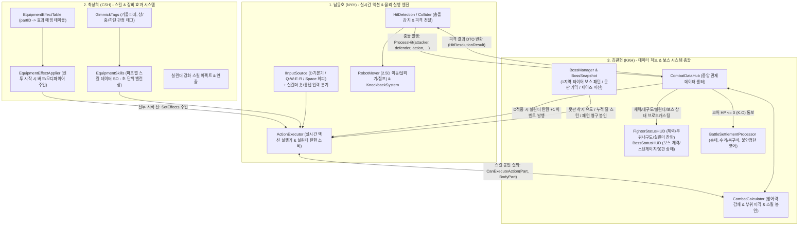

# 전투 파트 3인 협업 체계 및 실행 가이드 (Battle Team 3-Way R&R)

> **프로젝트**: 리얼 스틸 (카쿠토우 / 팀 999)  
> **장르**: 2.5D 사이드뷰 실시간 액션 기믹 파훼형 보스전 (Blasphemous 레퍼런스)  
> **문서 버전**: v3.1 (프레임 엔진 폐기 반영: 유니티 표준 실시간 액션 물리 기반으로 전면 전환)  
> **전투 파트원 (3명)**:
> 1. **남윤호 (NYH)**: 전투 실행 엔진 & 실시간 액션 물리 (ActionExecutor, HitDetection, RobotMover, CylinderInput)
> 2. **최상희 (CSH)**: 스킬/특수효과 & 기믹 태그 시스템 (EquipmentSkills, GimmickTags, EquipmentEffectTable, EquipmentEffectApplier)
> 3. **김관현 (KKH - 본인)**: 전투 데이터 매니지먼트 & 보스 시스템 총괄 (CombatDataHub, CombatCalculator, BossEngine, BattleSettlement, StatusHUD)

---

## 1. 전투 파트 3인 핵심 역할 분담 (R&R)

> 💡 **주요 변경 사항: 복잡한 60fps 격투 프레임 엔진(`CombatClock`, 프레임 단위 박스 스텝) 폐기**  
> 유니티 표준 실시간 사이드뷰 액션(Update/FixedUpdate, 콜라이더/트리거, 초(Second) 단위 쿨타임 및 무적 시간)으로 전환되어 시스템이 훨씬 직관적이고 가벼워졌습니다.

전투는 **「몸체(실시간 액션 물리) + 무기(스킬 & 기믹 태그) + 두뇌(데이터 & 보스 기믹 총괄)」**의 3박자로 분리되어 동작합니다.



---

## 2. 파트원별 상세 담당 업무 및 실제 연동 파일

### 1) 남윤호 (NYH) — "전투의 몸체 (실시간 액션 물리, 이동, 실린더 조작)"
* **핵심 역할**: 플레이어와 보스가 전장에서 실제로 움직이고, 때리고, 피하는 **2.5D 실시간 액션 물리 및 조작 엔진**.
* **주요 담당 업무**:
  * **조작 및 실린더 입력 (`IInputSource`, `PlayerInputSource`)**:
    * 좌우 이동(`←/→`), 대시 달리기(`←←/→→`), 점프(`↑`), 회피(`Space`, 0.3초 무적 구간 적용, 자원 0 소모).
    * `Q`·`W` 팔 스킬의 **숏탭(일반 버전) vs 롱탭(실린더 1발 소모 강화 버전)** 입력 분기 판정.
  * **액션 실행기 (`ActionExecutor`)**:
    * 초(Second) 단위 쿨타임 및 선딜/후딜 타이머 기반으로 공격 동작 실행.
    * KKH 허브에서 `D 기본기 적중` 이벤트 수신 시 실린더 잔탄 +1 충전.
  * **충돌 판정 및 넉백 (`HitDetection`, `KnockbackSystem`)**:
    * 실시간 히트박스-허트박스 충돌 감지 시 **KKH의 `CombatDataHub.ProcessHit` 호출**.
    * KKH가 반환한 `HitResolutionResult.KnockbackDistance`로 물리 넉백 적용.

---

### 2) 최상희 (CSH) — "전투의 무기 (스킬, 기믹 태그, 강화 버전)"
* **핵심 역할**: 플레이어가 장착한 파츠와 보스 패턴에 대응하는 **스킬 수치, 기믹 태그, 실린더 강화 연출**.
* **주요 담당 업무**:
  * **파츠별 스킬 데이터화 (`EquipmentSkills/*.asset`)**:
    * `D 기본기`: 쿨 0.5초, 피해 10, 사거리 1.2, 적중 시 탄 +1 고정.
    * `Q`·`W` 팔 스킬 (일반 / 실린더 소모 강화 버전 2단 구성).
    * `E`·`R` 다리 스킬 (기동, 위치선정, 무적 판정 등).
    * `머리 패시브`: 자동 적용 (치명타 저항, 탄환 장전 보조, 내구도 보호 등).
  * **기믹 태그 바인딩 (`GimmickTags`)**:
    * 스킬별 태그 지정: `기물 파괴`, `원거리 기물`, `상단 부위`, `중단 부위`, `하단 부위`.
    * 기물 타격 시 추가 대미지 연산 및 상/하단 고저차 판정 연계.
  * **장비 효과 주입 (`EquipmentEffectTable`, `EquipmentEffectApplier`)**:
    * 배틀 시작 직전 KKH의 장착 파츠 목록을 읽고 `ActionExecutor.SetEffects`로 모디파이어 주입.

---

### 3) 김관현 (KKH - 본인) — "전투의 두뇌 (데이터 허브 & 보스 기믹 총괄)"
* **핵심 역할**: 수치 공식 연산, 실린더 상태 관리, **1지역 보스(타이어/못판 기믹) 총괄**, 하드코어 정산 및 HUD UI.
* **주요 담당 업무**:
  * **중앙 관제 허브 (`CombatDataHub`)**:
    * NYH의 `HitDetection`이 호출하는 `ProcessHit` 창구.
    * 일반 피격 $\rightarrow$ 코어 HP만 감쇄 차감 / 보스 특수 스킬 $\rightarrow$ 해당 파츠 내구도 차감.
    * `D 기본기 적중` 감지 시 실린더 탄환 충전(+1) 이벤트 브로드캐스트.
  * **수치 공식 계산기 (`CombatCalculator`)**:
    * 방어력 감쇄: $\text{실제 피해} = \text{원시 피해} \times \frac{100}{\text{방어력} + 100}$
    * 스킬 피해량 공식: $\text{피해} = \text{스킬 기본 피해} \times \frac{\text{팔 공격력}}{100}$
    * **스킬 봉인 게이트 (`CanExecuteAction`)**: D 기본기는 항상 허용, Q·W·E·R 스킬은 해당 부위 내구도 0 시 시전 차단.
  * **보스 시스템 총괄 (`BossMasterData`, `BossSnapshot`, `BossManager`)**:
    * **1지역 타이어 보스 구현**:
      * 돌진 패턴 중 누적 피해 게이지 연산 $\rightarrow$ 임계치 도달 시 3초 스턴.
      * 못판 기믹 연산: 보스 낙하 좌표가 못판(좌/우 1/3)과 겹칠 시 **바퀴 펑크** 판정 $\rightarrow$ 4초 그로기(피해 1.5배) & 못판 1회 소멸 & 펑크 2회 누적 시 도약/돌진 영구 약화.
  * **전투 HUD (`FighterStatusHUD`, `BossStatusHUD`)**:
    * 플레이어 HUD: 가슴 `CORE` 및 하단 대형 체력바(`440/440`) + 5개 부위 내구도 + **실린더 잔탄 UI(3칸)**.
    * 보스 HUD: 상단 대형 체력바 + 돌진 저지 누적 대미지 게이지 + 못판 상태 표시.
  * **하드코어 정산 (`BattleSettlementProcessor`)**:
    * 코어 체력 0 $\rightarrow$ 판돈 몰수, 파츠 영구 파괴 롤링(70%~1%), 코어 '불안정한 코어' 강등(복구비 공식 $100G + Lv \times 50G$).
    * 보스 토벌 $\rightarrow$ 판돈 전액 지급, 코어 경험치 획득/레벨업, 파손 부품 내구도 1 응급 복구.

---

## 3. 실시간 전투 루프 (3자 정밀 연동 시나리오)

```text
[시나리오 1: 전투 시작 직전]
1. (KKH) 빈 슬롯이 있으면 기본 파츠(일반 70% 스탯) 자동 임시 장착.
2. (KKH) BattleManager가 InitializeBattle(playerSnapshot, bossSnapshot) 실행.
3. (CSH) EquipmentEffectApplier가 KKH의 파츠를 읽고 NYH ActionExecutor에 SetEffects 주입.
4. (KKH/NYH) 실린더 탄환 초기값 1발 세팅 및 HUD 3칸 중 1칸 점등.

[시나리오 2: 플레이어가 D 기본기를 적중시켰을 때]
1. (NYH) HitDetection이 D 공격 충돌 감지 -> KKH CombatDataHub.ProcessHit 호출.
2. (KKH) 대미지 계산 후 실린더 충전 이벤트 발행: OnCylinderLoaded(currentBullets + 1).
3. (NYH/KKH) ActionExecutor 및 FighterStatusHUD의 실린더 탄환이 즉시 +1 충전(최대 3발).

[시나리오 3: 플레이어가 Q(왼팔 스킬)을 길게 눌렀을 때 (실린더 강화)]
1. (NYH) PlayerInputSource가 Q 롱탭 감지 -> 잔탄이 1발 이상인지 확인.
2. (NYH) ActionExecutor가 KKH에게 사용 가능 여부 질의: CanExecuteAction(Part, LeftArm).
3. (KKH) 왼팔 내구도 > 0 확인 시 true 반환.
4. (NYH) 탄 1발 소비하며 (CSH)의 Q 강화 버전 스킬 동작 및 강화 이펙트 재생!

[시나리오 4: 1지역 보스 내려찍기 & 못판 기믹 파훼]
1. (KKH/NYH) 보스가 도약 후 플레이어 X좌표 추적 시작 (그림자 표시).
2. (NYH) 플레이어가 전장 좌측 1/3 지점에 있는 고철 못판 위로 보스 그림자를 유도한 뒤 회피(Space)로 탈출.
3. (KKH) 보스 낙하 좌표 == 못판 영역 판정 -> "바퀴 펑크!"
4. (KKH) 남은 내려찍기 즉시 중단, 보스 4초간 그로기(받는 피해 1.5배) 돌입, 못판 오브젝트 소멸.
5. (KKH) BossStatusHUD에 PUNK / GROGGY 연출 브로드캐스팅!

[시나리오 5: 보스 돌진 패턴 저지]
1. (KKH) 보스가 돌진 예고(2초)를 켜고 머리 위에 누적 피해 게이지 활성화.
2. (NYH/CSH) 플레이어가 2초 안에 Q/W 스킬을 집중 사격.
3. (KKH) 2초 내에 요구 피해량 도달 시 돌진 취소 및 3초 스턴 부여! 실패 시 보스 돌진 감행.
```

---

## 4. 3자 협업 체크포인트 & 인터페이스 규약

1. **실시간 시간 단위 통일**:
   * 프레임(Tick) 카운팅 대신 **초(Second, `Time.deltaTime`) 단위 타이머**를 표준으로 사용합니다.
2. **식별자 통일**:
   * 로봇 및 보스 구분 키는 `"Player"`와 `"Boss"`(또는 `"Enemy"`) 문자열을 표준으로 사용합니다.
3. **부위 Enum 통일**:
   * `BodyPart` (`Head`, `LeftArm`, `RightArm`, `LeftLeg`, `RightLeg`, `Core`) 공통 enum 준수.
4. **기믹 태그 Enum 공유**:
   * `GimmickTag` (`StructureBreak`, `RangedStructure`, `HighPart`, `MidPart`, `LowPart`)를 CSH 스킬과 KKH 보스 피격 판정에서 공통으로 사용.
5. **실린더 이벤트 브로드캐스트**:
   * 실린더 탄환 변화는 `CombatDataHub.OnCylinderChanged(int cur, int max)`를 통해 NYH와 HUD가 동시에 동기화.
