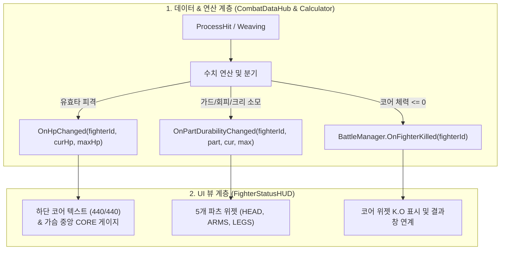

# [구현 설계서] 전투 체력(Core HP) 및 파츠 내구도 HUD 연동 가이드

> **프로젝트**: 리얼 스틸 (로봇 커스터마이징 RPG / 실시간 전략 액션)  
> **기획서 기준 조항**: §484~519, §570~580, §662~678, §800~848  
> **담당 파트**: 전투 데이터 & 매니지먼트 (KKH)  
> **문서 목적**: 기획서 규칙에 맞춘 코어 체력 vs 파츠 내구도 UI/데이터 완벽 연동 절차 수립

---

## ⚡ [실전 작업 TODO 체크리스트 바로가기]
> **현재 작업 현황**: 스크립트 작성 완료 $\rightarrow$ **프리팹/씬 바인딩 및 실시간 테스트 단계**

- [ ] **[Phase 1] 위젯 프리팹 바인딩 (`PartGaugeWidget.prefab`)**
  - 프리팹 루트에 `PartGaugeWidget` 컴포넌트 추가 및 4개 필드(Slider, Fill Image, TMP 2개) 연결
- [ ] **[Phase 2] 씬 UI 바인딩 (`Battle_Test_KKH.unity`)**
  - 하단 `Total_HP` 슬라이더에 체력 텍스트(`Total_HP_Text`) 추가
  - `FighterStatusHUD` 오브젝트에 스크립트 추가 후 `Target Fighter ID: "Player"`, 슬라이더/텍스트, 6개 위젯 연결
- [ ] **[Phase 3] 실시간 인터랙티브 테스트 (`HUDInteractiveTester.cs`)**
  - 숫자 1~5(부위 피격 -20), Space(코어 피격 -100), K(코어 파괴 K.O), R(원복) 키 입력 시각 검증
- [ ] **[Phase 4] 적군(Enemy) HUD 확장 및 프리팹화**
  - 플레이어 HUD를 프리팹화 후 적군용 복제 배치 (`Target Fighter ID: "Enemy"`)
- [ ] **[Phase 5] UI 애니메이션 및 연출 폴리싱 (옵션)**
  - 체력 감소 잔상 바(Damage Buffer Bar), 25% 이하 빈사 경고 점멸(Pulse)

👉 **[상세 인스펙터 바인딩 및 검증 항목은 문서 맨 아래 '6. 실전 구현 및 작업 TODO 체크리스트' 참조](#6-실전-구현-및-작업-todo-체크리스트)**

---

## 1. 기획서 핵심 시스템 분석

### 1-1. 코어 체력 (Core HP) vs 파츠 내구도 (Durability)

| 비교 항목 | 코어 체력 (Core HP) | 5개 파츠 내구도 (Durability) |
| :--- | :--- | :--- |
| **담당 슬롯** | **코어 (Core)** | **머리, 왼팔, 오른팔, 왼다리, 오른다리** |
| **자원 성격** | **최종 생명력 (Life)** | **방어 및 행동 소모형 자원 (Stamina/Armor)** |
| **감소 조건** | 가드/회피에 실패한 **모든 유효타 피격 시** (§841) | • 가드 시: **양팔 내구도** 분산 소모 (§512)<br>• 회피(위빙) 시: **다리 내구도** 5 고정 소모 (§756)<br>• 치명타 피격 시: **머리 내구도** 소모 (§500) |
| **0 도달 시 결과** | **즉시 전투 패배 (K.O) & 게임 오버!** (§803)<br>• 코어가 '불안정한 코어'로 전락 (§847) | **전투 속행 (행동 차단 및 확률 페널티)** (§827)<br>• 팔 0: 가드 불가, 공격력 급감<br>• 다리 0: 위빙 회피 50% 실패 및 불가<br>• 머리 0: 버프/저항 상실 |
| **UI 시각적 표현** | **가슴 중앙 게이지 & 하단 대형 체력바 (`440/440`)** | **실루엣 주변 5개 파츠 슬라이더 바** |

---

## 2. 전체 아키텍처 및 데이터 흐름



---

## 3. 단계별 상세 구현 절차

### [1단계] 프리팹 내부 계층 구조 최적화 (`PartGaugeWidget.prefab`)

프리팹 내부에 중복 포함된 `Canvas (1920x1080)`를 제거하여 좌표 오작동 및 드로우콜 낭비를 방지합니다.

* **최종 권장 계층 구조**:
  ```text
  PartGaugeWidget (RectTransform: 120 x 45, Anchor: Center) + PartGaugeWidget.cs
    └── Part_Panel (Image - 각진 어두운 배경 패널)
          ├── PartName (TextMeshPro - "HEAD", "CORE", "L.ARM" 등)
          ├── PartHPScore (TextMeshPro - "35/35")
          └── Slider (UI Slider - 여백 0 세팅, Interactable: OFF)
                ├── Background (어두운 회색 바탕)
                └── Fill Area
                      └── Fill (녹색/노랑/빨강/회색 동적 변경)
  ```

---

### [2단계] `PartGaugeWidget.cs` 구현

파츠 내구도와 코어 체력 수치를 공통으로 수용하되, **코어 파괴(K.O)와 파츠 파손(BROKEN)을 명확하게 분기**합니다.

```csharp
using UnityEngine;
using UnityEngine.UI;
using TMPro;

public class PartGaugeWidget : MonoBehaviour
{
    [Header("담당 부위")]
    [SerializeField] private BodyPart targetPart;

    [Header("UI 바인딩")]
    [SerializeField] private Slider durabilitySlider;
    [SerializeField] private Image durabilityFillImage;
    [SerializeField] private TextMeshProUGUI partNameText;
    [SerializeField] private TextMeshProUGUI partValueText;

    [Header("상태별 색상")]
    [SerializeField] private Color normalColor = new Color(0.1f, 0.95f, 0.2f); // 녹색 (정상)
    [SerializeField] private Color warningColor = new Color(1f, 0.8f, 0.1f); // 노랑 (50% 이하)
    [SerializeField] private Color dangerColor = new Color(1f, 0.25f, 0.25f); // 빨강 (25% 이하)
    [SerializeField] private Color brokenColor = new Color(0.35f, 0.35f, 0.35f); // 회색 (파손/사망)

    public BodyPart TargetPart => targetPart;

    public void SetLabel(string label)
    {
        if (partNameText != null)
            partNameText.text = label;
    }

    public void UpdateDurability(int cur, int max)
    {
        // 1. 슬라이더 값 갱신
        if (durabilitySlider != null)
        {
            durabilitySlider.maxValue = max;
            durabilitySlider.value = cur;
        }

        // 2. 텍스트 표시 (코어 체력 0은 K.O, 파츠 내구도 0은 BROKEN)
        if (partValueText != null)
        {
            if (cur <= 0)
            {
                partValueText.text = targetPart == BodyPart.Core 
                    ? "<color=#FF0000>K.O</color>" 
                    : "<color=#FF3333>BROKEN</color>";
            }
            else
            {
                partValueText.text = $"{cur}/{max}";
            }
        }

        // 3. 잔여 비율에 따른 동적 색상
        if (durabilityFillImage != null)
        {
            float ratio = max > 0 ? (float)cur / max : 0f;

            if (cur <= 0)
                durabilityFillImage.color = brokenColor;
            else if (ratio > 0.5f)
                durabilityFillImage.color = normalColor;
            else if (ratio > 0.25f)
                durabilityFillImage.color = warningColor;
            else
                durabilityFillImage.color = dangerColor;
        }
    }
}
```

---

### [3단계] `FighterStatusHUD.cs` 구현

`CombatDataHub`의 이벤트를 수신하여 **코어 체력**과 **5개 파츠 내구도**를 분배하고, **코어 파괴 시 전투 종료**를 관리합니다.

```csharp
using System;
using System.Collections.Generic;
using UnityEngine;
using TMPro;

public class FighterStatusHUD : MonoBehaviour
{
    [Header("대상 식별자")]
    [Tooltip("플레이어 HUD는 'Player', 상대 HUD는 'Enemy'")]
    [SerializeField] private string targetFighterId = "Player";

    [Header("하단 코어 통합 체력 UI")]
    [SerializeField] private TextMeshProUGUI coreHpText;

    [Header("부위별 게이지 목록 (총 6개: Core + 5개 부위)")]
    [SerializeField] private List<PartGaugeWidget> partWidgets = new List<PartGaugeWidget>();

    private Dictionary<BodyPart, PartGaugeWidget> widgetLookup = new Dictionary<BodyPart, PartGaugeWidget>();

    private void Awake()
    {
        widgetLookup.Clear();
        foreach (var widget in partWidgets)
        {
            if (widget != null)
                widgetLookup[widget.TargetPart] = widget;
        }
    }

    private void Start()
    {
        if (CombatDataHub.Instance != null)
        {
            CombatDataHub.Instance.OnHpChanged += HandleHpChanged;
            CombatDataHub.Instance.OnPartDurabilityChanged += HandlePartDurabilityChanged;

            RefreshAll();
        }
    }

    private void OnDestroy()
    {
        if (CombatDataHub.Instance != null)
        {
            CombatDataHub.Instance.OnHpChanged -= HandleHpChanged;
            CombatDataHub.Instance.OnPartDurabilityChanged -= HandlePartDurabilityChanged;
        }
    }

    public void RefreshAll()
    {
        var hub = CombatDataHub.Instance;
        if (hub == null) return;

        // 1. 코어 본체 체력 동기화
        int curHp = hub.GetCurrentHp(targetFighterId);
        int maxHp = hub.GetMaxHp(targetFighterId);
        UpdateCoreHpDisplay(curHp, maxHp);

        if (widgetLookup.TryGetValue(BodyPart.Core, out var coreWidget))
            coreWidget.UpdateDurability(curHp, maxHp);

        // 2. 5개 파츠 내구도 동기화
        foreach (var kvp in widgetLookup)
        {
            if (kvp.Key == BodyPart.Core) continue;

            int curDur = hub.GetPartDurability(targetFighterId, kvp.Key);
            int maxDur = hub.GetPartMaxDurability(targetFighterId, kvp.Key);
            kvp.Value.UpdateDurability(curDur, maxDur);
        }
    }

    private void HandleHpChanged(string fighterId, int curHp, int maxHp)
    {
        if (!fighterId.Equals(targetFighterId, StringComparison.OrdinalIgnoreCase))
            return;

        UpdateCoreHpDisplay(curHp, maxHp);

        // 가슴 중앙 Core 게이지 갱신
        if (widgetLookup.TryGetValue(BodyPart.Core, out var coreWidget))
            coreWidget.UpdateDurability(curHp, maxHp);

        // [핵심 규칙] 코어가 0이 되면 즉시 사망 처리
        if (curHp <= 0)
        {
            Debug.Log($"<color=red>[전투 종료] {fighterId} 코어 완전 파괴! K.O 판정.</color>");
            if (coreWidget != null)
                coreWidget.UpdateDurability(0, maxHp);
        }
    }

    private void HandlePartDurabilityChanged(string fighterId, BodyPart part, int curDur, int maxDur)
    {
        if (!fighterId.Equals(targetFighterId, StringComparison.OrdinalIgnoreCase))
            return;

        if (widgetLookup.TryGetValue(part, out var widget))
            widget.UpdateDurability(curDur, maxDur);
    }

    private void UpdateCoreHpDisplay(int curHp, int maxHp)
    {
        if (coreHpText != null)
            coreHpText.text = $"<color=#00FF44>{curHp}</color> <color=#777777>/ {maxHp}</color>";
    }
}
```

---

## 4. 인스펙터 바인딩 체크리스트

1. **위젯 인스턴스 6개 설정**:
   - `Widget_Head` $\rightarrow$ TargetPart: `Head`
   - `Widget_Core` $\rightarrow$ TargetPart: `Core` (가슴 위치)
   - `Widget_LeftArm` $\rightarrow$ TargetPart: `LeftArm`
   - `Widget_RightArm` $\rightarrow$ TargetPart: `RightArm`
   - `Widget_LeftLeg` $\rightarrow$ TargetPart: `LeftLeg`
   - `Widget_RightLeg` $\rightarrow$ TargetPart: `RightLeg`
2. **`FighterStatusHUD` 오브젝트 설정**:
   - `Target Fighter Id`: `Player`
   - `Core Hp Text`: 하단 십자가 옆 총 체력 TextMeshPro 연결
   - `Part Widgets`: 6개의 위젯 인스턴스 모두 등록

---

## 5. 검증 시나리오 점검표

- [ ] **가드 피격**: 가드 성공 시 코어 체력은 보존되고, 양팔(`L.ARM`, `R.ARM`) 내구도만 감소하는가?
- [ ] **위빙 회피**: 위빙 입력 시 코어 체력은 보존되고, 다리(`LEG`) 내구도가 5 차감되는가?
- [ ] **일반 피격**: 노가드 유효타 피격 시 파츠 내구도는 멀쩡하고 가슴 `CORE` 위젯과 하단 `440/440` 숫자가 동시에 깎이는가?
- [ ] **치명타 피격**: 크리티컬 피격 시 머리(`HEAD`) 내구도 감소와 함께 코어 체력도 함께 깎이는가?
- [ ] **코어 파괴(K.O)**: 코어 체력이 0이 되었을 때 `K.O`가 표시되며 `BattleManager`의 사망 처리가 정상 호출되는가?

---

## 6. 실전 구현 및 작업 TODO 체크리스트

> **현재 진행 상황 요약**: 핵심 연산(`CombatDataHub`), 뷰 스크립트([FighterStatusHUD.cs](file:///d:/3%ED%95%99%EB%85%84/2026_Com2us_Project/Assets/KKH/02.Scripts/05.UI/FighterStatusHUD.cs), [PartGaugeWidget.cs](file:///d:/3%ED%95%99%EB%85%84/2026_Com2us_Project/Assets/KKH/02.Scripts/05.UI/PartGaugeWidget.cs)) 작성 완료. **프리팹 컴포넌트 부착 및 씬 인스펙터 바인딩, 실시간 인터랙티브 테스트 단계 대기 중.**

### 📌 [Phase 1] 위젯 프리팹 에셋 바인딩 (`PartGaugeWidget.prefab`)
- [ ] **스크립트 부착**: `Assets/KKH/04.Prefab/PartGaugeWidget.prefab` 루트 오브젝트에 `PartGaugeWidget` 컴포넌트 추가
- [ ] **인스펙터 참조 연결**:
  - [ ] `durabilitySlider` $\leftarrow$ 하위 `HP_Bar` (Slider 컴포넌트) 연결
  - [ ] `durabilityFillImage` $\leftarrow$ 하위 `HP_Bar/Fill Area/Fill` (Image 컴포넌트) 연결
  - [ ] `partNameText` $\leftarrow$ 하위 `PartLabel` (TextMeshProUGUI 컴포넌트) 연결
  - [ ] `partValueText` $\leftarrow$ 하위 `PartHPValue` (TextMeshProUGUI 컴포넌트) 연결
- [ ] **색상 팔레트 기본값 확인**: 정상(녹색), 경고(노랑), 위험(빨강), 파손/사망(회색)
- [ ] 프리팹 저장 (`Save` 및 Apply Overrides)

---

### 📌 [Phase 2] 테스트 씬 UI 계층 구조 및 인스펙터 바인딩 (`Battle_Test_KKH.unity`)
- [ ] **총합 체력 텍스트 오브젝트 추가**:
  - `Image/Total_HP` 슬라이더 하위 또는 바로 위에 `TextMeshPro - Text` 오브젝트(`Total_HP_Text`) 생성 (기본값: `"440 / 440"`, 가운데 정렬)
- [ ] **`FighterStatusHUD` 오브젝트 설정**:
  - [ ] `FighterStatusHUD` GameObject에 `FighterStatusHUD` 컴포넌트 추가
  - [ ] `Target Fighter ID`: `"Player"` 입력
  - [ ] `Total Health Slider` $\leftarrow$ 하단 `Total_HP` Slider 연결
  - [ ] `Total Health Text` $\leftarrow$ 신규 생성한 `Total_HP_Text` 연결
- [ ] **6개 위젯 인스턴스 `Target Part` 설정 및 리스트 등록**:
  - [ ] 머리 위젯 오브젝트 $\rightarrow$ TargetPart: `BodyPart.Head`
  - [ ] 가슴 중앙 위젯 오브젝트 $\rightarrow$ TargetPart: `BodyPart.Core`
  - [ ] 왼팔 위젯 오브젝트 $\rightarrow$ TargetPart: `BodyPart.LeftArm`
  - [ ] 오른팔 위젯 오브젝트 $\rightarrow$ TargetPart: `BodyPart.RightArm`
  - [ ] 왼다리 위젯 오브젝트 $\rightarrow$ TargetPart: `BodyPart.LeftLeg`
  - [ ] 오른다리 위젯 오브젝트 $\rightarrow$ TargetPart: `BodyPart.RightLeg`
  - [ ] `FighterStatusHUD.partGaugeWidgets` 리스트에 6개 위젯 인스턴스 모두 등록

---

### 📌 [Phase 3] 실시간 HUD 인터랙티브 테스트 (게임 뷰 시각 검증)
- [ ] **키 입력 인터랙티브 테스터 작성/배치 (`HUDInteractiveTester.cs`)**:
  - `숫자 1~5 키`: 머리, 왼팔, 오른팔, 왼다리, 오른다리 내구도 20씩 차감 (`CombatDataHub` 이벤트 유발)
  - `Space 키`: 코어 체력 100 차감 (하단 총합 체력 슬라이더 + 가슴 CORE 게이지 동시 갱신 확인)
  - `K 키`: 코어 체력 0 강제 설정 $\rightarrow$ 가슴 CORE 위젯 및 하단 텍스트 `K.O` 표시 및 전투 종료 로그 확인
  - `R 키`: 전신 내구도 및 코어 체력 100% 원복 (리셋)
- [ ] **체력 비율별 동적 색상 변화 육안 점검**:
  - 50% 초과: 정상 녹색 (`#1AF333`)
  - 25% ~ 50%: 경고 노란색 (`#F3F333`)
  - 0% ~ 25%: 위험 빨간색 (`#F33333`)
  - 0% 도달 시:
    - 부위 파츠: 회색 게이지 + `<color=#FF3333>BROKEN</color>`
    - 코어: 회색 게이지 + `<color=#FF0000>K.O</color>`

---

### 📌 [Phase 4] 적군(Enemy) HUD 확장 및 프리팹화 (1:1 대전 지원)
- [ ] 플레이어용 `FighterStatusHUD` 완제품을 프리팹(`FighterStatusHUD.prefab`)으로 저장
- [ ] 씬에 적군용 HUD 인스턴스 배치 (화면 우측 상단 대칭 배치)
- [ ] 적 HUD의 `Target Fighter ID`를 `"Enemy"`로 변경
- [ ] 적 로봇 피격 시 적 HUD 게이지/텍스트만 독립적으로 갱신되는지 확인

---

### 📌 [Phase 5] UI 연출 및 애니메이션 폴리싱 (옵션)
- [ ] **체력 감소 잔상 효과 (Damage Buffer Bar)**: 피격 즉시 줄어드는 게이지 뒤에 천천히 줄어드는 붉은색 잔상 바 연출
- [ ] **빈사 상태 경고 연출**: 코어 체력 25% 이하 시 가슴 CORE 위젯 및 화면 테두리 붉은빛 깜빡임(Pulse)
- [ ] **파츠 파괴 시 시각 효과**: 파츠 내구도 0 도달 시 해당 위젯 흔들림(Shake) 및 스파크 연출

