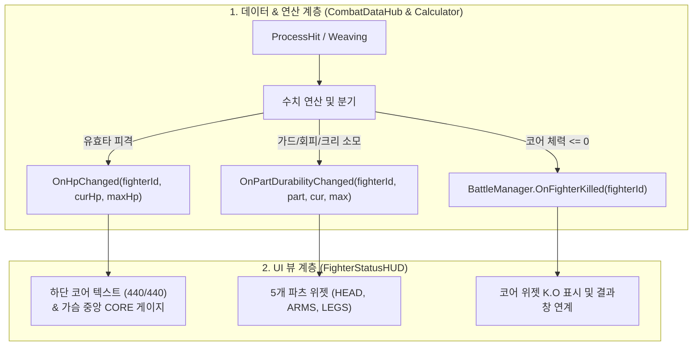

# [구현 설계서] 전투 체력(Core HP) 및 파츠 내구도 HUD 연동 가이드

> **프로젝트**: 리얼 스틸 (로봇 커스터마이징 RPG / 실시간 전략 액션)  
> **기획서 기준 조항**: §484~519, §570~580, §662~678, §800~848  
> **담당 파트**: 전투 데이터 & 매니지먼트 (KKH)  
> **문서 목적**: 기획서 규칙에 맞춘 코어 체력 vs 파츠 내구도 UI/데이터 완벽 연동 절차 수립

---

## 1. 기획서 핵심 시스템 분석

### 1-1. 코어 체력 (Core HP) vs 파츠 내구도 (Durability)

| 비교 항목 | 코어 체력 (Core HP) | 5개 파츠 내구도 (Durability) |
| :--- | :--- | :--- |
| **담당 슬롯** | **코어 (Core)** | **머리, 왼팔, 오른팔, 왼다리, 오른다리** |
| **자원 성격** | **최종 생명력 (Life)** | **방어 및 행동 소모형 자원 (Stamina/Armor)** |
| **감소 조건** | 가드/회피에 실패한 **모든 유효타 피격 시** (§841) | • 가드 시: **양팔 내구도** 분산 소모 (§512)<br>• 회피(위빙) 시: **다리 내구도** 5 고정 소모 (§756)<br>• 치명타 피격 시: **머리 내구도** 소모 (§500) |
| **0 도달 시 결과** | **즉시 전투 패배 (K.O) & 게임 오버!** (§803)<br>• 코어가 '불안정한 코어'로 전락 (§847) | **전투 속행 (행동 차단 및 확률 페널티)** (§827)<br>• 팔 0: 가드 불가, 공격력 급감<br>• 다리 0: 위빙 회피 50% 실패 및 불가<br>• 머리 0: 버프/저항 상실 |
| **UI 시각적 표현** | **가슴 중앙 게이지 & 하단 대형 체력바 (`440/440`)** | **실루엣 주변 5개 파츠 슬라이더 바** |

---

## 2. 전체 아키텍처 및 데이터 흐름



---

## 3. 단계별 상세 구현 절차

### [1단계] 프리팹 내부 계층 구조 최적화 (`PartGaugeWidget.prefab`)

프리팹 내부에 중복 포함된 `Canvas (1920x1080)`를 제거하여 좌표 오작동 및 드로우콜 낭비를 방지합니다.

* **최종 권장 계층 구조**:
  ```text
  PartGaugeWidget (RectTransform: 120 x 45, Anchor: Center) + PartGaugeWidget.cs
    └── Part_Panel (Image - 각진 어두운 배경 패널)
          ├── PartName (TextMeshPro - "HEAD", "CORE", "L.ARM" 등)
          ├── PartHPScore (TextMeshPro - "35/35")
          └── Slider (UI Slider - 여백 0 세팅, Interactable: OFF)
                ├── Background (어두운 회색 바탕)
                └── Fill Area
                      └── Fill (녹색/노랑/빨강/회색 동적 변경)
  ```

---

### [2단계] `PartGaugeWidget.cs` 구현

파츠 내구도와 코어 체력 수치를 공통으로 수용하되, **코어 파괴(K.O)와 파츠 파손(BROKEN)을 명확하게 분기**합니다.

```csharp
using UnityEngine;
using UnityEngine.UI;
using TMPro;

public class PartGaugeWidget : MonoBehaviour
{
    [Header("담당 부위")]
    [SerializeField] private BodyPart targetPart;

    [Header("UI 바인딩")]
    [SerializeField] private Slider durabilitySlider;
    [SerializeField] private Image durabilityFillImage;
    [SerializeField] private TextMeshProUGUI partNameText;
    [SerializeField] private TextMeshProUGUI partValueText;

    [Header("상태별 색상")]
    [SerializeField] private Color normalColor = new Color(0.1f, 0.95f, 0.2f); // 녹색 (정상)
    [SerializeField] private Color warningColor = new Color(1f, 0.8f, 0.1f); // 노랑 (50% 이하)
    [SerializeField] private Color dangerColor = new Color(1f, 0.25f, 0.25f); // 빨강 (25% 이하)
    [SerializeField] private Color brokenColor = new Color(0.35f, 0.35f, 0.35f); // 회색 (파손/사망)

    public BodyPart TargetPart => targetPart;

    public void SetLabel(string label)
    {
        if (partNameText != null)
            partNameText.text = label;
    }

    public void UpdateDurability(int cur, int max)
    {
        // 1. 슬라이더 값 갱신
        if (durabilitySlider != null)
        {
            durabilitySlider.maxValue = max;
            durabilitySlider.value = cur;
        }

        // 2. 텍스트 표시 (코어 체력 0은 K.O, 파츠 내구도 0은 BROKEN)
        if (partValueText != null)
        {
            if (cur <= 0)
            {
                partValueText.text = targetPart == BodyPart.Core 
                    ? "<color=#FF0000>K.O</color>" 
                    : "<color=#FF3333>BROKEN</color>";
            }
            else
            {
                partValueText.text = $"{cur}/{max}";
            }
        }

        // 3. 잔여 비율에 따른 동적 색상
        if (durabilityFillImage != null)
        {
            float ratio = max > 0 ? (float)cur / max : 0f;

            if (cur <= 0)
                durabilityFillImage.color = brokenColor;
            else if (ratio > 0.5f)
                durabilityFillImage.color = normalColor;
            else if (ratio > 0.25f)
                durabilityFillImage.color = warningColor;
            else
                durabilityFillImage.color = dangerColor;
        }
    }
}
```

---

### [3단계] `FighterStatusHUD.cs` 구현

`CombatDataHub`의 이벤트를 수신하여 **코어 체력**과 **5개 파츠 내구도**를 분배하고, **코어 파괴 시 전투 종료**를 관리합니다.

```csharp
using System;
using System.Collections.Generic;
using UnityEngine;
using TMPro;

public class FighterStatusHUD : MonoBehaviour
{
    [Header("대상 식별자")]
    [Tooltip("플레이어 HUD는 'Player', 상대 HUD는 'Enemy'")]
    [SerializeField] private string targetFighterId = "Player";

    [Header("하단 코어 통합 체력 UI")]
    [SerializeField] private TextMeshProUGUI coreHpText;

    [Header("부위별 게이지 목록 (총 6개: Core + 5개 부위)")]
    [SerializeField] private List<PartGaugeWidget> partWidgets = new List<PartGaugeWidget>();

    private Dictionary<BodyPart, PartGaugeWidget> widgetLookup = new Dictionary<BodyPart, PartGaugeWidget>();

    private void Awake()
    {
        widgetLookup.Clear();
        foreach (var widget in partWidgets)
        {
            if (widget != null)
                widgetLookup[widget.TargetPart] = widget;
        }
    }

    private void Start()
    {
        if (CombatDataHub.Instance != null)
        {
            CombatDataHub.Instance.OnHpChanged += HandleHpChanged;
            CombatDataHub.Instance.OnPartDurabilityChanged += HandlePartDurabilityChanged;

            RefreshAll();
        }
    }

    private void OnDestroy()
    {
        if (CombatDataHub.Instance != null)
        {
            CombatDataHub.Instance.OnHpChanged -= HandleHpChanged;
            CombatDataHub.Instance.OnPartDurabilityChanged -= HandlePartDurabilityChanged;
        }
    }

    public void RefreshAll()
    {
        var hub = CombatDataHub.Instance;
        if (hub == null) return;

        // 1. 코어 본체 체력 동기화
        int curHp = hub.GetCurrentHp(targetFighterId);
        int maxHp = hub.GetMaxHp(targetFighterId);
        UpdateCoreHpDisplay(curHp, maxHp);

        if (widgetLookup.TryGetValue(BodyPart.Core, out var coreWidget))
            coreWidget.UpdateDurability(curHp, maxHp);

        // 2. 5개 파츠 내구도 동기화
        foreach (var kvp in widgetLookup)
        {
            if (kvp.Key == BodyPart.Core) continue;

            int curDur = hub.GetPartDurability(targetFighterId, kvp.Key);
            int maxDur = hub.GetPartMaxDurability(targetFighterId, kvp.Key);
            kvp.Value.UpdateDurability(curDur, maxDur);
        }
    }

    private void HandleHpChanged(string fighterId, int curHp, int maxHp)
    {
        if (!fighterId.Equals(targetFighterId, StringComparison.OrdinalIgnoreCase))
            return;

        UpdateCoreHpDisplay(curHp, maxHp);

        // 가슴 중앙 Core 게이지 갱신
        if (widgetLookup.TryGetValue(BodyPart.Core, out var coreWidget))
            coreWidget.UpdateDurability(curHp, maxHp);

        // [핵심 규칙] 코어가 0이 되면 즉시 사망 처리
        if (curHp <= 0)
        {
            Debug.Log($"<color=red>[전투 종료] {fighterId} 코어 완전 파괴! K.O 판정.</color>");
            if (coreWidget != null)
                coreWidget.UpdateDurability(0, maxHp);
        }
    }

    private void HandlePartDurabilityChanged(string fighterId, BodyPart part, int curDur, int maxDur)
    {
        if (!fighterId.Equals(targetFighterId, StringComparison.OrdinalIgnoreCase))
            return;

        if (widgetLookup.TryGetValue(part, out var widget))
            widget.UpdateDurability(curDur, maxDur);
    }

    private void UpdateCoreHpDisplay(int curHp, int maxHp)
    {
        if (coreHpText != null)
            coreHpText.text = $"<color=#00FF44>{curHp}</color> <color=#777777>/ {maxHp}</color>";
    }
}
```

---

## 4. 인스펙터 바인딩 체크리스트

1. **위젯 인스턴스 6개 설정**:
   - `Widget_Head` $\rightarrow$ TargetPart: `Head`
   - `Widget_Core` $\rightarrow$ TargetPart: `Core` (가슴 위치)
   - `Widget_LeftArm` $\rightarrow$ TargetPart: `LeftArm`
   - `Widget_RightArm` $\rightarrow$ TargetPart: `RightArm`
   - `Widget_LeftLeg` $\rightarrow$ TargetPart: `LeftLeg`
   - `Widget_RightLeg` $\rightarrow$ TargetPart: `RightLeg`
2. **`FighterStatusHUD` 오브젝트 설정**:
   - `Target Fighter Id`: `Player`
   - `Core Hp Text`: 하단 십자가 옆 총 체력 TextMeshPro 연결
   - `Part Widgets`: 6개의 위젯 인스턴스 모두 등록

---

## 5. 검증 시나리오 점검표

- [ ] **가드 피격**: 가드 성공 시 코어 체력은 보존되고, 양팔(`L.ARM`, `R.ARM`) 내구도만 감소하는가?
- [ ] **위빙 회피**: 위빙 입력 시 코어 체력은 보존되고, 다리(`LEG`) 내구도가 5 차감되는가?
- [ ] **일반 피격**: 노가드 유효타 피격 시 파츠 내구도는 멀쩡하고 가슴 `CORE` 위젯과 하단 `440/440` 숫자가 동시에 깎이는가?
- [ ] **치명타 피격**: 크리티컬 피격 시 머리(`HEAD`) 내구도 감소와 함께 코어 체력도 함께 깎이는가?
- [ ] **코어 파괴(K.O)**: 코어 체력이 0이 되었을 때 `K.O`가 표시되며 `BattleManager`의 사망 처리가 정상 호출되는가?

