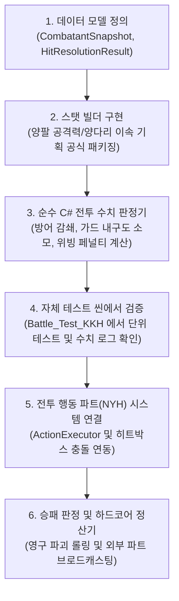

# 전투 DB & 데이터 허브 (KKH) 실전 구현 TODO 리스트

- **담당 파트**: 전투 DB / 전투 결과 처리 및 데이터 허브 파트 (본인 - KKH)
- **협력 파트**: 전투 행동 / 전투 실행 엔진 파트 (NYH)
- **대상 파일 위치**: `Assets/KKH/02.Scripts/`
- **테스트 씬**: `Assets/KKH/01.Scene/Battle_Test_KKH.unity`
- **최종 수정일**: 2026-09-18

---

## 🧭 개발 원칙 및 진행 흐름
> **전투 행동 파트(NYH)의 개발 진행 상태와 독립적으로, 자체 테스트 씬(`Battle_Test_KKH.unity`)에서 모든 수치 연산과 판정을 100% 검증한 후 시스템을 결합합니다.**

---

## 📌 Phase 1. 런타임 전투 데이터 모델 정의 (기초 뼈대)
전투 행동 파트 및 전투 시스템 전반에서 실시간으로 참조할 순수 데이터 클래스(POCO) 및 결과 DTO를 작성합니다.

- [ ] **`Assets/KKH/02.Scripts/CombatantSnapshot.cs` 생성**
  - [ ] `PartRuntimeState` 클래스 정의
    - `int MasterPartId`: 부품 식별 ID
    - `int CurrentDurability`: 실시간 현재 내구도
    - `int MaxDurability`: 최대 내구도
  - [ ] `CombatantSnapshot` 클래스 정의
    - 식별: `string FighterId`, `bool IsPlayer`
    - 코어 스탯: `CurrentHp`, `MaxHp`, `BaseDefense`
    - 기획 복합 연산 스탯:
      - `TotalAttackPower`: 기본 공격력 + (왼팔 + 오른팔) / 2
      - `FinalMoveSpeed`: (왼다리 + 오른다리) / 2
      - `CritResistance`: 머리 파츠 치명타 저항
      - `CritDamageReduction`: 머리 파츠 치명타 피해 삭감률
      - `GuardDefBonus`: 팔 가드 방어력 보정
    - 부위 상태 매핑: `Dictionary<BodyPart, PartRuntimeState> PartStates`
    - 헬퍼 메서드:
      - `bool IsPartBroken(BodyPart part)`: 부위 파손 여부 (내구도 <= 0)
      - `void ConsumeDurability(BodyPart part, int amount)`: 내구도 차감 및 최소값 0 보정
- [ ] **`Assets/KKH/02.Scripts/HitResolutionResult.cs` 생성** (타격 판정 결과 DTO)
  - `int DamageToHp`: 코어 HP 실질 피해량
  - `bool IsGuarded`: 가드 성공 여부
  - `bool IsEvaded`: 위빙(회피) 성공 여부
  - `int StaggerAdded`: 피격자에게 누적될 경직도 수치
  - `int LeftArmDurabilityDamage`: 가드로 소모된 왼팔 내구도
  - `int RightArmDurabilityDamage`: 가드로 소모된 오른팔 내구도

---

## 📌 Phase 2. 기획서 공식 기반 스탯 빌더 (Stat Builder)
인벤토리/세이브 데이터 및 적 프리셋 데이터를 읽어 `CombatantSnapshot`으로 가공하는 팩토리를 작성합니다.

- [ ] **`Assets/KKH/02.Scripts/CombatantBuilder.cs` 생성**
  - [ ] 플레이어용 빌드 메서드 구현
    - 입력: 코어 스탯 + 장착된 5부위 `PartMasterData` 리스트
    - 공식 반영:
      - $\text{TotalAttackPower} = \text{BaseAtk} + \frac{\text{LeftArmAtk} + \text{RightArmAtk}}{2}$
      - $\text{FinalMoveSpeed} = \frac{\text{LeftLegSpeed} + \text{RightLegSpeed}}{2}$
      - $\text{CritResistance} = \text{HeadStat.critResistance}$
      - $\text{CritDamageReduction} = \text{HeadStat.critDamageReduction}$
      - $\text{GuardDefBonus} = \text{LeftArm.guardDefBonus} + \text{RightArm.guardDefBonus}$
  - [ ] 적(NPC/더미 봇)용 빌드 메서드 구현
    - 더미 봇 테스트용 기본 스탯 프리셋 생성 로직

---

## 📌 Phase 3. 순수 C# 전투 수치 판정기 (Combat Calculator)
유니티 엔진(물리, 애니메이션)과 독립적으로 동작하여 TDD 단위 테스트가 가능한 순수 C# 수치 연산 코어를 작성합니다.

- [ ] **`Assets/KKH/02.Scripts/CombatCalculator.cs` 생성**
  - [ ] **행동 실행 가능 여부 검사**: `CanExecuteAction(CombatantSnapshot actor, ActionData action)`
    - `action.Source == ActionSource.CoreFixed`: 부위 파손과 무관하게 항상 실행 가능
    - `action.Source == ActionSource.Part`: `actor.IsPartBroken(action.RequiredPart)` 여부 검사 후 파손 시 `false` 반환
  - [ ] **타격/방어 판정 및 대미지 감쇄**: `EvaluateHit(CombatantSnapshot attacker, CombatantSnapshot defender, ActionData attackAction, bool isGuarding, bool isWeaving)`
    - 위빙 성공 시: 대미지 0, `IsEvaded = true` 반환
    - 기본 공격력: $\text{RawDamage} = \text{attacker.TotalAttackPower} \times (\text{attackAction.Damage} / 100)$
    - 가드 시:
      - 방어력 합산: $\text{TotalDef} = \text{defender.BaseDefense} + \text{defender.GuardDefBonus}$
      - 감쇄 피해 계산: $\text{FinalDmg} = \text{RawDamage} \times \frac{100}{\text{TotalDef} + 100}$
      - 양팔 내구도 5:5 분산 소모, 코어 HP 피해 0, `IsGuarded = true` 반환
    - 코어 직격 시:
      - 감쇄 피해 계산: $\text{FinalDmg} = \text{RawDamage} \times \frac{100}{\text{defender.BaseDefense} + 100}$
      - 피격자 `CurrentHp` 차감
    - 누적 경직도 `attackAction.StaggerValue` 전달
  - [ ] **위빙 시도 판정**: `EvaluateWeavingAttempt(CombatantSnapshot actor)`
    - 좌/우 다리 중 무작위 1개 내구도 5 고정 차감
    - 양다리 모두 파괴 상태: 100% 회피 불가 (실패)
    - 다리 1개 파괴 상태: 50% 확률로 회피 실패 판정 반환
    - 정상 상태: 100% 회피 성공 판정

---

## 📌 Phase 4. 자체 테스트 씬(`Battle_Test_KKH.unity`) 수치 검증
전투 행동 파트(NYH)의 완성 여부와 상관없이, 에디터 재생 시 콘솔 로그로 모든 수치 연산을 눈으로 직접 검증합니다.

- [ ] **`Assets/KKH/03.SOData/`에 테스트용 에셋 생성**
  - `Test_Head.asset`, `Test_LeftArm.asset`, `Test_RightArm.asset`, `Test_LeftLeg.asset`, `Test_RightLeg.asset`
- [ ] **`Assets/KKH/02.Scripts/CombatDataHubTester.cs` 작성**
  - 테스트 씬의 빈 오브젝트에 부착하고 `Start()`에서 일괄 검증 실행:
    - [ ] `[Test 1]`: 스탯 빌드 결과 로그 (양팔 공격력 평균, 양다리 이동속도 평균 검증)
    - [ ] `[Test 2]`: 대미지 감쇄 공식 검증 (방어력 100일 때 대미지 50% 정확히 감쇄되는지 확인)
    - [ ] `[Test 3]`: 가드 시 코어 피해 0 및 양팔 내구도 균등 소모 확인
    - [ ] `[Test 4]`: 다리 1개 파괴 후 위빙 100회 시도 시 약 50회 실패 통계 확인
    - [ ] `[Test 5]`: 팔 파괴 후 `CanExecuteAction`으로 해당 팔 기술 사용 불가 로그 확인

---

## 📌 Phase 5. 전투 데이터 허브 싱글톤 & 전투 행동 파트(NYH) 파이프라인 연동
전투 씬 내에서 실시간으로 동작하며 전투 행동 파트(NYH)가 호출할 수 있는 중앙 매니저를 구축합니다.

- [ ] **`Assets/KKH/02.Scripts/CombatDataHub.cs` (MonoBehaviour 싱글톤) 생성**
  - `CombatantSnapshot PlayerSnapshot`, `CombatantSnapshot EnemySnapshot` 관리
  - 공용 연동 API 제공:
    - `bool CanExecuteAction(string fighterId, ActionData action)`
    - `HitResolutionResult ProcessHit(string attackerId, string defenderId, ActionData action, bool isGuarding, bool isWeaving)`
    - `bool ProcessWeavingAttempt(string fighterId)`
- [ ] **전투 행동 파트(NYH) `ActionExecutor.cs` 연동 안내 및 주입**
  - `state.Begin()` 직전에 `CombatDataHub.Instance.CanExecuteAction(...)` 확인하도록 연동
- [ ] **히트박스 충돌 스크립트 연동**
  - 충돌 시 `CombatDataHub.Instance.ProcessHit(...)` 호출 파이프라인 구축

---

## 📌 Phase 6. 하드코어 승패 정산기 (Settlement Processor)
전투 종료 시 승패 결과에 따라 내구도 긴급 복구, 영구 파괴 롤링 및 외부 파트로 데이터를 전달합니다.

- [ ] **`Assets/KKH/02.Scripts/BattleSettlementProcessor.cs` 생성**
  - [ ] `TriggerBattleEnd(bool playerWon, CombatantSnapshot player, CombatantSnapshot enemy)`
  - [ ] 승리 정산: 내구도 0인 부품 내구도 1로 긴급 복구
  - [ ] 패배 정산: 전 부품 내구도 0 강제 전환 및 등급별 영구 파괴 롤링
    - 기획서 확률 적용: 일반(70%), 레어(45%), 에픽(20%), 전설(5%), 프로토타입(1%)
- [ ] **외부 파트 인터페이스/이벤트 브로드캐스팅**
  - 크래프팅/파괴 파트(YJW): 영구 파괴된 부품 목록 전달 (인벤토리에서 삭제)
  - 골드/판돈 파트(LSH): 배팅 결과 및 승리 보상 골드 전달
  - 고물상/코어 파트(KDU): 패배 시 코어 Unstable(불안정) 상태 플래그 전달

