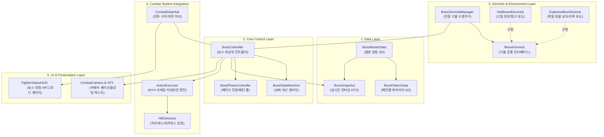
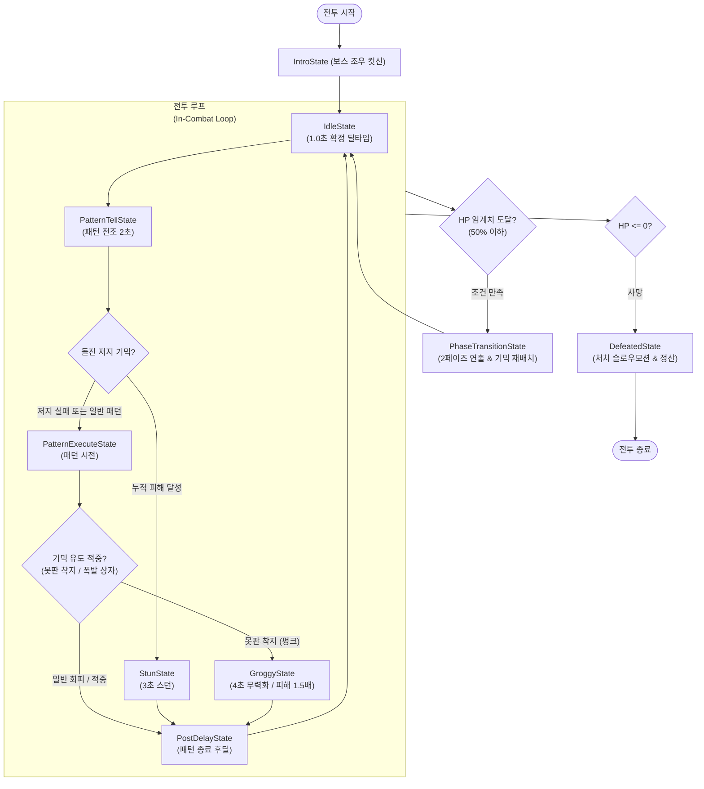
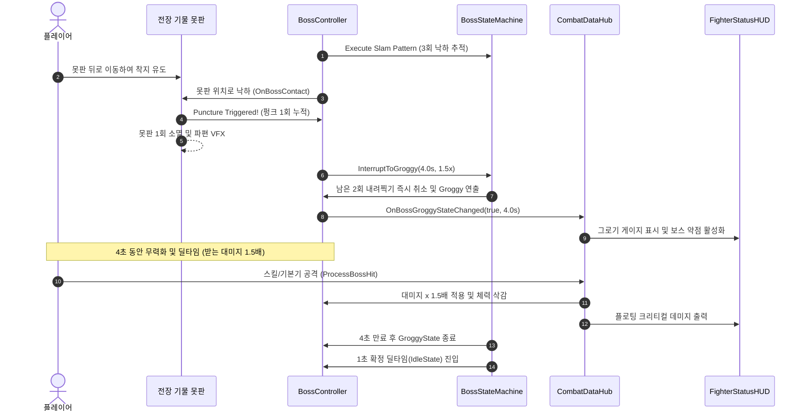
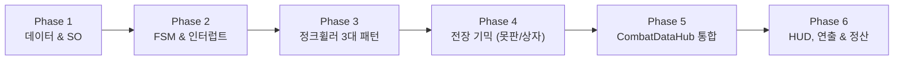

# 전투 데이터 및 보스 시스템 기술 명세서 (Boss System Architecture Specification)

- **문서 버전**: v1.0.0
- **작성 일자**: 2026-10-10
- **담당 파트**: 전투 데이터 허브 & 게임플레이 매니저 (KKH)
- **참조 기획서**: `D:\3학년\리얼스틸 기획서.md` (§11, §12, §18, §21)
- **대상 시스템**: 사이드뷰 실시간 기믹 파훼형 보스전 엔진 및 전투 데이터 통합 파이프라인

---

## 1. 개요 및 기획 배경

### 1.1 기획 정체성
본 프로젝트의 보스전은 단순한 샌드백형 HP 깎기 전투가 아닌, **사이드뷰 실시간 기믹 파훼형 액션 전투 (레퍼런스: Blasphemous)**를 지향합니다.
플레이어는 기본 조작(이동, 달리기, 점프, 회피)과 실린더 자원 기반 파츠 스킬(Q·W·E·R)을 활용하여 보스의 공격 패턴을 회피하고, 전장에 배치된 기물이나 보스의 특정 부위를 공략하여 그로기(무력화) 상태를 유도해야 합니다.

### 1.2 지역 1 보스: "정크 휠러" (폐타이어 & 폐엔진) 핵심 메커니즘
기획서 §18에 명시된 지역 1 보스의 메커니즘 규칙은 다음과 같습니다:

1. **공통 딜타임 보장**: 보스의 모든 공격 패턴 종료 후 **1.0초 확정 딜레이(딜타임)** 부여.
2. **패턴 1 - 튀어오르기 탄막**: 화면 하단에서 상단으로 도약하며 360도 12방향(30도 간격) 투사체를 3회 발사. 발사마다 15도씩 회전하여 안전 틈새 유도.
3. **패턴 2 - 돌진 & DPS 체크 저지**: 맵 좌우를 가로지르는 돌진 전 약 2초간 전조(바퀴 헛돔·붉은 점멸) 발생. 머리 위 누적 피해 게이지 달성 시 **3초 스턴**, 실패 시 돌진(Space 회피 무적 회피 필수).
4. **패턴 3 - 3단 내려찍기 & 못판 유도 (부위 파괴)**:
   - 보스가 도약 후 플레이어 X좌표를 1초간 추적 → 0.5초 후 급강하(총 3회 반복).
   - 전장 좌/우 1/3 지점에 배치된 **고철 못판(Nail Board)** 위로 착지를 유도하면 **바퀴 펑크** 발생.
   - **펑크 효과**: 남은 내려찍기 즉시 중단, **4초간 그로기 (받는 피해 1.5배 증폭)**, 못판 1회용 소멸.
   - **부위 파괴**: 펑크 2회 누적 시 타이어 부위 영구 파괴 → 튀어오르기 높이 및 돌진 속도 영구 감소.
5. **전장 기물 - 폭발 화물 상자**:
   - 필드에 떨어지는 상자 중 빨간 폭발 상자(최대 2개).
   - 플레이어가 타격 시 1.5초 점멸 후 폭발하여 광역 피해 및 2초 스턴.
   - 보스가 돌진 중 부딪히면 즉시 자폭 유도(큰 대미지 + 2초 스턴).
6. **플레이어 파츠 내구도 타격 규칙**:
   - 일반 피격은 플레이어의 본체 코어 HP만 차감.
   - 보스의 특정 스킬에 피격될 때만 해당 지정 부위 파츠의 내구도가 차감되며, 내구도 0 도달 시 해당 QWER 스킬이 봉인됨.

---

## 2. 시스템 아키텍처 다이어그램

본 시스템은 **계층형 유한 상태 머신(HFSM)**을 코어로 삼고, 데이터 주도형 에셋(ScriptableObject)과 이벤트 기반 중재자(Mediator)를 결합하여 설계되었습니다.



---

## 3. 사용 기술 스택 (Technological Stack)

| 기술 / 라이브러리 | 도입 목적 및 기술적 기대효과 |
| :--- | :--- |
| **UniTask (Cysharp.Threading.Tasks)** | • 보스의 1초 확정 딜타임, 2초 돌진 전조, 3초 스턴, 4초 그로기 타이머를 Zero Allocation으로 비동기 처리.<br/>• `CancellationTokenSource`를 활용해 기믹 파훼(못판 착지) 시 진행 중이던 패턴 비동기 흐름을 **즉시 안전하게 취소(Cancel & Interrupt)**. |
| **HFSM (Hierarchical State Machine)** | • 공격 시전 중 기믹 피격, 돌진 저지 성공, 페이즈 전환 등 **우선순위 기반 상태 인터럽트**를 명확히 분기.<br/>• 스파게티 `switch/case`나 Update문 플래그 남발을 방지하고 각 상태(State)의 진입/실행/종료 수명주기 캡슐화. |
| **ScriptableObject (Data-Driven)** | • `BossMasterData` 및 `BossPatternData`를 분리하여 코드 재컴파일 없이 기획자가 유니티 인스펙터에서 투사체 개수/각도, 요구 저지 피해량, 스턴 시간 등을 실시간 튜닝 가능. |
| **Interface 기반 상호작용 (`IBossGimmick`)** | • 못판, 폭발 상자, 향후 추가될 발전기/천장 조명 등을 보스 본체 코드와 강결합하지 않고 인터페이스 기반으로 느슨하게 결합하여 확장성 극대화. |
| **DOTween (Demigiant)** | • 보스 튀어오르기(Jump Tween), 그림자 플레이어 X좌표 추적 및 정지 연출, 돌진 전조 붉은 점멸(Flashing), 카메라 셰이크 연출에 활용. |
| **Observer Pattern (C# Event/Action)** | • 보스 상태 변화(`OnGroggyEntered`, `OnPhaseChanged`, `OnPartBroken`)를 HUD, 사운드, 카메라 등에 브로드캐스트하여 결합도를 낮춤. |

---

## 4. 보스 생명주기 및 상태 머신(HFSM) 상세



### 4.1 핵심 상태(State) 명세

1. **`BossIdleState` (딜타임 대기)**:
   - 기획서 명시: 패턴 종료 후 최소 1.0초간 행동하지 않고 기본 대기 상태 유지.
   - 플레이어에게 확실한 딜링 타임을 제공하는 구간.
2. **`BossPatternTellState` (전조 및 저지 체크)**:
   - 돌진 패턴 시 2초간 바퀴 헛돔 애니메이션, 붉은색 스프라이트 점멸, 머리 위 누적 게이지 활성화.
   - 플레이어의 공격을 실시간 집계하여 `dpsCheckRequiredDamage`(예: 300) 달성 시 `BossStunState(3초)`로 즉시 전환. 미달성 시 `BossChargeExecuteState`로 전이.
3. **`BossPatternExecuteState` (패턴 시전)**:
   - `BossJumpBarrageState`: 위로 도약하며 360도 12방향 탄막 3회 발사.
   - `BossChargeExecuteState`: 맵 끝까지 고속 돌진 (플레이어는 Space 회피 무적으로 통과).
   - `BossSlamState`: 도약 후 플레이어 X좌표 추적 → 낙하 (총 3회). 낙하 지점에 못판이 있을 시 즉시 취소 후 `BossGroggyState`로 전환.
4. **`BossGroggyState` (무력화 & 대미지 증폭)**:
   - 못판 착지 펑크 시 진입.
   - 지속 시간 4초, `BossSnapshot.currentDamageMultiplier = 1.5f` 적용.
   - 펑크 2회 누적 시 `BossSnapshot.DamageGimmick("TIRE_PART", 1)`을 통해 타이어 부위 파괴 플래그 활성화.

---

## 5. 핵심 모듈별 클래스 설계 명세

### 5.1 [Data] `BossPatternData.cs` (신규 ScriptableObject)
```csharp
using UnityEngine;

[CreateAssetMenu(fileName = "BossPattern_", menuName = "RealSteel/Combat/BossPatternData")]
public class BossPatternData : ScriptableObject
{
    [Header("1. 패턴 식별 정보")]
    public string patternID;
    public string patternName;

    [Header("2. 타이밍 및 딜레이")]
    public float tellDuration = 2.0f;       // 전조 시간 (초)
    public float postDelay = 1.0f;          // 패턴 종료 후 확정 딜타임 (초)

    [Header("3. DPS 체크 저지 기믹 (돌진 등)")]
    public bool hasDpsCheck = false;
    public int requiredDamageToInterrupt = 300; // 저지에 필요한 누적 대미지
    public float interruptStunDuration = 3.0f;  // 저지 성공 시 스턴 시간

    [Header("4. 피격 시 플레이어 파츠 타격")]
    [Tooltip("보스 스킬 피격 시에만 내구도를 차감할 대상 플레이어 부위")]
    public BodyPart targetPlayerPart = BodyPart.Core;
    public int partDurabilityDamage = 25;

    [Header("5. 액션 타임라인")]
    public ActionData actionData;           // NYH 프레임 타임라인 에셋 연동
}
```

### 5.2 [Control] `BossController.cs` (최상위 보스 제어기)
```csharp
using UnityEngine;
using Cysharp.Threading.Tasks;
using System.Threading;

public class BossController : MonoBehaviour
{
    [Header("마스터 데이터")]
    [SerializeField] private BossMasterData masterData;
    
    public BossSnapshot Snapshot { get; private set; }
    public BossStateMachine StateMachine { get; private set; }
    
    private CancellationTokenSource _patternCts;

    private void Awake()
    {
        InitializeSnapshot();
        StateMachine = new BossStateMachine(this);
    }

    private void InitializeSnapshot()
    {
        Snapshot = new BossSnapshot
        {
            bossID = masterData.bossID,
            bossName = masterData.bossName,
            maxHp = masterData.maxHp,
            currentHp = masterData.maxHp,
            baseDefense = masterData.baseDefense
        };

        // 기믹/부위 상태 초기화
        foreach (var gimmick in masterData.gimmickParts)
        {
            Snapshot.gimmickStates[gimmick.gimmickID] = new BossGimmickRuntimeState(
                gimmick.gimmickID, gimmick.gimmickName, gimmick.isPhysicalBossPart, gimmick.maxDurability
            );
        }

        // 전투 데이터 허브 등록
        CombatDataHub.Instance?.RegisterBoss(Snapshot);
    }

    /// <summary>
    /// 기믹 파훼(못판 착지, 폭발 상자 충돌) 시 호출되어 진행 중인 공격을 즉시 취소하고 그로기로 전이
    /// </summary>
    public void InterruptToGroggy(float duration, float damageMultiplier = 1.5f)
    {
        _patternCts?.Cancel();
        _patternCts = new CancellationTokenSource();
        StateMachine.ChangeState(new BossGroggyState(this, duration, damageMultiplier, _patternCts.Token));
    }
}
```

### 5.3 [Gimmick] `IBossGimmick.cs` 및 `NailBoardGimmick.cs`
```csharp
public interface IBossGimmick
{
    string GimmickID { get; }
    bool IsActive { get; }
    void OnBossContact(BossController boss);
    void OnPlayerHit(int damage, GimmickTag tag);
}
```

```csharp
using UnityEngine;

public class NailBoardGimmick : MonoBehaviour, IBossGimmick
{
    public string GimmickID => "GIMMICK_NAIL_BOARD";
    public bool IsActive { get; private set; } = true;

    [SerializeField] private float groggyDuration = 4.0f;
    [SerializeField] private GameObject breakVfx;

    public void OnBossContact(BossController boss)
    {
        if (!IsActive) return;

        IsActive = false;
        var gimmickState = boss.Snapshot.GetGimmick(GimmickID);
        if (gimmickState != null)
        {
            gimmickState.triggerCount++;
        }

        // 1. 보스 패턴 즉시 캔슬 및 4초 그로기 (받는 피해 1.5배)
        boss.InterruptToGroggy(groggyDuration, 1.5f);

        // 2. 펑크 2회 누적 시 타이어 부위 영구 파괴
        if (gimmickState != null && gimmickState.triggerCount >= 2)
        {
            boss.Snapshot.DamageGimmick("TIRE_PART", 9999);
            Debug.Log("<color=red>[Boss] 타이어 부위 파괴 완료! 도약 높이 및 돌진 속도 감소.</color>");
        }

        // 3. 못판 1회용 소멸
        if (breakVfx != null) Instantiate(breakVfx, transform.position, Quaternion.identity);
        Destroy(gameObject);
    }

    public void OnPlayerHit(int damage, GimmickTag tag) { /* 못판은 플레이어 피격 대상 아님 */ }
}
```

---

## 6. 전투 데이터 허브([CombatDataHub](file:///d:/3학년/2026_Com2us_Project/Assets/KKH/02.Scripts/04.Manager/CombatDataHub.cs)) 보스 연동 명세

기존 1:1 조립 로봇 구조와 보스전 구조를 결합하기 위해 `CombatDataHub`에 추가/연동되는 핵심 API 명세입니다.

### 6.1 보스 피격 연산식 및 대미지 처리 (`ProcessBossHit`)
```csharp
/// <summary>
/// 플레이어 -> 보스 타격 처리
/// </summary>
public HitResolutionResult ProcessBossHit(string attackerId, BossController boss, ActionData action)
{
    var attacker = GetSnapshot(attackerId);
    var bossSnapshot = boss.Snapshot;

    var result = new HitResolutionResult();

    // 1. 기본 공격력 연산 (공격력 계수 반영)
    float damageRatio = action.Damage > 0f ? action.Damage / 100f : 1f;
    float rawAtk = attacker.totalAttackPower * damageRatio;

    // 2. 보스 방어력 적용 (Def 공식: 100 / (Def + 100))
    float defReduction = 100f / (bossSnapshot.baseDefense + 100f);
    float finalDmg = rawAtk * defReduction;

    // 3. 기믹 파훼 그로기 상태 시 대미지 증폭 (기본 1.5배)
    if (bossSnapshot.isGroggy)
    {
        finalDmg *= bossSnapshot.currentDamageMultiplier;
        result.IsCritical = true; // 그로기 타격 시 시각적 크리티컬 강조
    }

    result.DamageToHp = Mathf.Max(1, Mathf.RoundToInt(finalDmg));
    bossSnapshot.currentHp = Mathf.Max(0, bossSnapshot.currentHp - result.DamageToHp);

    // 4. 이벤트 통보 (보스 전용 체력바 및 데미지 플로팅 텍스트)
    OnBossHpChanged?.Invoke(bossSnapshot.currentHp, bossSnapshot.maxHp);
    OnHitResolved?.Invoke(result);

    return result;
}
```

### 6.2 보스 -> 플레이어 타격 시 파츠 내구도 차감 규칙
기획서 §12.7에 따라, 보스 피격 시 일반 타격은 코어 HP만 차감하고, `targetPlayerPart != BodyPart.Core`인 특수 패턴 적중 시에만 해당 파츠 내구도를 차감합니다.

```csharp
public void ApplyBossAttackToPlayer(BossPatternData pattern, CombatantSnapshot playerSnapshot)
{
    if (pattern.targetPlayerPart != BodyPart.Core)
    {
        // 특정 부위 지정 타격 스킬 피격 시에만 내구도 감소
        if (playerSnapshot.partStates.TryGetValue(pattern.targetPlayerPart, out var partState))
        {
            partState.Consume(pattern.partDurabilityDamage);
            OnPartDurabilityChanged?.Invoke(playerSnapshot.fighterID, pattern.targetPlayerPart, 
                                            partState.currentDurability, partState.maxDurability);
        }
    }
}
```

---

## 7. 기믹 파훼 시퀀스 흐름도 (Sequence Diagram)

내려찍기 패턴 중 고철 못판 유도로 인한 **펑크 및 4초 그로기(1.5배 대미지)** 처리 시퀀스입니다.



## 8. 세부 작업 순서 (Step-by-Step Implementation Workflow)

본 보스 시스템은 기존의 1:1 대전 코어(`CombatDataHub`, `CombatantSnapshot`)를 해치지 않으면서 독립적으로 검증 후 점진적으로 통합할 수 있도록 **6개 페이즈(Phase)** 순서로 구현을 진행합니다.



---

### [Phase 1] 데이터 레이어 및 파라미터 에셋 구축
1. **`BossPatternData.cs` ScriptableObject 신규 작성**:
   - 패턴 식별자, 전조 시간, 후딜레이, 저지 요구 대미지, 플레이어 피격 부위 등 데이터 필드 정의.
2. **`BossMasterData.cs` 확장 및 지역 1 보스 에셋 구성**:
   - 기존 `BossMasterData`에 패턴 목록(`List<BossPatternData>`) 참조 추가.
   - 프로젝트 에셋 폴더에 `BossMasterData_JunkWheeler.asset` 및 개별 패턴 SO 3종 생성.
3. **`BossSnapshot.cs` 단위 검증**:
   - 기믹 내구도 맵(`gimmickStates`), 그로기 배율(`currentDamageMultiplier = 1.5f`), 스킬 봉인(`sealedSkills`) 정상 동작 확인.

---

### [Phase 2] FSM(상태 머신) 코어 및 비동기 인터럽트 엔진 구현
1. **`BossStateMachine` 및 `BossStateBase` 클래스 작성**:
   - 상태 진입(`Enter`), 업데이트(`Update`), 종료(`Exit`) 인터페이스 정의.
2. **UniTask 비동기 인터럽트 파이프라인 구축**:
   - `CancellationTokenSource`를 활용해 기믹 파훼(못판 착지) 시 진행 중인 공격 동작/타이머를 **즉시 Cancel하고 Groggy 상태로 전이**하는 구조 확립.
3. **핵심 공통 상태 4종 구현**:
   - **`BossIdleState`**: 패턴 종료 후 **1.0초 확정 딜타임** 대기 보장.
   - **`BossPatternTellState`**: 2초 전조 + 돌진 패턴 시 누적 피해 집계 (DPS 체크).
   - **`BossStunState`**: 저지 성공 시 3초 무력화.
   - **`BossGroggyState`**: 기믹 파훼 시 4초 무력화 및 받는 대미지 1.5배 플래그 활성화.

---

### [Phase 3] 지역 1 보스 "정크 휠러" 3대 패턴 로직 구현
1. **패턴 1: 튀어오르기 탄막 (`BossJumpBarrageState`)**:
   - DOTween을 이용해 하단에서 상단으로 도약.
   - 공중 도약 중 3회에 걸쳐 360도 12방향 투사체 생성 (매 발사마다 15도 오프셋 회전).
2. **패턴 2: 돌진 & DPS 체크 저지 (`BossChargePattern`)**:
   - 2초간 바퀴 헛돔 애니메이션 및 붉은색 점멸 연출.
   - 전조 중 피격 대미지 누적 집계 ➔ 요구치(300) 달성 시 `BossStunState(3초)` 즉시 전이.
   - 미달성 시 맵 가로지르는 고속 돌진 (플레이어는 Space 회피 무적으로 통과).
3. **패턴 3: 3단 내려찍기 (`BossSlamPattern`)**:
   - 보스 도약 ➔ 1초간 그림자가 플레이어 X좌표 추적 ➔ 0.5초 좌표 고정 후 낙하 (3회 반복 루프).
   - 착지 지점에서 전장 기믹 콜라이더 검사.

---

### [Phase 4] 전장 기믹 및 상호작용 시스템 구축
1. **`IBossGimmick.cs` 인터페이스 정의**:
   - 기물 식별자(`GimmickID`), 보스 접촉(`OnBossContact`), 플레이어 타격(`OnPlayerHit`) 메서드 규약화.
2. **`NailBoardGimmick.cs` (고철 못판) 구현**:
   - 전장 좌/우 1/3 지점에 프리팹 배치.
   - 보스 내려찍기 착지 충돌 시 ➔ 보스에게 `InterruptToGroggy(4초, 1.5배)` 호출 ➔ 펑크 2회 누적 검사 ➔ 못판 소멸 VFX 재생 후 Destroy.
   - 펑크 2회 시 `BossSnapshot.DamageGimmick("TIRE_PART", 9999)` 호출로 타이어 부위 영구 파괴.
3. **`ExplosiveBoxGimmick.cs` (폭발 화물 상자) 구현**:
   - 플레이어 타격 시 1.5초 퓨즈 점멸 후 반경 3.0m 폭발 (큰 대미지 + 2초 스턴).
   - 보스 돌진 중 접촉 시 즉시 자폭 유도 (보스 2초 스턴).
   - 20초 경과 시 자동 소멸 타이머.
4. **`BossGimmickManager.cs` 전장 매니저 작성**:
   - 전장 내 못판 스폰, 폭발 상자 주기적 낙하 스폰(최대 2개 유지) 관리.

---

### [Phase 5] CombatDataHub 및 전투 엔진 통합
1. **`CombatDataHub.cs` 보스 전용 API 확장**:
   - `RegisterBoss(BossSnapshot boss)` 등록 엔드포인트 구현.
   - `ProcessBossHit(string attackerId, BossController boss, ActionData action)`: 그로기 상태 시 대미지 1.5배 연산 및 크리티컬 플래그 반영.
   - `ApplyBossAttackToPlayer(BossPatternData pattern, CombatantSnapshot player)`: 보스 전용 스킬 적중 시에만 플레이어 부위 내구도 차감.
2. **NYH 전투 액션 시스템 연동**:
   - `HitDetection`, `ActionExecutor`, `RobotMover`와 히트박스/피격박스 판정 파이프라인 연결.

---

### [Phase 6] UI, 연출 및 전투 정산 연동
1. **`FighterStatusHUD.cs` 보스 UI 확장**:
   - 화면 상단 중앙 대형 보스 HP 바 연동.
   - 보스 머리 위 저지 누적 게이지 및 그로기 4초 타이머 게이지 바 표시.
   - 타이어 부위 파괴 시 부위 아이콘 파손 표시.
2. **플로팅 텍스트 & 연출 고도화**:
   - 기획서 §13 데미지 플로팅 텍스트: 일반 타격 vs 그로기 1.5배 증폭 타격 색상/크기 차별화.
   - 기믹 파훼 성공 시 히트스톱(0.1초 역경직) 및 카메라 셰이크 연출.
3. **`BattleSettlementProcessor.cs` 보스전 정산 처리**:
   - 보스 처치 시 승리: 골드 1,500 및 코어 경험치 500 획득, 파손 파츠 내구도 1 응급 복구.
   - 보스전 패배 시: 파츠 파괴 판정 및 불안정한 코어 전환 패널티 연동.

---

## 9. 개발자 TODO 체크리스트 (Actionable Checklist)

### 📌 [TODO 1] 데이터 및 SO 에셋 준비
- [x] `Assets/KKH/02.Scripts/01.Data/BossPatternData.cs` 신규 작성
- [x] `Assets/KKH/02.Scripts/01.Data/BossMasterData.cs`에 `List<BossPatternData> patterns` 필드 추가
- [x] `Assets/KKH/02.Scripts/Editor/BossAssetFactory.cs` 에디터 팩토리 작성 (SO 원클릭 생성기)
- [x] 지역 1 보스 에셋 생성 구성:
  - [x] `Pattern_01_JumpBarrage.asset` (튀어오르기 탄막)
  - [x] `Pattern_02_Charge.asset` (돌진 & 2초 저지 게이지 300)
  - [x] `Pattern_03_Slam.asset` (3단 내려찍기 & 못판 유도)
  - [x] `BossMasterData_JunkWheeler.asset` (마스터 데이터 및 패턴 연결)

### 📌 [TODO 2] FSM 코어 및 비동기 인터럽트
- [x] `Assets/KKH/02.Scripts/03.Logic/Boss/FSM/BossStateBase.cs` 작성
- [x] `Assets/KKH/02.Scripts/03.Logic/Boss/FSM/BossStateMachine.cs` 작성
- [x] `Assets/KKH/02.Scripts/03.Logic/Boss/BossController.cs` 기본 뼈대 작성
- [x] `BossIdleState.cs` 구현 (UniTask.Delay 1000ms 딜타임 보장)
- [x] `BossPatternTellState.cs` 구현 (2초 전조 + 실시간 누적 대미지 인터럽트)
- [x] `BossStunState.cs` 구현 (3초 스턴)
- [x] `BossGroggyState.cs` 구현 (4초 그로기, 1.5배 대미지 배율 적용)
- [x] `Assets/KKH/02.Scripts/06.Test/BossFSMTester.cs` 인터랙티브 테스트 도구 구현

### 📌 [TODO 3] 보스 3대 공격 패턴 로직
- [ ] `BossJumpBarrageState.cs` 구현 (도약 트윈 + 12방향 탄막 3회 회전 발사)
- [ ] `BossChargeState.cs` 구현 (맵 좌우 고속 돌진 + Space 회피 판정)
- [ ] `BossSlamState.cs` 구현 (플레이어 X좌표 1초 추적 + 급강하 3회 루프)

### 📌 [TODO 4] 전장 기물 (Gimmick) 시스템
- [ ] `Assets/KKH/02.Scripts/03.Logic/Boss/Gimmick/IBossGimmick.cs` 인터페이스 작성
- [ ] `NailBoardGimmick.cs` 작성 (보스 착지 충돌 감지, 펑크 2회 부위 파괴, 못판 파괴)
- [ ] `ExplosiveBoxGimmick.cs` 작성 (타격 시 1.5초 점멸 폭발, 보스 돌진 자폭 2초 스턴, 20초 소멸)
- [ ] `BossGimmickManager.cs` 작성 (기물 스폰 위치 제어 및 수명 관리)
- [ ] 프리팹 제작: `Prefab_NailBoard`, `Prefab_ExplosiveBox`

### 📌 [TODO 5] CombatDataHub & 전투 엔진 연동
- [ ] `CombatDataHub.cs`에 `RegisterBoss(BossSnapshot boss)` 구현
- [ ] `CombatDataHub.cs`에 `ProcessBossHit` 구현 (그로기 1.5배 대미지 증폭 연산)
- [ ] `CombatDataHub.cs`에 `ApplyBossAttackToPlayer` 구현 (특정 패턴 피격 시에만 파츠 내구도 차감)
- [ ] NYH `HitDetection` 콜라이더와 보스 피격박스/공격박스 레이어 매핑

### 📌 [TODO 6] HUD 및 피니시 연출
- [ ] `FighterStatusHUD.cs`에 보스 전용 상단 대형 HP 게이지 연결
- [ ] 보스 머리 위 전조 누적 피해 게이지 및 그로기 4초 슬라이더 UI 구현
- [ ] 기획서 §13 플로팅 데미지 텍스트 팝업 (일반 텍스트 vs 그로기 크리티컬 텍스트)
- [ ] 타이어 부위 파괴 시 UI 아이콘 X 표시 전환
- [ ] `BattleSettlementProcessor.cs` 보스 승리 보상(1500G, 500EXP) 연동

