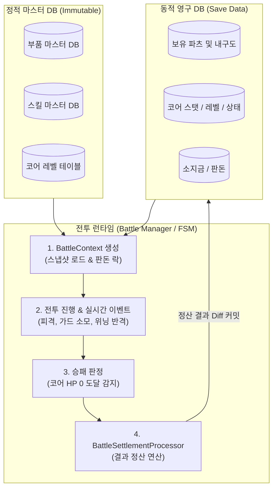
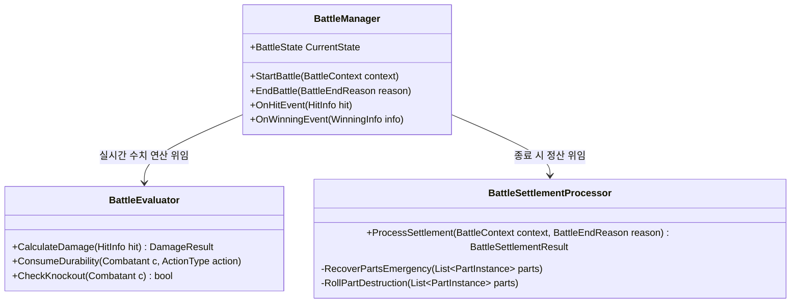
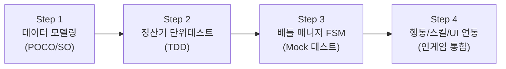

# 전투 DB & 배틀 매니저(Battle Manager) 아키텍처 설계서

- **문서 버전**: v1.0
- **담당자**: 김관현 (전투 결과 처리 및 전투 데이터 관리)
- **대상 프로젝트**: 리얼 스틸 (가제 / 로봇 커스터마이징 RPG)
- **작성일**: 2026-09-17

---

## 1. 개요 및 설계 목표

### 1.1 담당 영역
본 문서는 기획서상의 **"김관현: 전투 결과 처리 및 전투 데이터 관리"** 파트에 해당하는 전투 데이터베이스(DB) 구조와 배틀 매니저(Battle Manager)의 아키텍처를 정의합니다.

### 1.2 핵심 설계 철학: Stateless Runtime vs Stateful Persistent
- **런타임 분리 (Stateless Runtime)**: 인게임 실시간 전투 중 변동되는 일시 데이터(HP, 일시적 버프, 실시간 경직치 등)는 영구 세이브 데이터에 직접 쓰지 않고 전투 컨텍스트(`BattleContext`) 스냅샷 안에서만 관리합니다.
- **영구 데이터 격리 (Stateful Persistent)**: 전투 종료 시점에 한 번에 정산(`BattleSettlementResult`)하여 영구 DB(내구도 영구 차감, 파츠 파손/영구 손실, 코어 불안정화, 경험치 및 골드)에 원자적(Atomic)으로 반영합니다.



---

## 2. 데이터베이스 구조 (전투 DB 레이어)

데이터는 **불변 마스터 데이터(기획 기준치)**와 **가변 인스턴스 데이터(유저/NPC 상태값)**로 명확히 분리합니다.

### 2.1 불변 마스터 데이터 (Static Master DB)
기획 밸런스 및 아이템 원형을 정의합니다. (ScriptableObject 또는 JSON 매핑)

| 데이터 모델 | 주요 필드 | 설명 |
| :--- | :--- | :--- |
| `PartMasterData` | `PartID`, `PartType(Head/Arm/Leg)`, `Grade(Common~Prototype)`, `BaseDurability`, `BaseDef`, `BaseAtk`, `SkillID`, `DestructionResistance` | 부품 기본 규격 및 파괴 저항력(등급별 파괴 확률 가중치) |
| `CoreMasterData` | `Level`, `RequiredExp`, `MaxHp`, `Defense` | 코어 레벨별 성장 테이블 |
| `BattleConstants` | 방어력 대미지 감쇄 공식($\frac{\text{Def}}{\text{Def} + 100}$), 패링 판정 프레임, 다리 내구도 고정 소모량(5) | 전투 관련 하드코딩 방지용 상수 풀 |

### 2.2 가변 인스턴스 데이터 (Runtime / Save Data)
인벤토리와 세이브 파일에 기록되는 실제 장비/유저 데이터입니다.

```csharp
// 부품 인스턴스 (보유 및 장착된 부품의 상태)
public class PartInstance
{
    public string InstanceId { get; set; }     // 고유 식별자 (GUID)
    public int MasterPartId { get; set; }       // PartMasterData 참조 ID
    public int CurrentDurability { get; set; }  // 현재 내구도
    public int MaxDurability { get; set; }      // 최대 내구도
    public bool IsBroken => CurrentDurability <= 0; // 부위 파손 여부 (스킬/액션 페널티)
    public bool IsDestroyed { get; set; }      // 영구 파괴(삭제 대상) 여부
}

// 코어 인스턴스
public enum CoreState { Normal, Unstable }

public class CoreInstance
{
    public int CurrentLevel { get; set; }
    public int CurrentExp { get; set; }
    public CoreState State { get; set; }        // 패배 시 Unstable로 전환 (출격 불가)
}

// 전투 런타임 세션 컨텍스트
public class BattleContext
{
    public int AreaId { get; set; }
    public int BetAmount { get; set; }          // 협상으로 결정된 최종 판돈
    public bool IsChampionMatch { get; set; }
    public CombatantSnapshot Player { get; set; }
    public CombatantSnapshot Enemy { get; set; }
}
```

---

## 3. 배틀 매니저(Battle Manager) 아키텍처

단일 거대 클래스(God Class)를 방지하기 위해 역할을 3개의 컴포넌트로 분책합니다.



### 3.1 `BattleManager` (오케스트레이터 / 흐름 제어)
- 전투의 생명주기(FSM) 관리:
  - `Ready` $\rightarrow$ `InBattle` $\rightarrow$ `Paused` $\rightarrow$ `Finished` $\rightarrow$ `Settlement`
- 전투 내 행동(남윤호 님) 및 스킬(최상희 님)에서 발생하는 이벤트를 수신하고 중계.

### 3.2 `BattleEvaluator` (실시간 규칙 판정기 - Pure C#)
- **대미지 감쇄 연산**: $\text{Damage} = \text{RawDamage} \times (1 - \frac{\text{Def}}{\text{Def} + 100})$
- **행동별 내구도 소모 판정**:
  - 가드 피격 시 $\rightarrow$ 양팔 파츠 내구도 차감
  - 회피 및 위닝(패링) 성공 시 $\rightarrow$ 양다리 중 무작위 1개 내구도 5 고정 차감
  - 치명타 피격 시 $\rightarrow$ 머리 파츠 내구도 차감
- **부위 파손 브로드캐스팅**: 내구도 0 도달 시 즉시 `OnPartBroken` 이벤트를 발생시켜 스킬 비활성화 및 회피 확률 50% 페널티 적용.

### 3.3 `BattleSettlementProcessor` (결과 정산기 - 핵심 담당 파트)
전투 종료 트리거 발생 시 기획서의 규칙에 따라 결과를 계산하고 DTO 객체를 생성합니다.

```csharp
public class BattleSettlementResult
{
    public BattleEndReason EndReason { get; set; }
    public int EarnedGold { get; set; }              // 획득/차감 골드 (판돈 계산)
    public int EarnedCoreExp { get; set; }           // 획득 코어 경험치
    public bool DidCoreLevelUp { get; set; }         // 코어 레벨업 여부
    public bool IsCoreUnstable { get; set; }         // 코어 불안정화 여부
    public List<PartInstance> UpdatedParts { get; set; }   // 갱신된 내구도 목록
    public List<PartInstance> DestroyedParts { get; set; } // 영구 파괴되어 삭제될 부품 목록
}
```

#### 정산 규칙 상세
1. **승리 시 (Player Win)**:
   - 판돈 획득: $\text{EarnedGold} = \text{BetAmount} \times 2$ (원금 + 딴 돈)
   - 코어 경험치 지급 및 레벨업 체크.
   - 내구도 0이 된 부품: 영구 파괴하지 않고 **내구도 1의 긴급 복구 상태**로 유지.
2. **패배 시 (Player Lose)**:
   - 판돈 전액 몰수 ($\text{EarnedGold} = 0$).
   - 장착 중이던 모든 파츠 내구도 0으로 강제 전환.
   - **영구 파손 롤링**: 각 파츠의 등급별 파괴 확률 테이블에 따라 확률 판정 $\rightarrow$ 파괴 확정 파츠는 `DestroyedParts`에 추가.
   - 코어 상태를 `Unstable`로 전환 (복구 전까지 출격 불가).

---

## 4. 타 파트와의 인터페이스 및 협업 규약 (Contract)

| 대상 담당자 | 제공/수신 형태 | 데이터 / 이벤트 규약 |
| :--- | :--- | :--- |
| **남윤호 (전투 행동/그리드)** | Event 수신 & 반환 | • 수신: `PlayerActionTriggered(ActionType, Frame)`<br>• 발행: `OnPartBroken(PartType)` $\rightarrow$ 회피 50% 실패 처리 |
| **최상희 (전투 스킬)** | State 질의 | • 질의: `IsSkillUsable(PartType)` (해당 부품 내구도 > 0 확인)<br>• 통보: 스킬 시전에 따른 코어/부품 소모치 반영 |
| **윤지우 (크래프팅/파괴)** | Result 전달 | • 전달: `BattleSettlementResult.DestroyedParts`<br>• 인벤토리에서 영구 삭제 처리 및 정비소 수리비 견적 연계 |
| **이상혁 (경제/경매/골드)** | Result 전달 | • 전달: `BattleSettlementResult.EarnedGold`<br>• 유저 지갑 및 NPC 소지금 잔액 업데이트 |
| **김도언 (자원/고물상)** | State 동기화 | • 전투 패배로 코어가 `Unstable`일 때 고물상 정비소 복구 기능 연계 |

---

## 5. 단계별 구현 로드맵 (Roadmap)



1. **Step 1: 데이터 모델링 (ScriptableObject / C# Class)**
   - `PartMasterData`, `PartInstance`, `CoreMasterData`, `BattleContext` 규격 정의.
2. **Step 2: 정산 로직 단위 테스트 (TDD)**
   - 유니티 씬(Scene) 없이도 C# 단위 테스트로 승/패 시의 내구도 처리, 영구 파손 롤링, 판돈 및 경험치 계산 검증.
3. **Step 3: Mock 기반 BattleManager FSM 구축**
   - 가상 버튼(P1 승리, P2 승리)으로 전투 종료 시 데이터가 정산기 거쳐 세이브 데이터에 정확히 반영되는지 검증.
4. **Step 4: 타 파트 이벤트 바인딩**
   - 남윤호 님(행동), 최상희 님(스킬) 스크립트와 C# `event` / `delegate` 연동.

