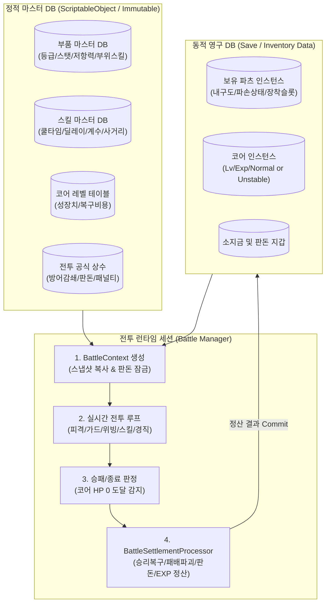
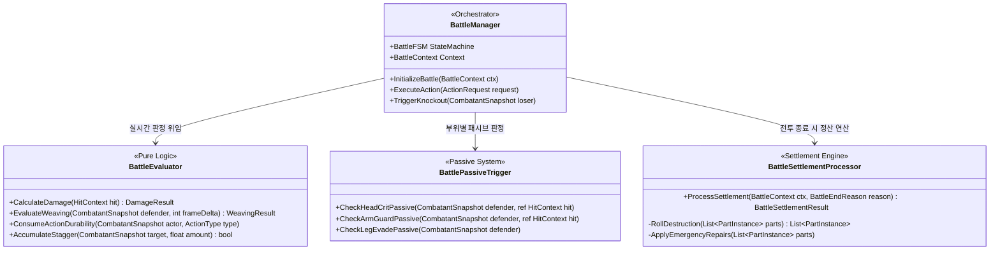
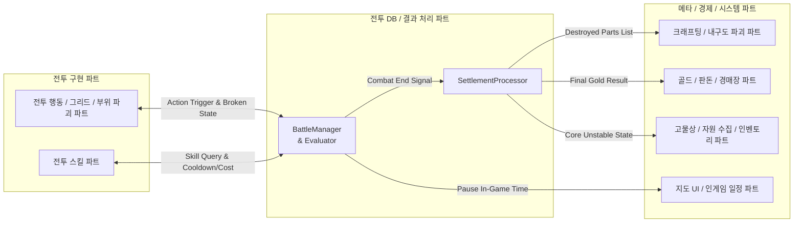
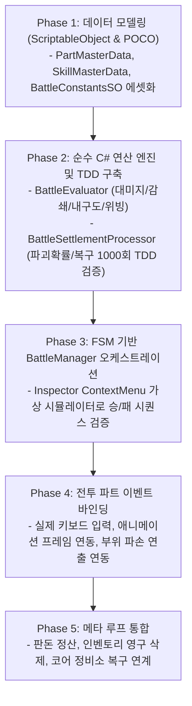

# 전투 DB & 배틀 매니저(Battle Manager) 아키텍처 설계서

- **문서 버전**: v2.1 (최신 기획서 (2) 및 프로젝트 표준 규격 반영 개정판)
- **담당 파트**: 전투 DB / 전투 결과 처리 및 전투 데이터 관리 파트
- **대상 프로젝트**: 리얼 스틸 (로봇 커스터마이징 RPG / 2.5D 실시간 액션)
- **최종 수정일**: 2026-09-18

---

## 1. 개요 및 설계 원칙

### 1.1 담당 영역 및 목적
본 문서는 기획서상의 **"전투 결과 처리 및 전투 데이터 관리 파트"** 역할을 바탕으로, 전투 시스템 전반의 기반이 되는 데이터베이스(DB) 구조와 실시간 전투 판정/종료 후 정산을 관장하는 **배틀 매니저(Battle Manager)** 의 구체적인 구현 아키텍처를 정의합니다.

### 1.2 핵심 아키텍처 원칙
1. **Stateless Runtime vs Stateful Persistent (런타임/영구 데이터 격리)**:
   - 인게임 전투 중 변동되는 일시 데이터(현재 HP, 게이지, 버프, 프레임 카운트)는 `BattleContext` 스냅샷에서 독립적으로 처리합니다.
   - 전투 종료 시점에 `BattleSettlementProcessor`가 차이점(Diff)을 계산하여 영구 데이터(보유 파츠, 코어 상태, 소지금)에 원자적(Atomic)으로 반영합니다.
2. **이벤트 기반 디커플링 (Event-driven Decoupling)**:
   - 전투 행동 파트, 전투 스킬 파트, 크래프팅/파괴 파트, 경제/판돈 파트 모듈 간 직접 참조를 배제하고, `BattleManager`의 C# `Action/Func` 및 Event Bus를 통해 느슨하게 결합합니다.
3. **Pure C# 연산 엔진 분리 (Unity 의존성 최소화)**:
   - 대미지 계산식, 부위 파괴 롤링, 경직도/위빙 판정은 순수 C# 도메인 모델로 격리하여 유니티 씬(Scene) 없이도 **100% 단위 테스트(TDD)**가 가능하도록 구현합니다.



---

## 2. 전투 DB 레이어 (데이터 모델링)

기획서 (2)의 확정 수치 테이블(등급 배율, 액티브 스킬 수치, 파괴 확률, 부위별 패시브 등)을 시스템화합니다.

### 2.1 불변 마스터 데이터 (Static Master DB)

#### 1) 부품 마스터 (`PartMasterData`)
- **공통 규격 준수**:
  - 부위 슬롯: 전투 행동 파트의 `BodyPart` (`Head, LeftArm, RightArm, LeftLeg, RightLeg, Core`) 사용.
  - 부품 등급: 자원/인벤토리 파트의 `PartGrade` (`Common, Rare, Epic, Legendary, Prototype`) 사용.
- **기획서 공식 반영**:
  - 등급 배율: 일반(1.00배 / 파괴 70%), 레어(1.20배 / 파괴 45%), 에픽(1.44배 / 파괴 20%), 전설(1.73배 / 파괴 5%), 프로토타입(2.07배 / 파괴 1%)
  - 수치 공격력 공식: `기본 공격력 + (왼팔 공격력 + 오른팔 공격력) / 2`
  - 이동 속도 공식: `(왼다리 속도 + 오른다리 속도) / 2`

```csharp
// PartGrade 및 BodyPart는 프로젝트 공통 enum 참조
[CreateAssetMenu(fileName = "PartMasterData", menuName = "RealSteel/DB/PartMasterData", order = 1)]
public class PartMasterData : ScriptableObject
{
    [Header("기본 식별 정보")]
    public int partID;
    public string partName;
    public BodyPart slotType;
    public PartGrade partGrade;

    [Header("내구도 및 파괴 리스크 (기획서 §5.6)")]
    public int baseDurability;
    [Range(0f, 1f)]
    public float destructionResistance;    // 일반 70%, 레어 45%, 에픽 20%, 전설 5%, 프로토 1%

    [Header("부위별 스탯")]
    public HeadStatData headStatData;      // 치명타 저항, 치명타 대미지 감소율
    public ArmStatData armStatData;        // 팔 기본 공격력, 공격력 계수, 가드 방어 보정
    public LegStatData legStatData;        // 이동 속도 보정, 위빙 무적 프레임 보정

    [Header("스킬 연동")]
    public int activeSkillId = -1;
    public List<int> passiveSkillIds = new List<int>();
}

[System.Serializable]
public struct HeadStatData
{
    public float critResistance;          // 치명타 저항 (합연산 감소)
    public float critDamageReduction;     // 치명타 대미지 감소율
}

[System.Serializable]
public struct ArmStatData
{
    public int armAttackPower;            // 팔 기본 공격력 (등급표 기준치: 100, 120, 144, 173, 207)
    public float atkMultiplier;           // 공격 계수 (기본 1.0)
    public int guardDefBonus;             // 가드 방어력 보정치
}

[System.Serializable]
public struct LegStatData
{
    public float moveSpeedBonus;          // 이동 속도 보정 (양다리 평균값으로 최종 이동속도 적용)
    public float invincibleFramesBonus;   // 위빙(저스트 회피) 무적 시간 보정치
}
```

#### 2) 액티브 스킬 마스터 (`SkillMasterData`)
기획서 5.3 액티브 5종 밸런스 테이블 및 입력 키 바인딩 매핑:

| 스킬명 | 입력 키 | 쿨타임(초) | 기본 피해량 | 사거리 | 선딜레이(f) | 후딜레이(f) | 경직도 누적 | 특수 룰 |
| :---: | :---: | :---: | :---: | :---: | :---: | :---: | :---: | :--- |
| **잽 (Jab)** | `D` | 0.5 | 10 | 1.2 | 0 | 5 | 0% | 경직 없음, 초단 쿨타임 견제기 |
| **스트레이트** | `Q` | 3.0 | 35 | 3.0 | 15 | 45 | 35% | 긴 사거리, 긴 후딜레이 |
| **훅 (Hook)** | `A` | 2.5 | 20 | 2.5 | 6 | 20 | 20% | 최단 선딜레이 기습기 |
| **어퍼컷** | `W` | 4.0 | 45 | 1.0 | 25 | 15 | 45% | 초근접 고화력 |
| **백스핀 엘보우** | `S` | 6.0 | 65 | 2.5 | 40 | 50 | 60% | **가드 관통(Guard Break)**, 최강 화력 |

```csharp
[CreateAssetMenu(fileName = "SkillMasterData", menuName = "RealSteel/DB/SkillMasterData")]
public class SkillMasterData : ScriptableObject
{
    public int SkillId;
    public string SkillName;
    public KeyCode DefaultKey;
    public float Cooldown;
    public int BaseDamage;
    public float AttackRange;
    public int StartupFrames;
    public int RecoveryFrames;
    public float StaggerAccumulation;     // 0.0 ~ 0.6 (60%)
    public bool IsGuardBreak;             // 백스핀 엘보우 전용 (가드 불가 판정)
}
```

#### 3) 전투 상수 및 공식 테이블 (`BattleConstantsSO`)
```csharp
[CreateAssetMenu(fileName = "BattleConstants", menuName = "RealSteel/DB/BattleConstants")]
public class BattleConstantsSO : ScriptableObject
{
    // 방어력 대미지 감소 공식 계수: Damage = RawDamage * (100 / (Defense + 100))
    public float DefenseFormulaDivisor = 100f;

    // 자원 소모 상수
    public int LegDurabilityCostOnEvade = 5;       // 회피/위빙 시 다리 1개 내구도 5 소모
    public float StaggerDuration = 2.0f;          // 경직도 100% 도달 시 그로기 시간 (2초)
    public float StaggerThreshold = 100.0f;       // 경직 한계치

    // 부위 파손 페널티
    public float BrokenLegEvadeSuccessRate = 0.5f;// 다리 1개 파괴 시 위빙/회피 성공률 50%
    public float BrokenArmGuardEfficiency = 0.5f; // 팔 1개 파괴 시 가드 효율 50% 감소

    // 복구 및 롤링 확률
    public int EmergencyRecoveredDurability = 1;   // 승리 시 내구도 0 파츠 복구 수치 (1)
}
```

---

### 2.2 가변 인스턴스 데이터 (Runtime / Save Data)

```csharp
// 유저 보유 및 장착 부품 상태
[System.Serializable]
public class PartInstance
{
    public string InstanceId;                  // GUID (아이템 인스턴스 고유 식별자)
    public int MasterPartId;                   // PartMasterData ID
    public int CurrentDurability;
    public int MaxDurability;
    
    public bool IsBroken => CurrentDurability <= 0; // 내구도 0 파손 (스킬 불가/기능 저하)
    public bool IsDestroyed;                  // 영구 파괴 (세이브 DB에서 삭제 대상)
}

// 코어 상태
public enum CoreStatus { Normal, Unstable }

[System.Serializable]
public class CoreInstance
{
    public int CurrentLevel;
    public int CurrentExp;
    public CoreStatus Status;                  // 패배 시 Unstable 전환 (출격 불가)
}

// 전투 런타임 스냅샷 (전투 중에만 존재)
public class CombatantSnapshot
{
    public string Name;
    public bool IsPlayer;
    public int CurrentHp;
    public int MaxHp;
    public int TotalDefense;
    public float CurrentStagger;               // 0 ~ 100
    public bool IsGroggy;                      // 2초 경직 상태
    public Dictionary<BodyPart, PartInstance> EquippedParts;

    // 기획서 (2) 공격력 공식: 기본 공격력 + (왼팔 공격력 + 오른팔 공격력) / 2
    public int CalculateTotalAttackPower(int baseAtk, Dictionary<int, PartMasterData> masterDb)
    {
        int leftAtk = 0;
        int rightAtk = 0;

        if (EquippedParts.TryGetValue(BodyPart.LeftArm, out var leftPart) && !leftPart.IsBroken)
            leftAtk = masterDb[leftPart.MasterPartId].armStatData.armAttackPower;

        if (EquippedParts.TryGetValue(BodyPart.RightArm, out var rightPart) && !rightPart.IsBroken)
            rightAtk = masterDb[rightPart.MasterPartId].armStatData.armAttackPower;

        return baseAtk + ((leftAtk + rightAtk) / 2);
    }

    // 기획서 (2) 이동 속도 공식: (왼다리 속도 + 오른다리 속도) / 2
    public float CalculateTotalMoveSpeed(Dictionary<int, PartMasterData> masterDb)
    {
        float leftSpeed = 0f;
        float rightSpeed = 0f;

        if (EquippedParts.TryGetValue(BodyPart.LeftLeg, out var leftLeg) && !leftLeg.IsBroken)
            leftSpeed = masterDb[leftLeg.MasterPartId].legStatData.moveSpeedBonus;

        if (EquippedParts.TryGetValue(BodyPart.RightLeg, out var rightLeg) && !rightLeg.IsBroken)
            rightSpeed = masterDb[rightLeg.MasterPartId].legStatData.moveSpeedBonus;

        return (leftSpeed + rightSpeed) / 2f;
    }
}
```

---

## 3. 배틀 매니저(Battle Manager) 아키텍처

`BattleManager`는 4개의 전담 서브시스템으로 분리 설계하여 유지보수성과 확장성을 극대화합니다.



### 3.1 `BattleManager` (오케스트레이터 & FSM)
전투의 전체 생명주기를 통제하고 타 파트와의 이벤트를 중계합니다.
- **상태 흐름**: `Matching` $\rightarrow$ `Countdown` $\rightarrow$ `InCombat` $\rightarrow$ `GroggyPause` $\rightarrow$ `RoundFinished` $\rightarrow$ `Settlement` $\rightarrow$ `SceneExit`
- **주요 이벤트 발행**:
  - `OnDamageApplied(HitResult result)`: UI(체력바, 대미지 텍스트) 및 이펙트 연동.
  - `OnPartBroken(CombatantSnapshot target, BodyPart slot)`: 캐릭터 스프라이트 반투명화(시각 피드백) 및 스킬 잠금.
  - `OnWeavingSuccess(CombatantSnapshot attacker, CombatantSnapshot counterAttacker)`: 화면 줌인/페이드 연출, 상대 2초 경직, 카운터 연계 찬스 오픈.
  - `OnGroggyStateChanged(CombatantSnapshot target, bool isGroggy)`: 필살기 연계 찬스 진입.

---

### 3.2 `BattleEvaluator` (실시간 규칙 및 수치 판정기)

#### 1) 대미지 및 방어력 감쇄 공식
기획서 5.2 수식 적용:
$$\text{Damage} = \text{RawDamage} \times \left(1 - \frac{\text{Defense}}{\text{Defense} + 100}\right) = \text{RawDamage} \times \frac{100}{\text{Defense} + 100}$$

#### 2) 부위별 리소스 소모 및 판정 로직
- **가드 (`C` 키)**:
  - 백스핀 엘보우(`S`) 피격 시 $\rightarrow$ **가드 관통(Guard Break)** 판정, 코어에 직격 대미지.
  - 일반 공격 방어 시 $\rightarrow$ 가드 방어력 합산 후 잔여 대미지만큼 **양팔 파츠 내구도 소모**.
  - 양팔 중 1개 파괴 상태: 가드 방어율 50% 저하.
  - 양팔 모두 파괴 상태: 가드 명령 자체가 불가.
- **회피 (`Spacebar`) 및 위빙(Weaving)**:
  - 시전 시 $\rightarrow$ 좌/우 다리 파츠 중 무작위 1개 **내구도 5 고정 소모**.
  - 다리 1개 파괴 상태: 위빙 입력 타이밍이 완벽하더라도 **50% 확률로 회피 실패** (“회피 실패” 플로팅 텍스트 출력).
  - 양다리 모두 파괴 상태: 회피 완전 불가 (패시브 '긴급 회피 프로토콜' 보유 시 5% 예외 발동).
- **헤드 피격 (치명타)**:
  - 머리의 치명타 저항률을 감안하여 크리티컬 발생 시 $\rightarrow$ **머리 파츠 내구도 직접 소모**.
- **경직도(Stagger) 누적**:
  - 잽(`D`)을 제외한 공격 적중 시 게이지 누적 $\rightarrow$ 100% 도달 시 **2초간 무방비 그로기 상태** 전환.

---

### 3.3 `BattlePassiveTrigger` (기획서 5.2.6 부위별 패시브 판정)
기획서에 명시된 독특한 부위별 패시브를 이벤트 시점에 인터셉트하여 처리합니다.
- **충격 흡수 프레임 (머리)**: 치명타 피격 시 20% 확률로 일반 데미지로 변환 & 머리 내구도 소모 50% 삭감.
- **오버라이드 시스템 (머리)**: 내구도 0 도달 시 10% 확률로 즉시 내구도 30% 회복하여 파손 방어.
- **반발 장갑 (팔)**: 가드 성공 시 15% 확률로 팔 내구도 소모 무효화 & 공격자에게 10% 경직도 반사.
- **잔상 회로 (다리)**: 위빙 완벽 판정 성공 시 50% 확률로 다리 내구도 5 소모 무효화.

---

### 3.4 `BattleSettlementProcessor` (결과 정산기 - 핵심 역할)

```csharp
public class BattleSettlementResult
{
    public BattleEndReason EndReason;            // PlayerWin, PlayerLose, Draw
    public int FinalGoldDelta;                   // 골드 변동치 (+획득 / 0)
    public int EarnedCoreExp;                    // 획득 코어 경험치
    public bool CoreLevelUpOccurred;             // 레벨업 여부
    public bool CoreBecameUnstable;              // 코어 불안정화 여부 (패배 시 true)
    public List<PartInstance> UpdatedParts;      // 내구도 변동 부품 목록
    public List<PartInstance> DestroyedParts;    // 영구 파괴 판정된 부품 목록 (인벤토리 삭제)
}
```

#### 정산 연산 파이프라인 (기획서 5.6.5, 5.6.6 준수)
1. **승리 시 (Player Win)**:
   - **판돈 정산**: $\text{FinalGoldDelta} = \text{BetAmount} \times 2$ (베팅 원금 + 승리 상금).
   - **코어 성장**: 상대 등급/구역 비례 경험치 가산 $\rightarrow$ 레벨업 시 코어 기본 HP/Def 영구 상승.
   - **응급 복구(Emergency Repair)**: 전투 중 내구도가 0이 된 모든 파츠는 파괴되지 않고 **내구도 1 상태로 응급 복구**되어 유지.
2. **패배 시 (Player Lose)**:
   - **판돈 상실**: 베팅액 전액 몰수 ($\text{FinalGoldDelta} = 0$).
   - **강제 파손**: 장착 중이던 모든 파츠(머리, 양팔, 양다리)의 **내구도를 0으로 강제 전환**.
   - **영구 파괴 롤링 (Permadeath Roll)**:
     - 내구도가 0이 된 각 파츠에 대해 기획서의 등급별 파괴 확률 테이블을 적용:
       - 일반: **70%** / 레어: **45%** / 에픽: **20%** / 전설: **5%** / 프로토타입: **1%**
     - 주사위 성공 시 `DestroyedParts` 리스트에 포함되어 **인벤토리에서 영구 삭제**.
   - **코어 불안정화**: 코어 상태를 `Unstable`로 격하 $\rightarrow$ 고물상 정비시설에서 골드를 지불하고 수리할 때까지 **신규 로봇 조립 및 출격 완전 차단**.

---

## 4. 파트 간 인터페이스 협업 규약 (Contract)

전투 DB 및 배틀 매니저 파트가 타 파트와 교환해야 하는 인터페이스 및 데이터 규약입니다.



| 대상 파트 | 데이터 교환 방식 | 상세 협업 내용 |
| :--- | :--- | :--- |
| **전투 행동 / 그리드 / 부위 파괴 파트** | Event & State | • **수신**: `OnActionInput(ActionType)` (회피/위빙/가드/이동 입력)<br>• **발행**: `OnPartBrokenStateChanged(BodyPart, bool)` $\rightarrow$ 회피 50% 실패 플로팅 연출 및 피격 모션 트리거 |
| **전투 스킬 파트** | Func 질의 & Callback | • **제공**: `bool CanCastSkill(BodyPart slot)` (해당 부위 내구도 > 0 확인)<br>• **수신**: `OnSkillCast(SkillMasterData skill)` $\rightarrow$ 선/후딜레이 프레임 락 및 경직도 누적 연산 |
| **크래프팅 / 내구도 파괴 파트** | Result DTO 전달 | • **전달**: `BattleSettlementResult.DestroyedParts`<br>• 파괴 확정 파츠를 인벤토리 세이브에서 삭제 및 정비소 수리 견적 산출 |
| **골드 / 판돈 / 경매장 파트** | Context 수신 & Result 전달 | • **수신**: 협상 완료된 판돈(`BetAmount`)을 `BattleContext`에 전달받음<br>• **전달**: `BattleSettlementResult.FinalGoldDelta`를 전달하여 유저/NPC 계좌 반영 |
| **고물상 / 자원 수집 / 인벤토리 파트** | State 동기화 | • 패배 시 코어가 `Unstable`로 변경되면 고물상 수리 상호작용 전까지 출격 버튼 비활성화 |
| **지도 UI / 인게임 일정 파트** | Lifecycle 연동 | • 기획서 5.1.5 규칙: 전투 진입 시 인게임 시간 정지(`Time.timeScale` 또는 시간 매니저 Pause 호출) |

---

## 5. 단계별 구현 및 검증 로드맵 (Action Plan)



1. **Step 1 (데이터 에셋화)**:
   - 기획서의 테이블을 Unity `ScriptableObject` 에셋 데이터로 입력 완료 (부품 5등급, 액티브 5종 스킬 등).
2. **Step 2 (단위 테스트 작성)**:
   - `BattleSettlementProcessorTests.cs`를 작성하여 일반 등급 부품이 패배 시 70% 확률로 삭제되는지, 승리 시 내구도 0 파츠가 1로 정상 복구되는지 1,000회 시뮬레이션 테스트 수행.
3. **Step 3 (BattleManager 가상 구동)**:
   - 유니티 에디터 상에서 `[ContextMenu("Simulate Player Win")]`, `[ContextMenu("Simulate Player Lose")]`를 구현하여 UI 및 세이브 데이터에 정확히 반영되는지 파이프라인 완성.
4. **Step 4 (전투 파트 코드 통합)**:
   - 전투 행동 파트의 이동/가드 스크립트 및 전투 스킬 파트의 스킬 발동 코드와 연동하여 실시간 피격 대미지 감쇄 및 부위 파손 적용.
